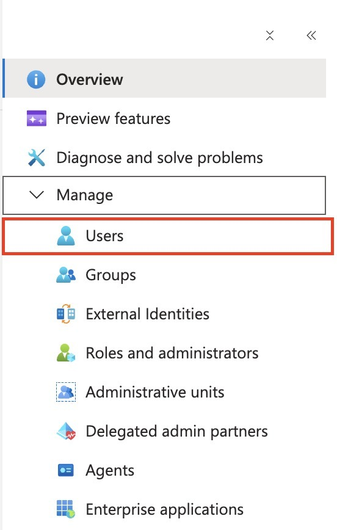
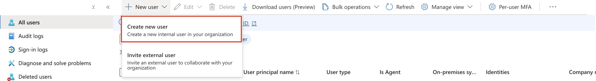
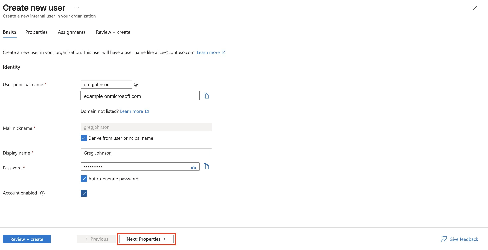
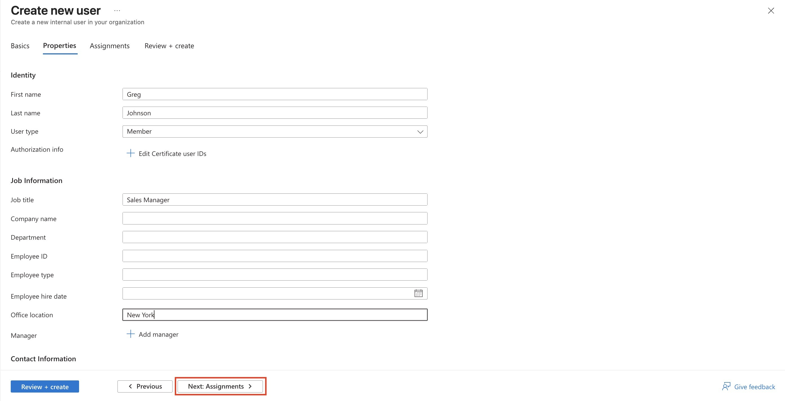
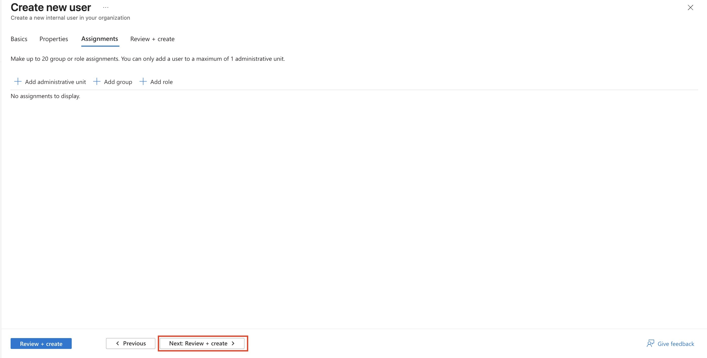
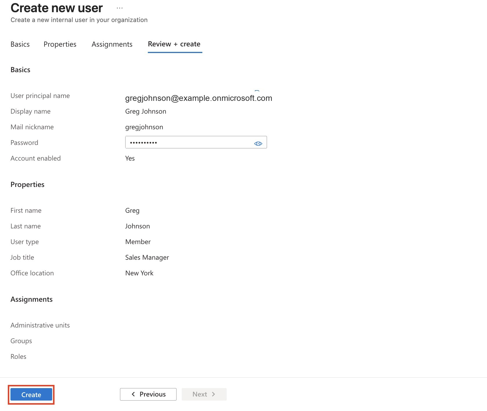

# Assignment 2: Create a User and Configure Profile Attributes

## Objective

Create a new internal Microsoft Entra user named **Greg Johnson** and configure basic profile attributes such as first name, last name, user type, job title, and office location.

## Scenario

An organization needs to onboard a new internal employee account in Microsoft Entra ID. The account should be created as a **member user**, enabled at creation time, and populated with profile information that can later support search, reporting, dynamic groups, app assignments, and administrative review.

## Portal Path

Microsoft Entra admin center → **Identity** → **Users** → **All users** → **New user** → **Create new user**

This screenshot shows the **Users** blade under the Manage area. This is where administrators manage internal users, guest users, deleted users, sign-in logs, and related identity tasks.

The **New user** menu gives two different paths: create a new internal user or invite an external user. For this assignment, the correct choice is **Create new user** because Greg Johnson is being added as an internal organization user.

## Prerequisites

- Access to a Microsoft Entra tenant or lab tenant.
- Permission to create users, such as **User Administrator** or a higher privileged role.
- A planned username, display name, and basic profile values.
- A safe temporary password process for the new account.

## Configuration Summary

| Setting | Value used in lab | Notes |
|---|---|---|
| User principal name | `gregjohnson@example.onmicrosoft.com` | Tenant domain redacted in screenshots |
| Mail nickname | `gregjohnson` | Derived from the user principal name |
| Display name | `Greg Johnson` | User-facing name shown in Entra and Microsoft 365 |
| Account enabled | Yes | Allows the account to sign in after creation |
| First name | `Greg` | Stored on the user profile |
| Last name | `Johnson` | Stored on the user profile |
| User type | Member | Internal organization user |
| Job title | `Sales Manager` | Useful for profile search, reporting, and dynamic rules |
| Department | Not populated in provided evidence | Can be configured from the same Properties tab |
| Office location | `New York` | Useful for profile search, reporting, and location-based organization data |
| Groups / roles / administrative units | None assigned during creation | Access can be assigned later using groups or roles |

## Steps Performed

### 1. Open Users and Start User Creation

From the Microsoft Entra admin center, open **Users**, select **New user**, and choose **Create new user**.

This matters because Microsoft Entra separates internal account creation from external guest invitation. Choosing **Invite external user** would create a guest collaboration flow instead of a normal internal member account.

### 2. Configure the Basics Tab

On the **Basics** tab, the user identity values were entered:

- User principal name: `gregjohnson`
- Domain: tenant domain selected from the dropdown
- Display name: `Greg Johnson`
- Password: auto-generated
- Account enabled: selected

The user principal name becomes the sign-in name. The display name is what administrators and users normally see in portals, address lists, and user pickers.

> **Exam Trap**
> User principal name and display name are not the same thing. The UPN is used for sign-in; the display name is the friendly name shown in the interface.

### 3. Configure the Properties Tab

On the **Properties** tab, the profile fields were populated:

- First name: `Greg`
- Last name: `Johnson`
- User type: `Member`
- Job title: `Sales Manager`
- Department: available on the form, but not populated in the provided evidence
- Office location: `New York`

These fields are not just cosmetic. Profile attributes can help with identity lifecycle processes, people search, app visibility, administrative reporting, and dynamic membership rules.

> **Memory Hook**
> Basics creates the sign-in identity. Properties describe the person.

### 4. Review Assignments

The **Assignments** tab allows administrators to add administrative units, groups, or roles during user creation. In this lab, no assignments were added.

This is a safer approach for a basic identity creation lab because it separates account creation from access granting. In real environments, access should usually be assigned through groups or entitlement processes rather than through ad hoc direct role assignment.

> **Exam Trap**
> Creating a user does not automatically grant meaningful access to apps, groups, Azure resources, or admin roles. Identity creation and access assignment are separate steps.

### 5. Review and Create

The **Review + create** tab summarizes the new account before creation. The review confirmed:

- UPN and display name were set.
- Account was enabled.
- User type was **Member**.
- Job title was set to **Sales Manager**.
- Office location was set to **New York**.
- No administrative units, groups, or roles were assigned.

After reviewing the values, the **Create** button completes the user creation process.

## Validation

The review screen confirms the intended values before the account is created. After creation, the expected validation steps are:

- Search for **Greg Johnson** under **Users → All users**.
- Open the user profile and confirm the UPN, display name, job title, office location, and user type.
- Confirm the account is enabled.
- Confirm no unexpected groups, roles, or administrative units were assigned during creation.

## Cleanup

If this was only a lab account, remove the user after validation:

1. Go to **Users → All users**.
2. Select **Greg Johnson**.
3. Delete the user.
4. If needed, check **Deleted users** and permanently delete the account after confirming it is no longer required.

## Exam Notes

| Topic | What to remember |
|---|---|
| Internal vs external user | **Create new user** creates an internal member account; **Invite external user** starts a guest collaboration flow |
| UPN vs display name | UPN is the sign-in name; display name is the friendly name |
| Member vs guest | Member normally means internal tenant user; guest normally means external collaboration identity |
| Profile attributes | Job title, department, office, and similar fields can support search, reporting, lifecycle workflows, and dynamic grouping |
| Access assignment | Creating the user does not automatically assign groups, roles, apps, or Azure RBAC permissions |
| Least privilege | Do not assign admin roles during user creation unless there is a clear requirement |

## Final Checklist

- [x] Opened the Users blade in Microsoft Entra.
- [x] Selected **Create new user** instead of external invitation.
- [x] Entered the user principal name and display name.
- [x] Left the account enabled.
- [x] Added profile properties for first name, last name, user type, job title, and office location.
- [x] Reviewed assignments and left groups/roles/admin units unassigned.
- [x] Reviewed the final account summary before creation.
