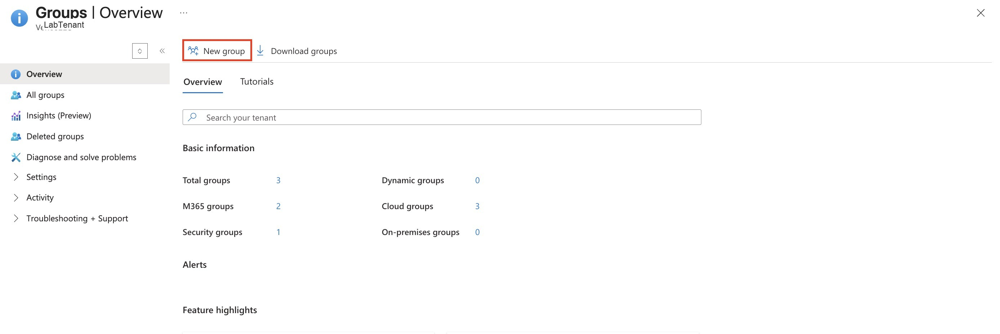
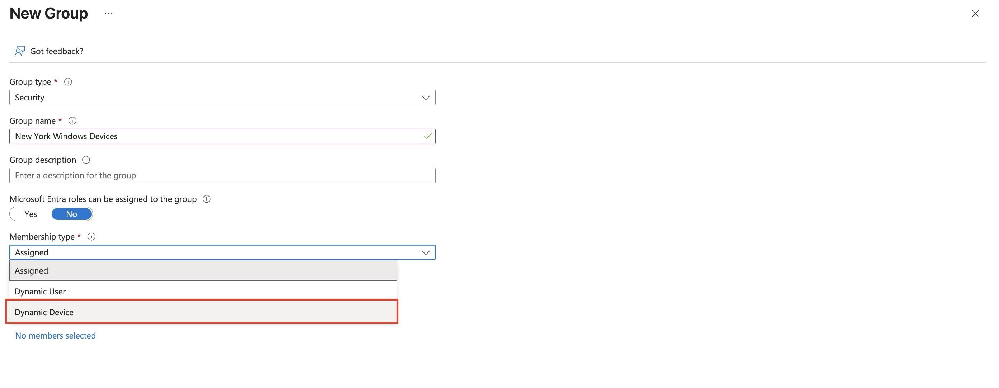
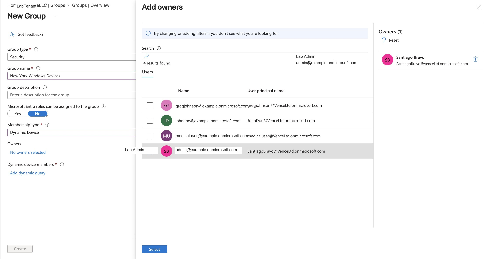
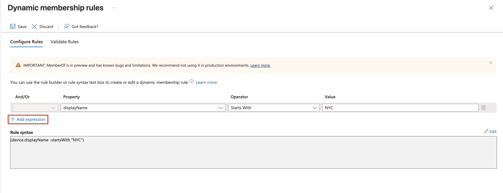
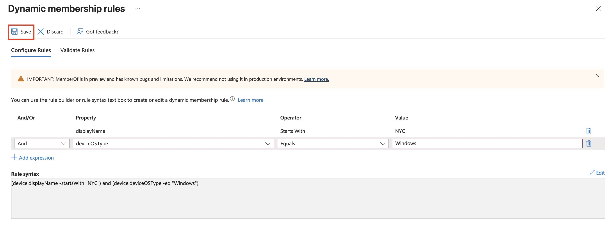
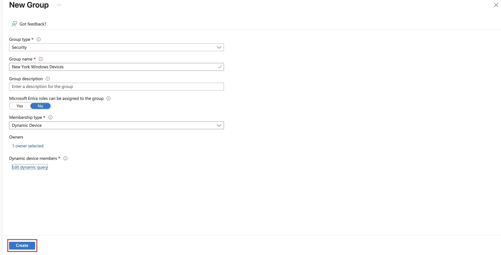

# Assignment 3: Create a Dynamic Security Group for Windows Devices

## Objective

Create a Microsoft Entra **security group** named **New York Windows Devices** and configure it as a **dynamic device** group. The group should automatically include Windows devices whose display names start with `NYC`.

## Scenario

An organization wants a group that automatically collects Windows devices from the New York office. Instead of manually adding devices one at a time, the administrator uses a dynamic membership rule so eligible devices are added based on device attributes.

## Portal Path

Microsoft Entra admin center → **Identity** → **Groups** → **All groups** → **New group**



The lab starts from the **Groups** area. Selecting **New group** begins the group creation workflow.

## Prerequisites

- Permission to create groups in Microsoft Entra.
- Microsoft Entra ID P1 or a license bundle that supports dynamic groups.
- Devices must exist in Microsoft Entra with attributes that match the dynamic rule.
- A naming convention for devices, such as New York devices starting with `NYC`.

## Configuration Summary

| Setting | Value used in lab | Notes |
|---|---|---|
| Group type | Security | Used for access control, policies, and device targeting |
| Group name | `New York Windows Devices` | Describes the target device population |
| Microsoft Entra roles can be assigned | No | This group is not intended for role-assignable admin access |
| Membership type | Dynamic Device | Membership is based on device attributes |
| Owner | Lab admin account | Owner was selected for group management |
| Dynamic rule condition 1 | `device.displayName -startsWith "NYC"` | Targets devices using the naming convention |
| Dynamic rule condition 2 | `device.deviceOSType -eq "Windows"` | Limits membership to Windows devices |
| Final rule syntax | `(device.displayName -startsWith "NYC") and (device.deviceOSType -eq "Windows")` | Both conditions must be true |

## Steps Performed

### 1. Start a New Group

From **Groups → Overview**, select **New group**.


This opens the group creation form where the group type, name, membership type, owners, and dynamic membership rule are configured.

### 2. Configure the Group Basics



The group was configured with:

- Group type: **Security**
- Group name: **New York Windows Devices**
- Microsoft Entra roles can be assigned to the group: **No**
- Membership type: **Dynamic Device**

The important choice is **Dynamic Device**. That tells Entra to calculate membership based on device properties instead of manually assigned users or devices.

> **Exam Trap**
> Dynamic User and Dynamic Device are different membership types. Use **Dynamic Device** when the rule uses `device` properties.

### 3. Add a Group Owner



An owner was selected for the group. Owners can help manage group settings and membership-related administration, depending on group type and permissions.

The screenshot also shows the group already set to **Dynamic Device**, which means users are not being added as members. The selected user is an owner, not a device member.

> **Exam Trap**
> Group owners are not the same as group members. For a dynamic device group, devices become members through the rule; users can still be owners for management.

### 4. Add the First Dynamic Rule Expression



The first dynamic membership expression checks the device display name:

```text
(device.displayName -startsWith "NYC")
```

This condition targets devices whose display names begin with the New York naming prefix.

### 5. Add the Windows Device Condition



A second expression was added with **And** logic:

```text
(device.deviceOSType -eq "Windows")
```

The final rule syntax shown in the portal was:

```text
(device.displayName -startsWith "NYC") and (device.deviceOSType -eq "Windows")
```

This means a device must satisfy both conditions:

- The display name starts with `NYC`
- The device OS type equals `Windows`

> **Memory Hook**
> Dynamic group rules are filters. If the object matches the filter, Entra adds it to the group.

### 6. Save the Rule and Create the Group



After saving the dynamic query, the group creation page showed:

- Group type: **Security**
- Group name: **New York Windows Devices**
- Membership type: **Dynamic Device**
- Owner selected
- Dynamic device members rule configured

The **Create** button completes the group creation.

## Validation

After the group is created, validate it by opening the group and checking:

- The group exists under **Groups → All groups**.
- The group type is **Security**.
- The membership type is **Dynamic Device**.
- The dynamic membership rule matches:

```text
(device.displayName -startsWith "NYC") and (device.deviceOSType -eq "Windows")
```

- Matching Windows devices are added after Entra processes dynamic membership.

Dynamic group membership may not appear instantly. Entra needs time to evaluate the rule and update membership.

## Cleanup

If this was only a lab group:

1. Go to **Groups → All groups**.
2. Search for **New York Windows Devices**.
3. Open the group and confirm it is not being used by policies or assignments.
4. Delete the group.
5. If needed, check deleted groups according to tenant retention behavior.

## Exam Notes

| Topic | What to remember |
|---|---|
| Security group | Used for access, policies, and resource targeting |
| Microsoft 365 group | Used for collaboration resources like Teams, mailbox, calendar, and SharePoint |
| Assigned membership | Members are added manually |
| Dynamic User membership | Users are added automatically based on user attributes |
| Dynamic Device membership | Devices are added automatically based on device attributes |
| Rule syntax | Device rules use `device.<attribute>` and user rules use `user.<attribute>` |
| Processing delay | Dynamic membership evaluation is not always immediate |
| Owner vs member | Owners manage the group; members are the users or devices included in the group |

## Final Checklist

- [x] Opened the Groups blade.
- [x] Started a new group.
- [x] Selected **Security** as the group type.
- [x] Named the group **New York Windows Devices**.
- [x] Set membership type to **Dynamic Device**.
- [x] Added an owner.
- [x] Configured a dynamic rule for `NYC` display names.
- [x] Added a Windows OS condition.
- [x] Saved the dynamic query and created the group.
