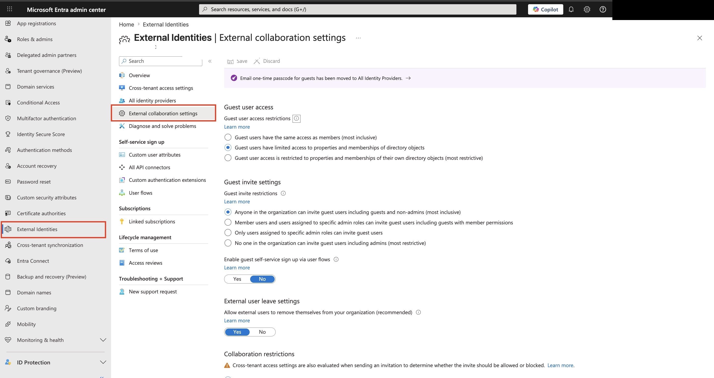
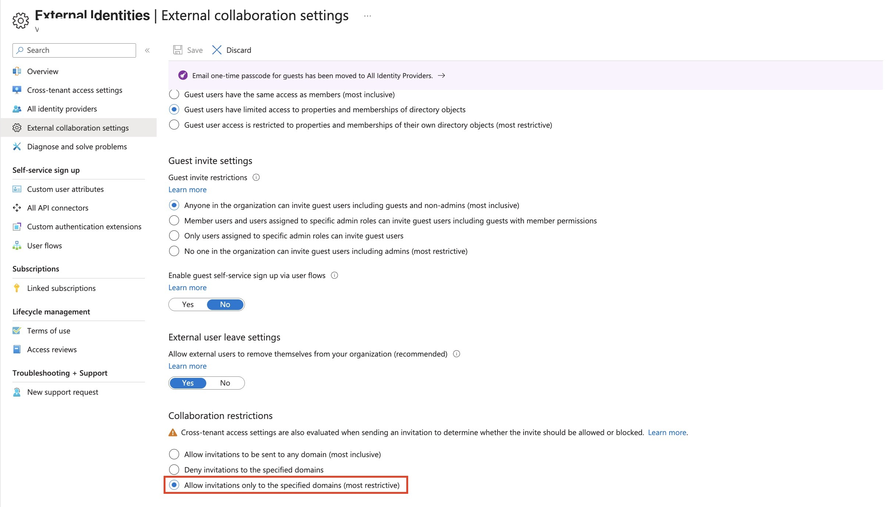
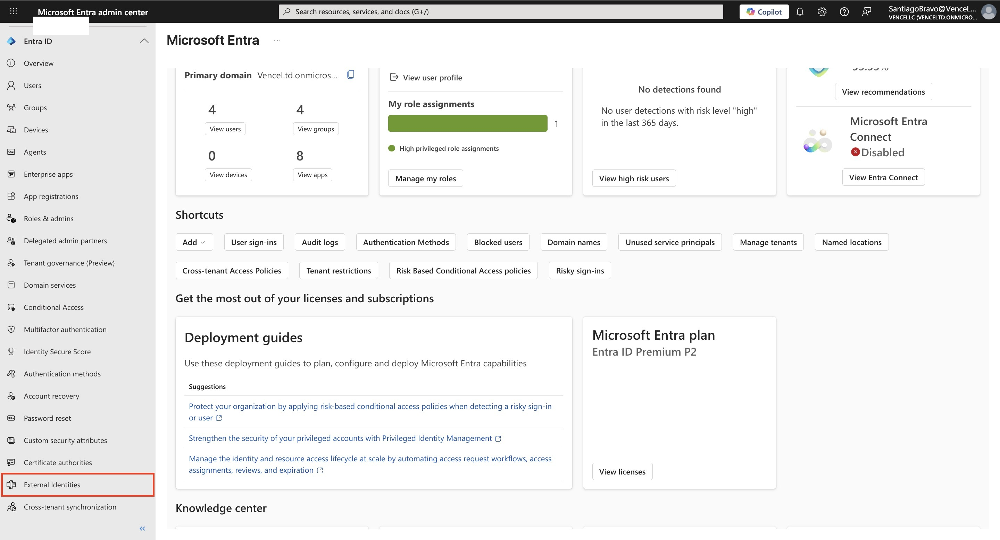
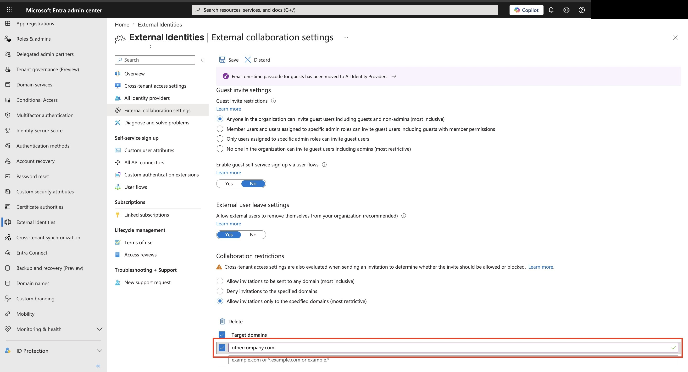
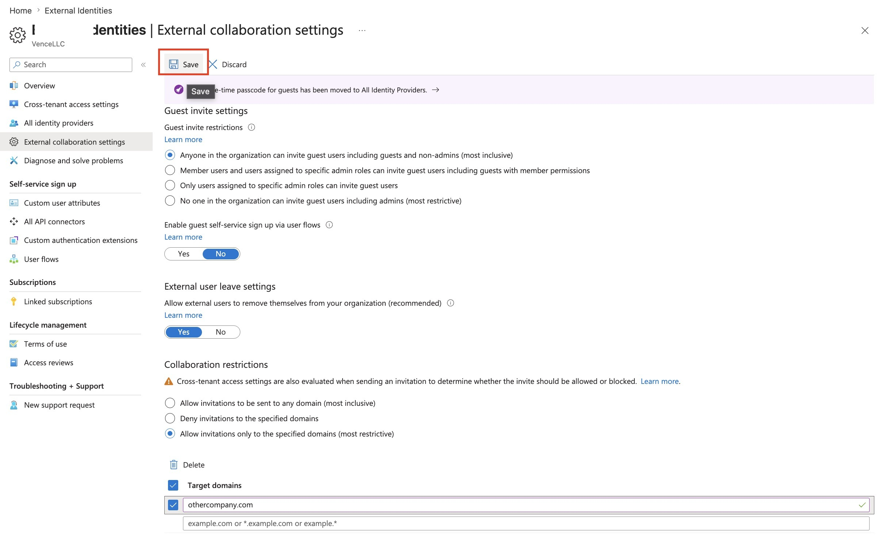

# Assignment 4: Configure External Collaboration Settings

## Objective

Configure Microsoft Entra **External collaboration settings** so guest invitations are allowed only for a specific trusted external domain.

## Scenario

An organization wants to collaborate with one approved partner company, but does not want users sending guest invitations to any random external domain. To reduce external access risk, the administrator configures a domain allow list and permits invitations only to `othercompany.com`.

## Portal Path

Microsoft Entra admin center → **Identity** → **External Identities** → **External collaboration settings**



The lab starts in the Microsoft Entra admin center. External collaboration controls are managed from **External Identities**, not from the regular Users blade.

## Prerequisites

- Permission to manage Microsoft Entra external collaboration settings.
- A lab tenant or approved test tenant.
- A trusted partner domain to use in the allow list.
- Change approval before modifying guest invitation settings in a production tenant.

## Configuration Summary

| Setting | Value used in lab | What it controls |
|---|---|---|
| Guest user access | Guest users have limited access to properties and memberships of directory objects | How much directory information guests can see |
| Guest invite restrictions | Anyone in the organization can invite guest users including guests and non-admins | Who is allowed to send guest invitations |
| Guest self-service sign-up via user flows | No | Whether guests can sign themselves up through user flows |
| External user leave settings | Yes | Whether external users can remove themselves from the organization |
| Collaboration restrictions | Allow invitations only to the specified domains | Which external domains can receive invitations |
| Target domain | `othercompany.com` | The approved external partner domain |

## Steps Performed

### 1. Open External Identities

From the Microsoft Entra admin center, open **External Identities**.


This is where Microsoft Entra B2B collaboration settings are managed, including guest access, invitation permissions, identity providers, and collaboration restrictions.

### 2. Open External Collaboration Settings

Select **External collaboration settings**.



This page controls tenant-wide behavior for guest collaboration. The settings affect how users invite external guests and which domains are allowed or blocked.

> **Exam Trap**
> External collaboration settings are tenant-level B2B settings. They are different from assigning an individual guest user to an app, group, or access package.

### 3. Choose the Most Restrictive Domain Option

Under **Collaboration restrictions**, select **Allow invitations only to the specified domains**.



This changes the tenant from a broad invitation model to an allow-list model. Only the domains explicitly listed under **Target domains** can receive guest invitations.

> **Memory Hook**
> **Who can invite?** = Guest invite restrictions.
> **Which domains can be invited?** = Collaboration restrictions.

### 4. Add the Approved Target Domain

Add the trusted partner domain under **Target domains**.



The lab used:

```text
othercompany.com
```

This means invitations can be sent only to users whose email domain matches the allowed partner domain.

> **Exam Trap**
> **Allow invitations only to specified domains** is an allow list. **Deny invitations to specified domains** is a block list. These are opposite designs.

### 5. Save the Setting

Select **Save** to apply the external collaboration setting.



Saving commits the tenant-wide collaboration restriction. Future guest invitations are evaluated against the configured target domain list.

## Validation

Validate the configuration by confirming:

- **External collaboration settings** is open under **External Identities**.
- **Allow invitations only to the specified domains** is selected.
- **Target domains** includes `othercompany.com`.
- A guest invitation to `user@othercompany.com` should be allowed.
- A guest invitation to an unlisted domain should be blocked or rejected.

Also remember that **cross-tenant access settings** can be evaluated when invitations are sent, so a domain allow list is not always the only control involved.

## Cleanup

If this was only a lab configuration:

1. Return to **External Identities → External collaboration settings**.
2. Remove the test target domain or restore the previous collaboration restriction setting.
3. Save the settings.
4. Confirm the tenant is back to its intended external collaboration policy.

## Exam Notes

| Topic | What to remember |
|---|---|
| External collaboration settings | Tenant-wide settings for Microsoft Entra B2B guest collaboration |
| Guest user access | Controls how much directory information guests can see |
| Guest invite restrictions | Controls who can invite guests |
| Collaboration restrictions | Controls which external domains can be invited |
| Allow invitations to any domain | Most inclusive option |
| Deny invitations to specified domains | Blocks listed domains but allows others |
| Allow invitations only to specified domains | Most restrictive domain allow-list option |
| Cross-tenant access settings | Can also affect whether external collaboration is allowed |
| Domain allow list | Useful for partner-only collaboration scenarios |

## Common Exam Traps

- Do not confuse **guest invite restrictions** with **collaboration restrictions**.
- Do not assume a domain allow list grants access to resources; it only controls whether invitations can be sent to that domain.
- Do not forget that users still need resource access after being invited, such as group, app, SharePoint, or Teams membership.
- Do not confuse External Identities settings with Conditional Access. Conditional Access can enforce sign-in controls, but this lab controls invitation domain restrictions.
- Do not overlook cross-tenant access settings. They can also influence whether collaboration with another tenant is allowed.

## Final Checklist

- [x] Opened **External Identities**.
- [x] Opened **External collaboration settings**.
- [x] Reviewed guest access and guest invitation behavior.
- [x] Selected **Allow invitations only to the specified domains**.
- [x] Added `othercompany.com` as the approved target domain.
- [x] Saved the configuration.
