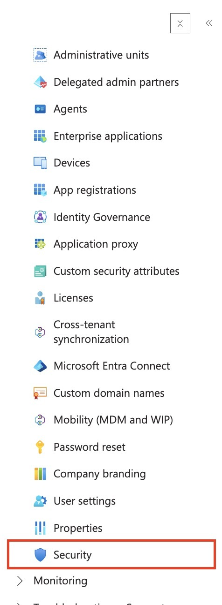
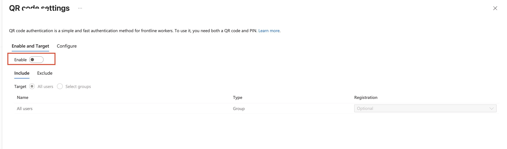
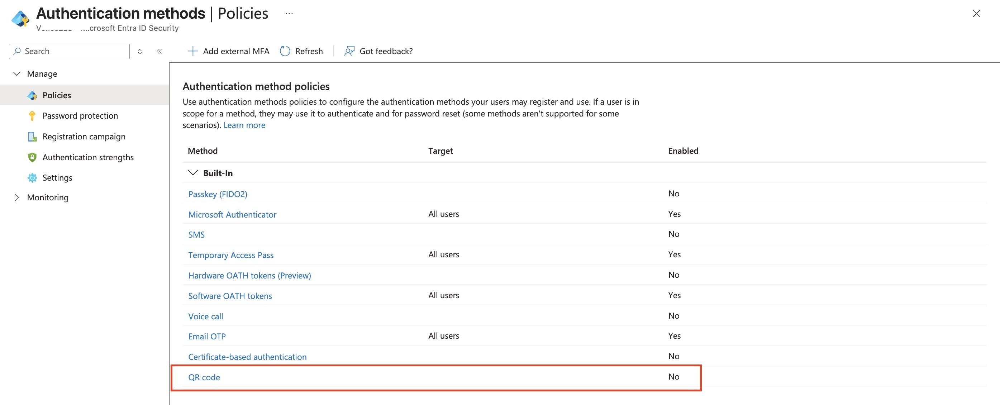
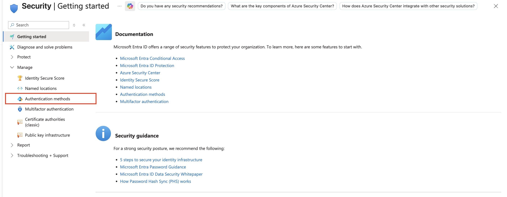
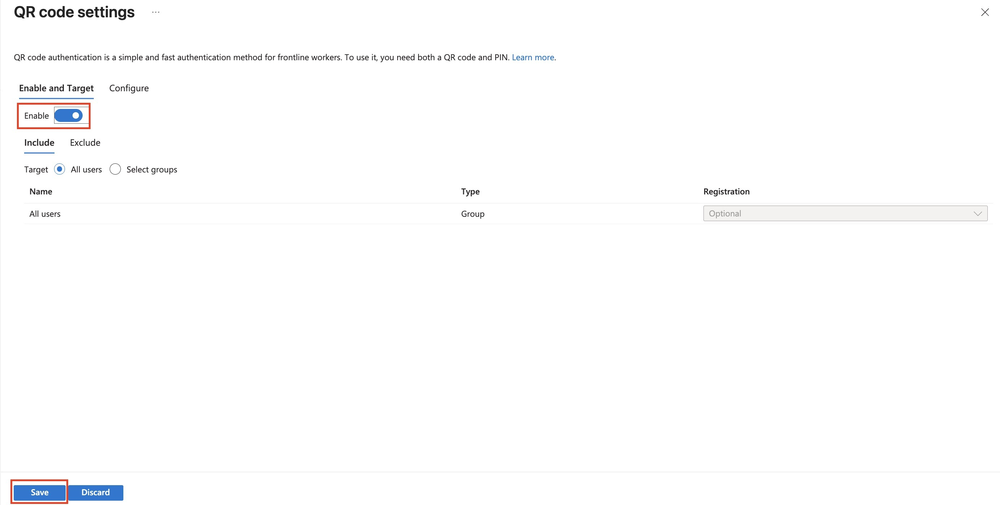
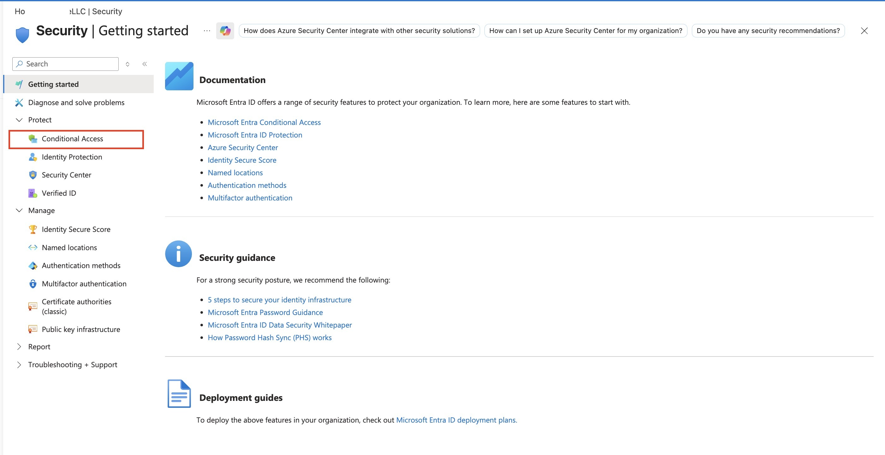
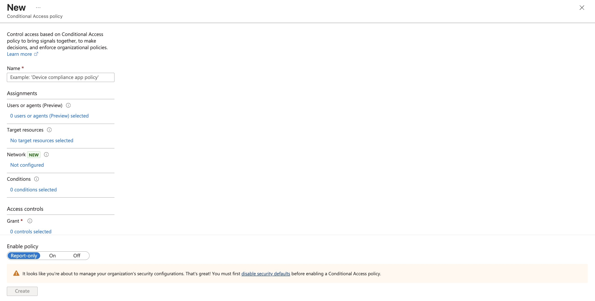
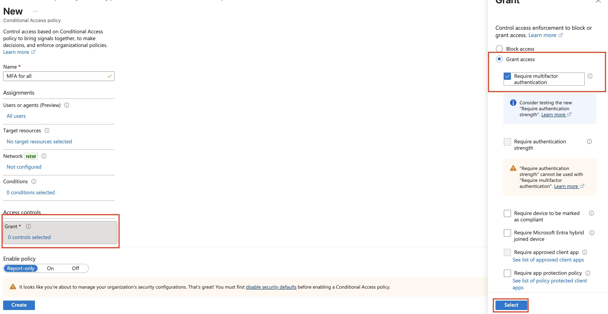
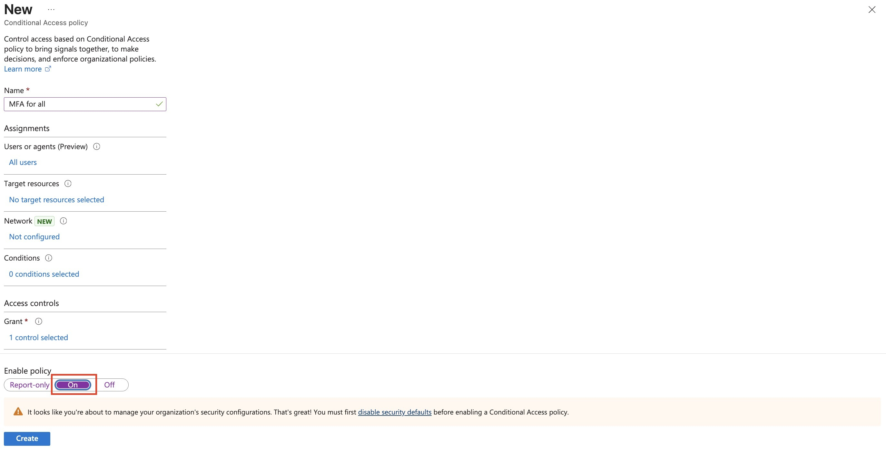
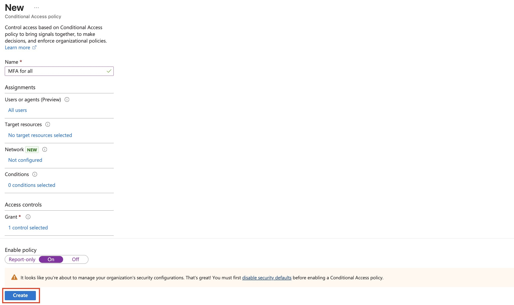

# Assignment 6: Enable QR Code Support and Require MFA with Conditional Access

## Objective

Enable the **QR code** authentication method in Microsoft Entra and create a Conditional Access policy named **MFA for all** that requires multifactor authentication for users.

## Scenario

An organization wants to support QR code authentication for frontline-style sign-in scenarios and also require MFA through Conditional Access. The lab demonstrates two separate controls:

- Authentication method policy: enables QR code authentication.
- Conditional Access policy: requires MFA during sign-in.

## Portal Paths

QR code authentication:

Microsoft Entra admin center -> **Identity** -> **Protection** -> **Authentication methods** -> **Policies** -> **QR code**

Conditional Access:

Microsoft Entra admin center -> **Identity** -> **Protection** -> **Conditional Access** -> **Policies** -> **New policy**

## Prerequisites

- Permission to manage authentication methods and Conditional Access policies.
- A tenant with Conditional Access available.
- Security defaults must be disabled before enforcing Conditional Access policies.
- A planned break-glass or emergency access account strategy before applying broad MFA policies.

## Configuration Summary

| Area | Setting | Value used in lab | Notes |
|---|---|---|---|
| Authentication method | QR code | Enabled | QR code auth requires both a QR code and PIN |
| QR code target | Include | All users | Broad lab scope |
| Conditional Access policy | Name | `MFA for all` | Clear purpose-based naming |
| Users or agents | Include | All users | Broad policy targeting |
| Grant control | Grant access | Require multifactor authentication | User must satisfy MFA |
| Policy state | Enable policy | On | Enforces policy when all conditions match |

> **Evidence Note**
> The Conditional Access screenshots show **No target resources selected**. In a real working policy, select the cloud apps, user actions, or authentication context the policy should apply to. For a broad MFA policy, admins often target **All cloud apps**, with carefully planned exclusions.

## Steps Performed

### 1. Open Security

From the Microsoft Entra navigation menu, open **Security**.

This is the starting area for identity protection, authentication methods, Conditional Access, and related security controls.

### 2. Open Authentication Methods

Under **Security -> Manage**, select **Authentication methods**.

Authentication method policies control which sign-in methods users can register and use.

### 3. Select the QR Code Method

In **Authentication method policies**, select **QR code**.

The QR code method appears as disabled before configuration.

### 4. Review the Disabled QR Code Setting

The QR code settings page initially shows **Enable** turned off.

QR code authentication is described as a fast authentication method for frontline workers. It requires both a QR code and PIN, so the QR code alone is not the entire credential.

### 5. Enable QR Code Authentication

Turn **Enable** on, target **All users**, and select **Save**.

This enables QR code authentication for the selected target population.

> **Exam Trap**
> Enabling an authentication method does not automatically force users to use it. It only makes that method available to the targeted users.

### 6. Open Conditional Access

Return to **Security** and open **Conditional Access**.

Conditional Access is where Entra evaluates signals and enforces access controls such as requiring MFA.

### 7. Target All Users

Create a new Conditional Access policy named **MFA for all** and set **Users or agents** to **All users**.

The policy targets every user in the tenant.

> **Exam Trap**
> Targeting **All users** can lock out administrators if the policy is misconfigured. In production, use report-only first, test with a pilot group, and exclude emergency access accounts.

### 8. Require MFA in Grant Controls

Under **Grant**, choose **Grant access** and select **Require multifactor authentication**.

This means access is allowed only after the user satisfies MFA.

> **Exam Trap**
> **Require multifactor authentication** and **Require authentication strength** are related but not the same control. The screenshot also shows they cannot be selected together in that blade.

### 9. Turn the Policy On

Set **Enable policy** to **On**.

The portal warns that security defaults must be disabled before a Conditional Access policy can be enabled.

### 10. Create the Policy

Select **Create** to finish the Conditional Access policy.

After creation, the policy exists in Conditional Access and enforces the configured grant control when its assignments and target resources match.

## Validation

Validate the configuration by checking:

- **Authentication methods -> Policies -> QR code** shows the method enabled.
- The QR code method targets the intended users or groups.
- **Conditional Access -> Policies** shows the policy named **MFA for all**.
- The policy includes **All users**.
- The grant control shows **Require multifactor authentication**.
- The policy state is **On** if the lab requires enforcement.
- Target resources are configured before relying on the policy in a real environment.

For a production-style validation, use:

- **Report-only** mode first.
- The Conditional Access **What If** tool.
- Sign-in logs to confirm whether the policy applied and whether MFA was required.

## Cleanup

If this was only a lab:

1. Open **Conditional Access -> Policies**.
2. Disable or delete the **MFA for all** policy.
3. Open **Authentication methods -> Policies -> QR code**.
4. Disable QR code authentication or narrow it back to the intended test group.
5. Confirm no broad test policy remains active.

## Exam Notes

| Topic | What to remember |
|---|---|
| QR code authentication | Authentication method intended for fast/frontline-style sign-in scenarios |
| QR code + PIN | QR code authentication requires both pieces |
| Authentication methods policy | Controls which methods users can register and use |
| Conditional Access | Enforces access decisions during sign-in |
| Require MFA | Grant control that allows access only after MFA is satisfied |
| All users | Powerful but risky broad assignment |
| Security defaults | Must be disabled before using Conditional Access enforcement |
| Report-only | Safer testing mode before enforcement |
| Break-glass account | Should not be blocked by broad MFA policy mistakes |
| Target resources | Determines which apps/actions/resources the policy applies to |

## Common Exam Traps

- Do not confuse **enabling an authentication method** with **requiring that method**.
- Do not assume QR code authentication is the same thing as MFA enforcement.
- Do not create broad **All users** Conditional Access policies without planning exclusions.
- Do not forget target resources in Conditional Access.
- Do not forget that security defaults and Conditional Access enforcement are not meant to be used together.
- Do not confuse **Require MFA** with **authentication strength**.

## Memory Hook

**Method policy = what users may use.**

**Conditional Access = what users must do to get access.**

## Final Checklist

- [x] Opened **Security**.
- [x] Opened **Authentication methods**.
- [x] Selected **QR code**.
- [x] Enabled QR code authentication.
- [x] Targeted all users in the lab.
- [x] Opened **Conditional Access**.
- [x] Created the **MFA for all** policy.
- [x] Targeted all users.
- [x] Selected **Require multifactor authentication**.
- [x] Turned the policy **On**.
- [x] Created the policy.
