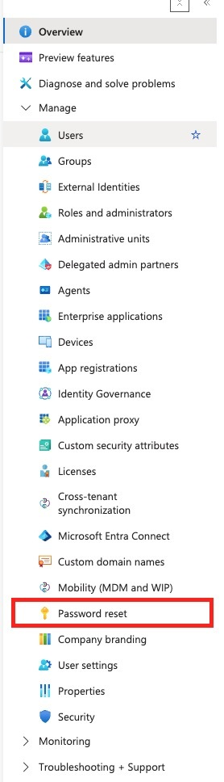
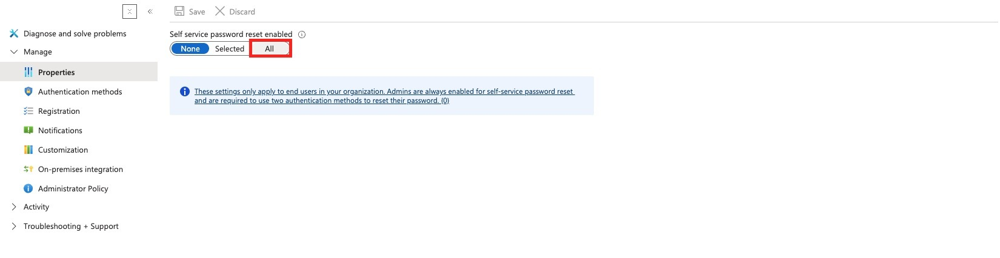
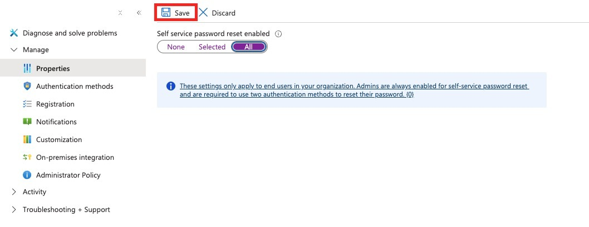
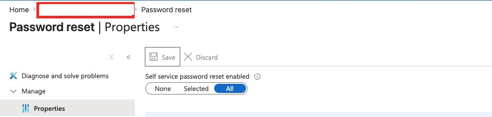
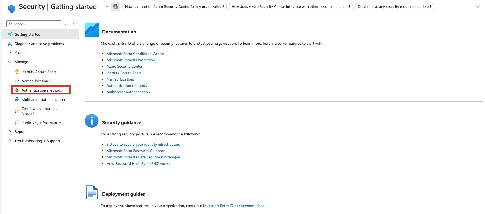
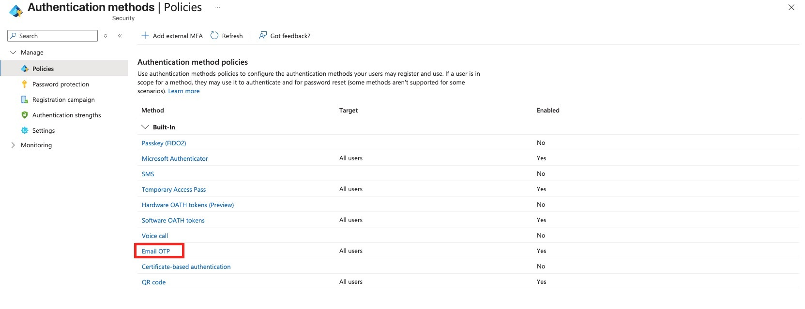
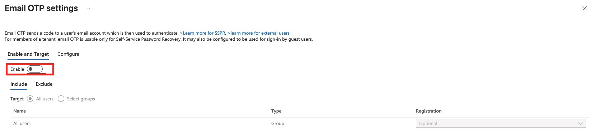
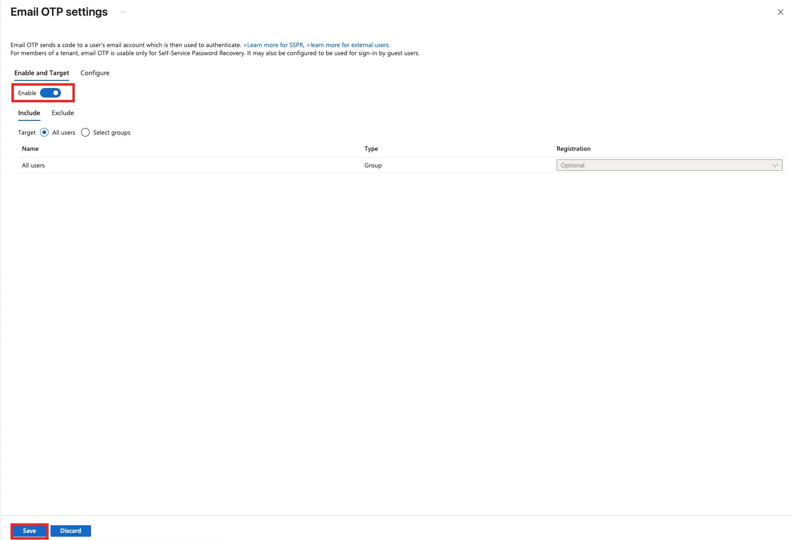

# Assignment 7: Enable SSPR and Email OTP Authentication Method

## Objective

Enable **Self-Service Password Reset (SSPR)** for all users and enable **Email OTP** as a supported authentication method.

## Scenario

The organization wants users to reset their own passwords instead of relying on the helpdesk for every reset. The lab also enables Email OTP so users can verify with a code sent to email where supported.

This assignment demonstrates two related but separate controls:

- Password reset properties: controls **who can use SSPR**.
- Authentication method policies: controls **which authentication methods users may register and use**.

## Portal Paths

Self-Service Password Reset:

Microsoft Entra admin center -> **Identity** -> **Password reset** -> **Properties**

Email OTP:

Microsoft Entra admin center -> **Identity** -> **Protection** -> **Authentication methods** -> **Policies** -> **Email OTP**

## Prerequisites

- Permission to manage password reset and authentication method settings.
- A test tenant or lab environment.
- A communication plan if enabling SSPR broadly in production.
- A pilot group is recommended before enabling for all users in a real tenant.

## Configuration Summary

| Area | Setting | Value used in lab | Notes |
|---|---|---|---|
| Password reset | Self service password reset enabled | All | Enables SSPR for all users |
| Authentication method | Email OTP | Enabled | Allows email one-time passcode where supported |
| Email OTP target | Include | All users | Broad lab scope |
| Registration | Email OTP registration | Optional | Users are not forced to register immediately |

## Steps Performed

### 1. Open Password Reset

From the Microsoft Entra navigation menu, select **Password reset**.

This is where SSPR is configured for the tenant.

### 2. Enable SSPR for All Users

On **Password reset -> Properties**, set **Self service password reset enabled** to **All**.

This allows all end users in the organization to use SSPR.

> **Exam Trap**
> Enabling SSPR for users does not mean users have already registered the required authentication methods. Registration settings and authentication method availability still matter.

### 3. Save the SSPR Setting

Select **Save** to apply the SSPR scope change.

If you leave the page without saving, the setting is not applied.

### 4. Confirm SSPR Is Enabled

Confirm the **All** option remains selected under **Self service password reset enabled**.

The saved configuration confirms that SSPR is now enabled for the selected scope.

### 5. Open Security

Return to the main Microsoft Entra navigation and open **Security**.

Security contains the authentication method policies used by SSPR and other sign-in scenarios.

### 6. Open Authentication Methods

Under **Security -> Manage**, select **Authentication methods**.

Authentication method policies define which methods are enabled, who can use them, and whether registration is required.

### 7. Select Email OTP

In the list of built-in authentication method policies, select **Email OTP**.

Email OTP appears as one of the available built-in authentication methods.

### 8. Review the Disabled Email OTP Setting

The Email OTP settings page initially shows **Enable** turned off.

The portal note explains that Email OTP sends a code to a user's email account. For tenant members, it is usable only for Self-Service Password Recovery, and it may also be configured for guest sign-in scenarios.

### 9. Enable Email OTP and Save

Turn **Enable** on, target **All users**, leave registration as **Optional**, and select **Save**.

This enables Email OTP for the selected users.

> **Exam Trap**
> Email OTP is an authentication method policy setting. SSPR enablement is configured separately under **Password reset -> Properties**. The exam may test that separation.

## Validation

Validate the configuration by checking:

- **Password reset -> Properties** shows SSPR enabled for **All** users.
- **Authentication methods -> Policies -> Email OTP** shows Email OTP enabled.
- Email OTP targets the intended users or groups.
- Registration is set to the intended value.
- A test user can complete the expected password reset flow.

For production-style validation, also review:

- user registration details
- audit logs
- sign-in or password reset activity
- helpdesk tickets after rollout

## Cleanup

If this was only a lab:

1. Open **Password reset -> Properties**.
2. Change SSPR back to **None** or **Selected** if broad enablement is no longer needed.
3. Open **Authentication methods -> Policies -> Email OTP**.
4. Disable Email OTP or narrow the target to a test group.
5. Save the updated settings.

## Exam Notes

| Topic | What to remember |
|---|---|
| SSPR | Lets users reset their own passwords |
| Password reset properties | Controls who can use SSPR: None, Selected, or All |
| Admin behavior | Admins are enabled for SSPR and require two methods for reset |
| Authentication methods | Controls which methods users may register and use |
| Email OTP | Sends a one-time code to an email account |
| Email OTP for members | Usable for Self-Service Password Recovery in this context |
| Email OTP for guests | May also be configured for guest sign-in scenarios |
| Registration optional | Method is available but not forced immediately |
| Save button | Required after changing either SSPR or Email OTP settings |

## Common Exam Traps

- Do not confuse **SSPR enablement** with **MFA enforcement**.
- Do not assume enabling Email OTP means all users are forced to use it.
- Do not forget that **Password reset** and **Authentication methods** are separate configuration areas.
- Do not assume users can reset passwords successfully if they have not registered enough usable methods.
- Do not roll out **All users** in production without testing and communications.
- Do not forget to save after changing SSPR or authentication method settings.

## Memory Hook

**Password reset Properties = who can use SSPR.**

**Authentication methods = what methods users may use.**

## Final Checklist

- [x] Opened **Password reset**.
- [x] Set SSPR to **All**.
- [x] Saved the SSPR setting.
- [x] Confirmed SSPR remained enabled for all users.
- [x] Opened **Security**.
- [x] Opened **Authentication methods**.
- [x] Selected **Email OTP**.
- [x] Enabled Email OTP.
- [x] Targeted all users in the lab.
- [x] Saved the Email OTP setting.
