# Assignment 8: Create a Conditional Access Policy to Block High-Risk Android Access

## Objective

Create a **Conditional Access** policy that blocks access when a sign-in matches this risk pattern:

- user is included in the policy
- target resource is included
- user risk is **High**
- sign-in risk is **High**
- device platform is **Android**

## Scenario

The organization wants to stop high-risk Android access attempts from reaching cloud resources. In this lab, the policy is intentionally broad so the configuration is easy to see: it targets all users and all resources, then blocks access when the risk and platform conditions match.

In a production tenant, this type of policy should be tested carefully, scoped to a pilot group first, and designed with emergency access account exclusions.

## Portal Path

Microsoft Entra admin center -> **Identity** -> **Protection** -> **Conditional Access** -> **Create new policy**

## Prerequisites

- Permission to create Conditional Access policies.
- Microsoft Entra ID P2 or equivalent licensing for risk-based conditions.
- Security defaults must be disabled before enforcing Conditional Access policies.
- At least one emergency access account should be excluded from broad blocking policies.
- A test tenant or lab environment is strongly recommended.

## Configuration Summary

| Area | Setting | Value used in lab | Notes |
|---|---|---|---|
| Policy name | Name | Block Android if High Risk | Clear name showing platform and condition |
| Assignments | Users or agents | All users | Lab scope; production should use careful exclusions |
| Target resources | Resources | All resources | Formerly shown as all cloud apps |
| Conditions | User risk | High | Account-level risk |
| Conditions | Sign-in risk | High | Specific authentication attempt risk |
| Conditions | Device platform | Android | Applies only to Android sign-ins |
| Grant control | Access control | Block access | Most restrictive result |
| Policy state | Enable policy | On | Enforces the policy |
| Lockout protection | Current admin | Excluded | Prevents the current admin from being locked out |

## Steps Performed

### 1. Open Security

From the Microsoft Entra navigation menu, open **Security**.

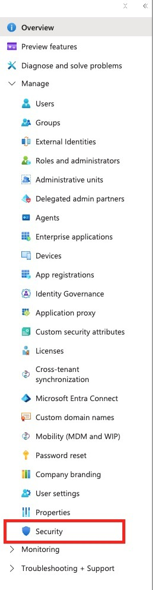

Security contains protection features such as Conditional Access, Identity Protection, and authentication methods.

### 2. Open Conditional Access

Under **Security -> Protect**, select **Conditional Access**.

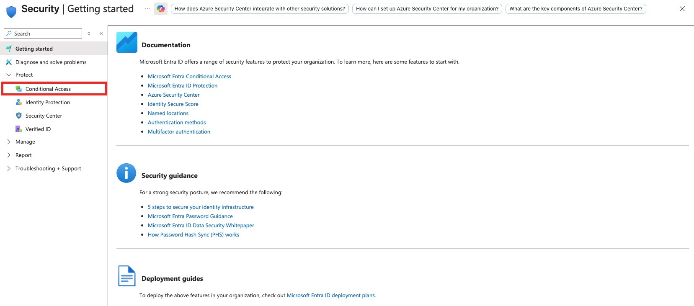

Conditional Access is where policies are created to combine identity, device, app, location, and risk signals.

### 3. Create a New Policy

On the Conditional Access overview page, select **Create new policy**.

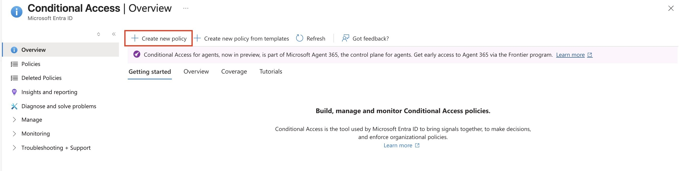

This opens the policy builder where assignments, conditions, grant controls, and policy state are configured.

### 4. Include All Users

Under **Assignments -> Users or agents**, select **All users**.

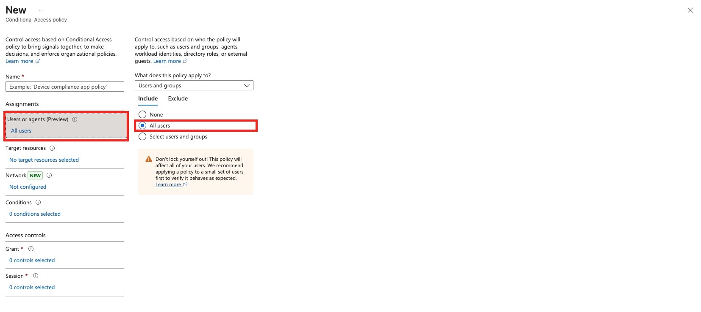

This makes the policy apply to every user in the tenant unless an exclusion is configured.

> **Exam Trap**
> **All users** includes administrators. Broad policies should exclude emergency access accounts and should usually be tested before enforcement.

### 5. Target All Resources

Under **Target resources**, select **All resources**, formerly labeled **All cloud apps**.

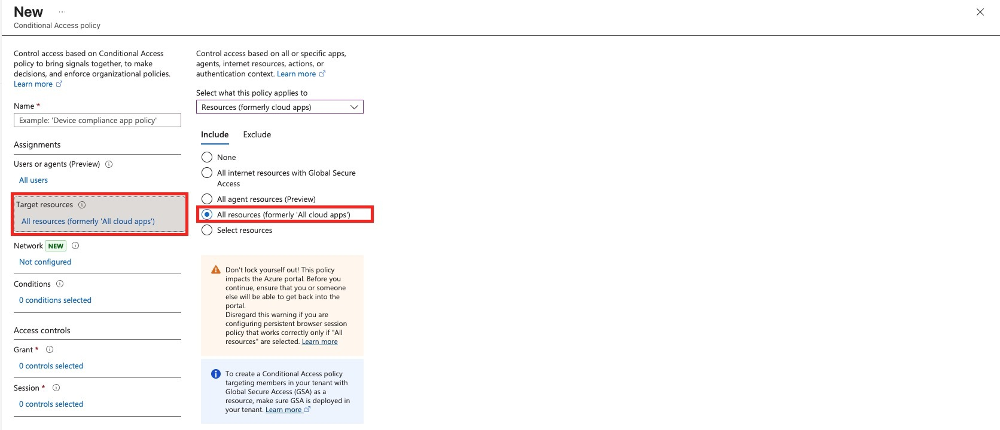

This means the policy can apply to any protected cloud resource when the other conditions match.

### 6. Configure User Risk

Under **Conditions -> User risk**, enable the condition and select **High**.

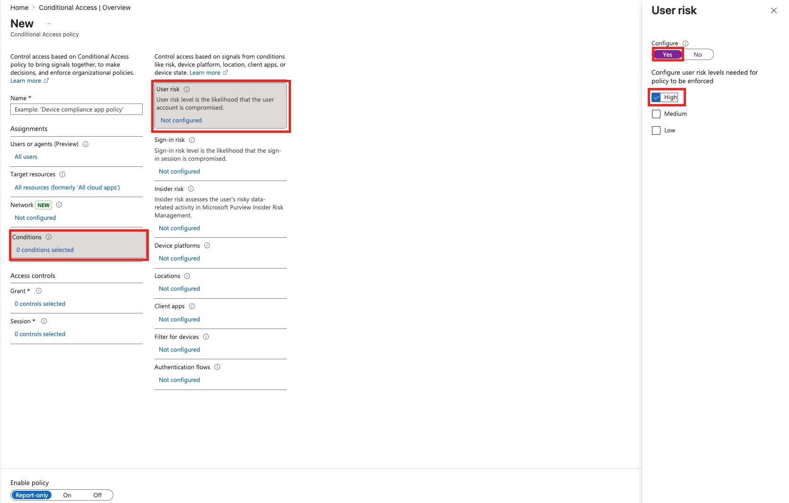

User risk represents the likelihood that the user account itself is compromised.

### 7. Configure Sign-In Risk

Under **Conditions -> Sign-in risk**, enable the condition and select **High**.

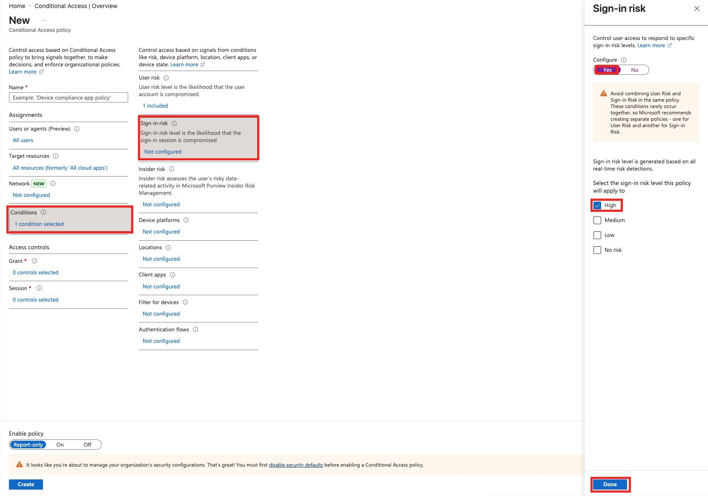

Sign-in risk represents the likelihood that a specific sign-in attempt is suspicious.

> **Exam Trap**
> User risk and sign-in risk are different. User risk is about the account. Sign-in risk is about a specific authentication event.

> **Exam Trap**
> The portal warns that user risk and sign-in risk should usually be handled in separate policies. This lab combines them because the assignment specifically asks for that configuration.

### 8. Configure Android as the Device Platform

Under **Conditions -> Device platforms**, enable the condition, choose **Select device platforms**, select **Android**, and click **Done**.

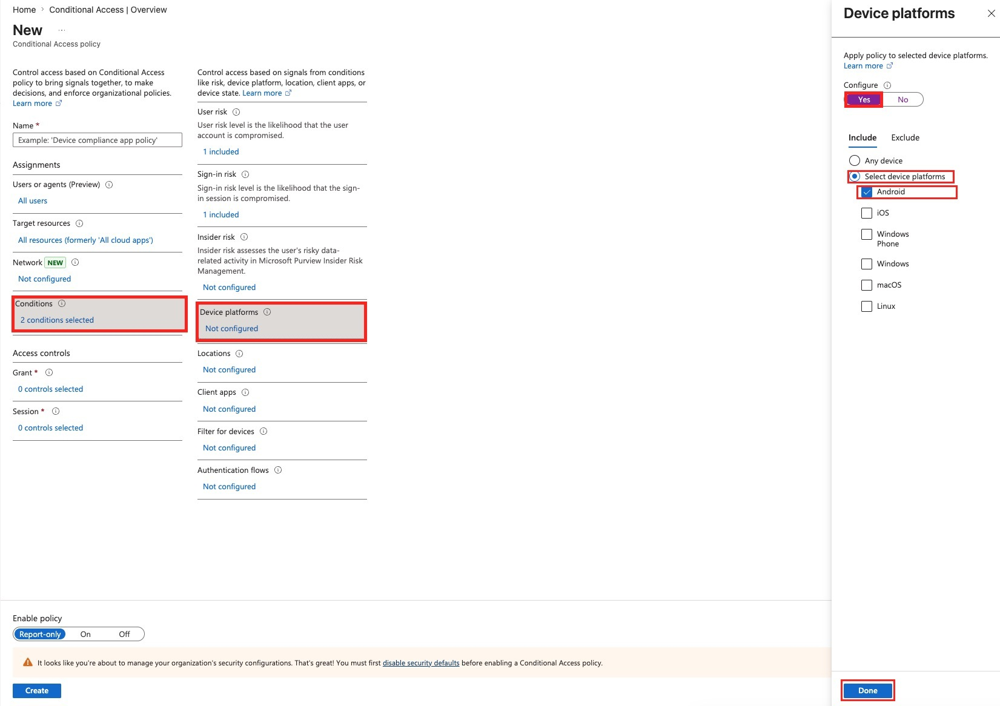

This limits the policy condition to Android device sign-ins.

> **Exam Trap**
> Device platform is not the same as device compliance. If the requirement says **Android**, use **Device platforms**. If the requirement says **compliant device**, use a grant control such as **Require device to be marked as compliant**.

### 9. Select Block Access

Under **Access controls -> Grant**, select **Block access**, then click **Select**.

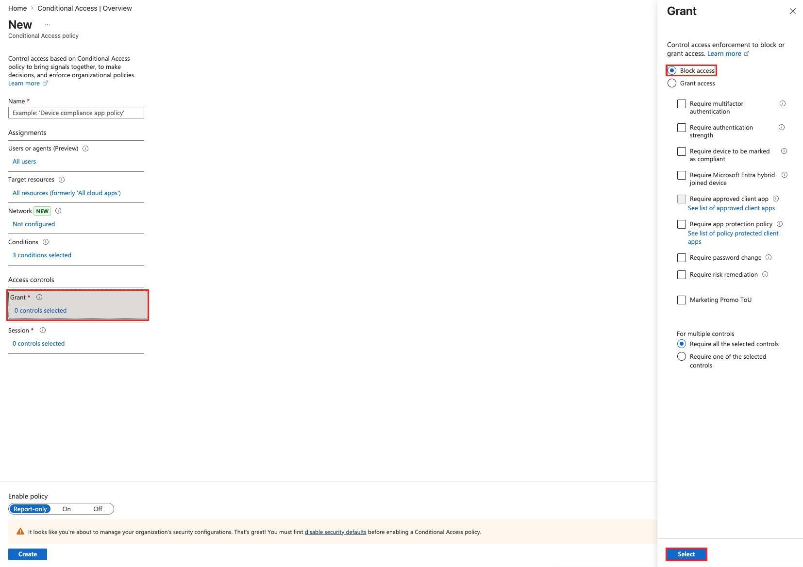

Block access is the most restrictive Conditional Access decision.

### 10. Review the Lockout Warning

Review the warning about broad policy scope and keep the current administrator excluded from the policy.

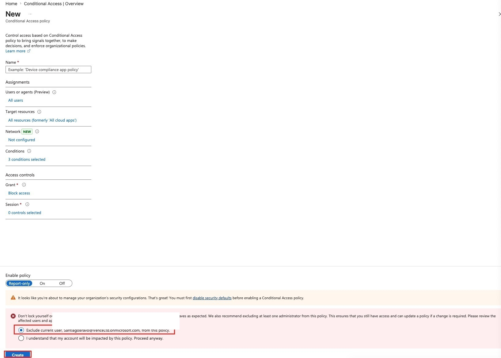

This protects the lab admin from being locked out while still allowing the policy to target the intended broad scope.

### 11. Name, Enable, and Create the Policy

Enter the policy name **Block Android if High Risk**, set **Enable policy** to **On**, and select **Create**.

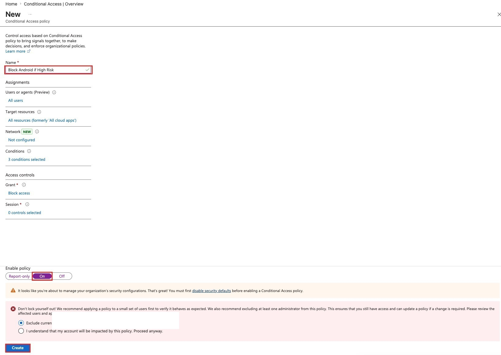

The policy is now configured to block high-risk Android access attempts.

## Validation

Validate the configuration by checking:

- The policy exists with the name **Block Android if High Risk**.
- **Users or agents** shows **All users**.
- **Target resources** shows **All resources**.
- **Conditions** shows three configured conditions:
  - user risk = High
  - sign-in risk = High
  - device platform = Android
- **Grant** shows **Block access**.
- **Enable policy** is set to **On**.
- The current admin or emergency access account is excluded from the broad policy.

For deeper testing, use:

- **Conditional Access -> What If** to simulate policy matching.
- **Sign-in logs** to confirm Conditional Access results after test sign-ins.
- **Report-only** mode in production before turning a policy on.

## Cleanup

If this was only a lab:

1. Open **Conditional Access -> Policies**.
2. Select **Block Android if High Risk**.
3. Set the policy to **Off** or delete it.
4. Confirm no production users are being blocked unexpectedly.
5. Re-enable any lab-only settings that were temporarily changed.

## Exam Notes

| Topic | What to remember |
|---|---|
| Conditional Access | Uses signals to make access decisions |
| User risk | Account-level compromise risk |
| Sign-in risk | Risk for a specific sign-in attempt |
| Device platform | Filters by platform such as Android, iOS, Windows, macOS, or Linux |
| Target resources | Defines what apps/resources the policy protects |
| Grant controls | Defines what happens: block, require MFA, require compliant device, and more |
| Block access | Most restrictive grant control |
| Report-only | Best practice for testing impact before enforcement |
| Security defaults | Must be disabled before Conditional Access enforcement |
| Emergency access | Broad policies should exclude break-glass accounts |

## Common Exam Traps

- Do not confuse **user risk** with **sign-in risk**.
- Do not confuse **device platform** with **device compliance**.
- Do not forget to configure **target resources**.
- Do not assume **All users** excludes administrators.
- Do not turn on broad blocking policies without exclusions.
- Do not forget that risk-based Conditional Access requires the right licensing.
- Do not forget that security defaults can block Conditional Access policy enforcement.
- Do not assume adding conditions is enough; the **Grant** action must be configured.
- Do not forget that **Report-only** tests impact but does not enforce.

## Memory Hook

**Signals:** all users + all resources + high risk + Android.

**Decision:** block access.

**Enforcement:** turn the policy on.

## Final Checklist

- [x] Opened **Security**.
- [x] Opened **Conditional Access**.
- [x] Created a new policy.
- [x] Included **All users**.
- [x] Targeted **All resources**.
- [x] Set **User risk** to **High**.
- [x] Set **Sign-in risk** to **High**.
- [x] Selected **Android** as the device platform.
- [x] Set **Grant** to **Block access**.
- [x] Reviewed lockout warning.
- [x] Excluded the current admin from the broad policy.
- [x] Named the policy **Block Android if High Risk**.
- [x] Set the policy to **On**.
- [x] Created the policy.
