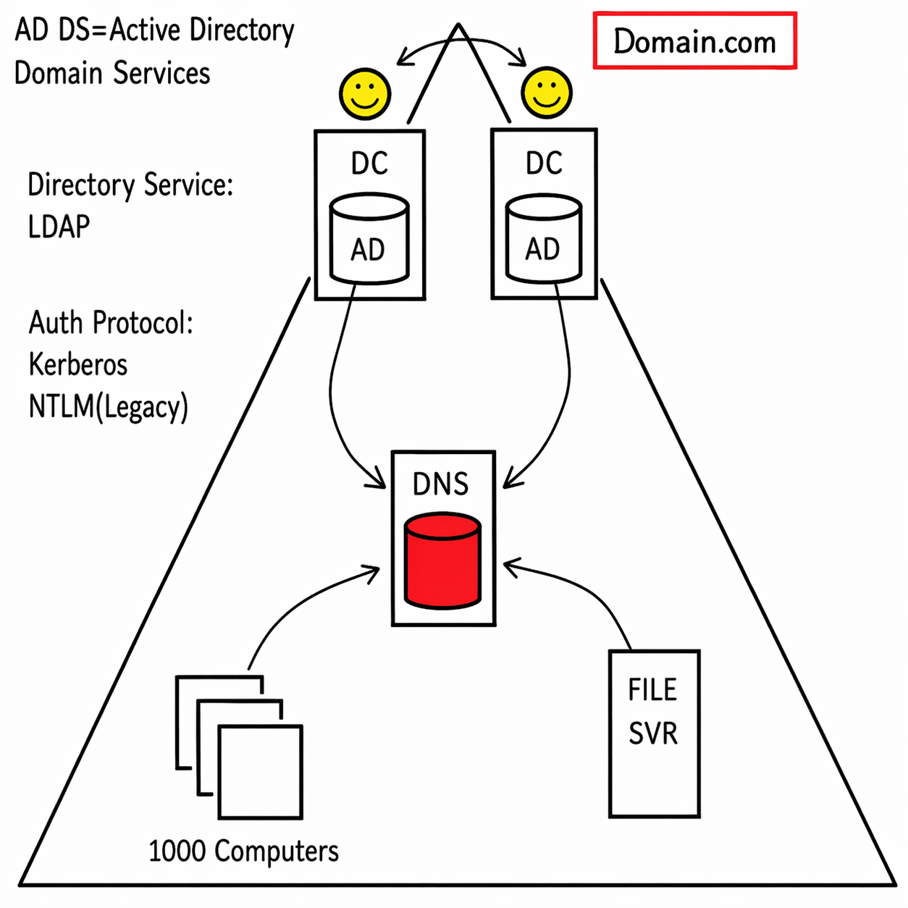
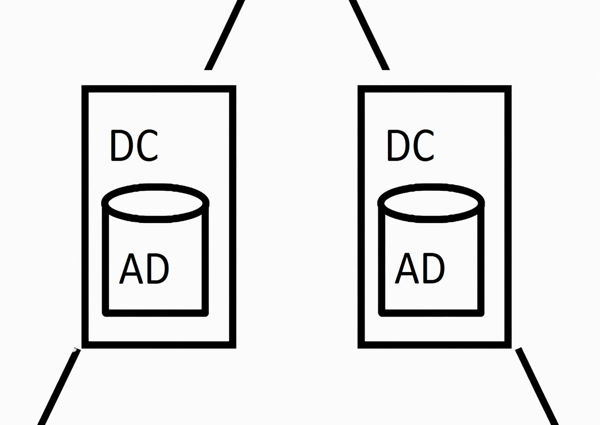
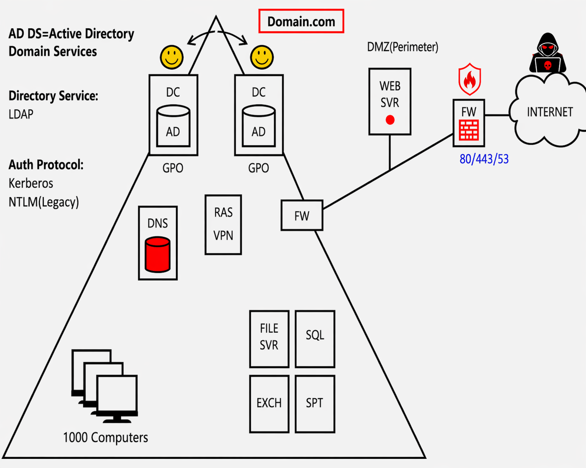
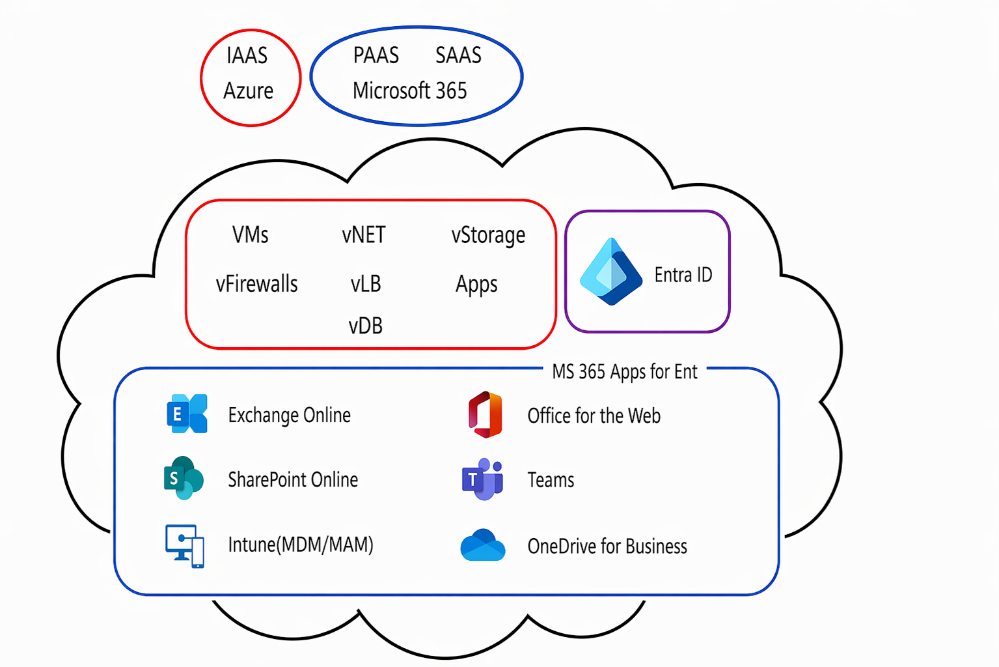

# Section 1: Introduction

Section 1 establishes the foundation for the rest of the SC-300 study guide. It introduces the Microsoft cloud environment, identity terminology, Active Directory fundamentals, remote access concepts, lab setup expectations, and the course workflow used for assignments and later documentation.

> [!NOTE]
> This is a foundation section. It introduces the cloud, identity, networking, lab setup, and course workflow concepts needed for later SC-300 topics. Key terms link to the [SC-300 glossary](../00-front-matter/glossary.md) on first meaningful use.

## 1. Welcome Video

### Core idea

The opening lesson sets expectations for how to approach the SC-300 material. The focus is not only on memorizing exam terms, but on understanding how Microsoft identity services behave in real administrative environments.

### What to know

- Expect a mix of conceptual explanations, diagrams, hands-on demonstrations, simulations, and exam-objective alignment.
- Treat the early lessons as orientation material. They explain the background that later identity, access, governance, and application topics build on.
- The course uses practical examples to connect cloud identity features to the older on-premises technologies many organizations still run.

> [!TIP]
> Memory hook: Section 1 is the runway. Later sections are easier when the cloud, identity, networking, and lab vocabulary already feel familiar.

## 2. Understanding the Microsoft 365 and Azure Environment

### Core idea

Microsoft cloud administration is built around several connected services. [Azure](../00-front-matter/glossary.md#azure) provides cloud infrastructure and platform services, [Microsoft 365](../00-front-matter/glossary.md#microsoft-365) provides productivity and collaboration services, and [Microsoft Entra ID](../00-front-matter/glossary.md#microsoft-entra-id) provides the shared identity layer used by both.

### What to know

- Azure and Microsoft 365 are separate service families, but they are not isolated from each other.
- Microsoft Entra ID is the cloud identity provider behind Microsoft 365 sign-ins and many Azure management experiences.
- User accounts, groups, roles, authentication methods, and access policies become recurring themes throughout SC-300.

### Key concepts

| Service area | Primary role | Identity relationship |
|---|---|---|
| Azure | Cloud infrastructure, platforms, applications, networking, and management services | Uses Microsoft Entra ID for authentication and access control |
| Microsoft 365 | Productivity, collaboration, email, files, Teams, and device/app management experiences | Uses Microsoft Entra ID as its directory and sign-in system |
| Microsoft Entra ID | Cloud identity and access management | Provides users, groups, roles, authentication, app access, and policy enforcement |

> [!WARNING]
> Exam trap: Microsoft 365, Azure, and Microsoft Entra ID are related, but they are not the same product. Entra ID is the identity layer that supports access to cloud services.

## 3. A Solid Foundation of Active Directory Domains

### Core idea

Modern Microsoft identity administration grew out of [Active Directory Domain Services](../00-front-matter/glossary.md#active-directory-domain-services) (AD DS). Even though SC-300 focuses on Microsoft Entra ID, many organizations still use AD DS on-premises and connect it to the cloud through [hybrid identity](../00-front-matter/glossary.md#hybrid-identity).

### Why Active Directory mattered

Before centralized directory services, administrators often managed computers individually. That approach did not scale well because each computer could have separate users, passwords, settings, and file-sharing rules. Active Directory introduced centralized identity, device management, authentication, and policy enforcement for Windows-based enterprise environments.

### What to know

- AD DS stores enterprise identity and configuration data such as users, computers, groups, and policies.
- A [domain controller](../00-front-matter/glossary.md#domain-controller) is a server that runs AD DS and stores a copy of the directory database.
- [Domains](../00-front-matter/glossary.md#domain) provide a logical boundary for centralized identity and device management.
- Multiple domain controllers improve redundancy, distribute authentication load, and replicate directory changes.
- [Kerberos](../00-front-matter/glossary.md#kerberos) is the primary modern AD authentication protocol; [NTLM](../00-front-matter/glossary.md#ntlm) exists for legacy compatibility.
- [LDAP](../00-front-matter/glossary.md#ldap) is used to query and access directory information.

### Key concepts

| Concept | Study-guide meaning |
|---|---|
| AD DS | The on-premises Microsoft directory service used to store and manage users, computers, groups, and policies |
| Domain Controller | A server running AD DS that authenticates users and stores a copy of the directory database |
| Domain | A logical identity and management boundary, often aligned to an organization's DNS namespace |
| Kerberos | The primary authentication protocol used in modern Active Directory domains |
| NTLM | A legacy authentication protocol still seen in older compatibility scenarios |
| LDAP | A directory access protocol used by services and applications to query directory data |
| DNS | The name-resolution system AD relies on to locate domain controllers and services |
| GPO | Group Policy Object; a centralized way to apply configuration and security settings to domain-joined systems |

### Domain Controllers

Domain controllers make centralized authentication possible. When a user signs in to a domain-joined computer, the client locates a domain controller, authenticates the user, and receives access based on domain identity and policy.

Multiple domain controllers are deployed so the environment can survive failures and handle authentication demand. When a change is made on one domain controller, replication distributes that change to other domain controllers.

### DNS in Active Directory

[DNS](../00-front-matter/glossary.md#dns) is not optional in an Active Directory environment. Domain-joined systems rely on DNS to locate domain controllers and other internal services. If DNS is broken, authentication and service discovery can fail even if the domain controllers themselves are online.

### Group Policy Objects

[Group Policy Objects](../00-front-matter/glossary.md#group-policy-object) allow administrators to enforce configuration at scale. Common examples include password rules, firewall settings, lock-screen behavior, software deployment, device restrictions, and other security baselines.

> [!WARNING]
> Exam trap: In AD DS, authentication problems are often DNS problems first. If clients cannot locate domain controllers through DNS, domain sign-in and service discovery can break.

> [!TIP]
> Memory hook: AD DS centralizes who users are, where services live, how authentication works, and what configuration applies.

## 4. A Solid Foundation of RAS, DMZ, and Virtualization

### Core idea

Traditional enterprise networks had to solve three major problems: secure remote access, safe exposure of public services, and efficient server hosting. [RAS/VPN](../00-front-matter/glossary.md#rasrras), [DMZ](../00-front-matter/glossary.md#dmz) designs, and [virtualization](../00-front-matter/glossary.md#virtualization) were key steps toward the cloud models used today.

### Key concepts

| Concept | Purpose |
|---|---|
| VPN | Creates an encrypted tunnel for remote users to access internal resources |
| RAS/RRAS | Microsoft remote access services that can provide VPN functionality |
| DMZ | A perimeter network used to host internet-facing services away from the internal LAN |
| Firewall | Controls traffic between networks and reduces exposure |
| Hypervisor | Software layer that runs and manages virtual machines |
| Virtualization | Allows multiple virtual servers to run on fewer physical hosts |

### Remote access

Remote users should not require many internal server ports to be opened directly to the internet. A [VPN](../00-front-matter/glossary.md#vpn) provides a safer model by allowing users to connect through an encrypted tunnel before reaching internal services such as file servers, databases, or collaboration systems.

### DMZ / perimeter network

A DMZ is used when an organization needs to host a public-facing service, such as a web server. Instead of placing that server directly inside the internal network, the server is placed in a perimeter network where [firewall](../00-front-matter/glossary.md#firewall) rules can limit what it can reach.

### Virtualization

Virtualization changed infrastructure planning by allowing many servers to run as virtual machines on fewer physical hosts. This improved consolidation, recovery options, testing, and resource efficiency.

### Bridge to cloud

RAS/VPN, DMZ design, and virtualization all point toward cloud thinking:

- Secure access to private resources
- Controlled exposure of public applications
- Pooled compute, memory, storage, and networking
- Faster recovery and easier scaling than purely physical infrastructure

> [!WARNING]
> Exam trap: A VPN is for secure remote access into private resources. A DMZ is for isolating public-facing services from the internal network.

> [!TIP]
> Memory hook: VPN brings trusted users in; DMZ keeps public services contained; virtualization turns hardware into flexible capacity.

## 5. A Solid Foundation of Microsoft Cloud Services

### Core idea

Microsoft cloud services build on the same ideas introduced by virtualization and centralized identity. Instead of owning every physical server, organizations consume infrastructure, platforms, and software from Microsoft cloud services.

### Cloud service models

| Model | Meaning | Microsoft-oriented example |
|---|---|---|
| [IaaS](../00-front-matter/glossary.md#iaas) | Infrastructure as a Service; cloud-hosted building blocks such as compute, storage, networking, and security components | Azure virtual machines, virtual networks, storage, load balancers, and firewalls |
| [PaaS](../00-front-matter/glossary.md#paas) | Platform as a Service; managed platforms that still require configuration and administration | Microsoft Entra ID, managed databases, app platforms, and identity controls |
| [SaaS](../00-front-matter/glossary.md#saas) | Software as a Service; finished applications users can access with minimal infrastructure management | Exchange Online, SharePoint Online, Teams, OneDrive for Business, Office for the web |

### Azure vs Microsoft 365

| Area | Typical focus | Billing pattern |
|---|---|---|
| Azure | Infrastructure, platforms, workloads, networking, and cloud resources | Often usage-based, depending on resources consumed |
| Microsoft 365 | Productivity, collaboration, communication, files, and device/app management | Usually subscription and license based |
| Microsoft Entra ID | Identity and access management shared across cloud services | Available in tiers and used across both Azure and Microsoft 365 scenarios |

### Microsoft 365 service examples

- Exchange Online provides cloud-hosted email and calendaring.
- SharePoint Online provides collaboration sites and document management.
- Teams provides collaboration, chat, meetings, and integration with other services.
- OneDrive for Business provides user-focused cloud file storage.
- [Intune](../00-front-matter/glossary.md#intune) provides cloud-based device and application management.
- Microsoft 365 Apps for enterprise provides Office applications licensed through Microsoft 365.

### Licensing models

Azure commonly uses metered billing for resources such as compute, storage, and networking. Microsoft 365 commonly uses subscription licensing, where licenses are purchased and assigned to users.

### Hybrid identity

Many established organizations do not immediately replace AD DS. Instead, they synchronize on-premises identities to Microsoft Entra ID so users can access both internal and cloud resources with a more unified sign-in experience.

Common hybrid identity themes include:

- Synchronizing users from AD DS to Microsoft Entra ID
- Reducing separate account management between on-premises and cloud systems
- Supporting single sign-on experiences where possible
- Managing the transition from traditional domain-based administration to cloud-first identity management

### Cloud-first direction

New organizations may choose cloud-first identity and device management without building a traditional on-premises domain. Established organizations often run hybrid environments while they modernize over time.

> [!WARNING]
> Exam trap: Microsoft 365 and Azure can look like separate worlds, but they commonly share Microsoft Entra ID as the identity layer.

> [!TIP]
> Memory hook: Azure is where you build and host; Microsoft 365 is where users work; Entra ID decides who gets in and what they can access.

## 6. Azure AD Is Being Renamed to Microsoft Entra ID

### Core idea

[Azure Active Directory](../00-front-matter/glossary.md#azure-active-directory) has been renamed Microsoft Entra ID. The product name changed, but many core identity concepts, licensing tiers, and administrative tasks remain recognizable.

### Key concepts

| Older name | Current name |
|---|---|
| Azure Active Directory | Microsoft Entra ID |
| Azure AD | Entra ID |
| Azure AD tenant | Microsoft Entra tenant |
| Azure AD Premium P1 | Microsoft Entra ID P1 |
| Azure AD Premium P2 | Microsoft Entra ID P2 |
| Azure AD Connect | [Microsoft Entra Connect](../00-front-matter/glossary.md#microsoft-entra-connect) |

### What to know

- Documentation, portals, courses, screenshots, and exam wording may use either name.
- Learn to translate old and new terms mentally.
- The rename does not mean the service became on-premises Active Directory.
- Microsoft Entra ID is still the cloud identity and access management service.

> [!WARNING]
> Exam trap: Azure AD and AD DS are not the same thing. Azure AD is now Microsoft Entra ID, a cloud identity provider. AD DS is the traditional on-premises directory service.

## 7. Before Beginning Your Account Lab

### Core idea

A lab [tenant](../00-front-matter/glossary.md#tenant) is the safest place to practice Microsoft Entra ID and Microsoft 365 administration. Trial availability can vary by region and by Microsoft program changes, so lab setup may require flexibility.

### What to know

- Use a dedicated test tenant instead of practicing in a production environment.
- Trial offers can change over time and may not be available in every region.
- Some labs may require Microsoft 365 features in addition to basic Office services.
- If a full trial tenant is unavailable, simulations and documentation can still support learning.

### Trial tenant options

| Option | Use case | Consideration |
|---|---|---|
| Microsoft 365 E5 trial | Broadest fit for identity, security, compliance, and productivity features | Availability and included services may vary |
| Microsoft 365 E3 or Business Premium | Alternative if E5 is unavailable | Some advanced features may be missing |
| Developer tenant | Useful for development and learning scenarios | Program rules and availability can change |
| Paid short-term subscription | Last-resort lab option when trials are unavailable | Must be managed carefully to avoid unwanted charges |
| Existing company tenant | Only if explicitly authorized | Avoid risky changes in production environments |

> [!WARNING]
> Exam trap: A lab tenant is not just a place to click through screens. It is where you learn how licensing, roles, policies, and identity objects interact.

## 8. Creating a Trial Microsoft 365/Azure Account

### Core idea

Creating a trial tenant gives you a controlled environment for hands-on practice. The exact portal wording can change, but the process usually involves creating a tenant, activating a trial or subscription, and assigning the correct license to the admin user.

### What you need

- A dedicated email address for setup and recovery.
- A phone number for verification.
- A payment method if required by the trial flow.
- A plan to cancel or manage billing before a trial converts to a paid subscription.

### Process overview

| Step | Purpose |
|---:|---|
| 1 | Start a Microsoft 365 or Azure trial flow using the current Microsoft signup experience |
| 2 | Create the tenant and initial administrator account |
| 3 | Activate the required Microsoft 365 subscription or trial |
| 4 | Assign the license to the administrator account |
| 5 | Confirm access to the Microsoft 365 admin center and Microsoft Entra admin center |
| 6 | Track the trial end date and cancel or adjust subscriptions before billing begins |

### What to know

- Portal names and menu labels may change over time.
- Some features require specific licenses.
- Most Section 1 work is about readiness, not advanced configuration.
- If a tenant cannot be created, continue studying concepts and use simulations where available.

> [!TIP]
> Memory hook: Tenant first, license second, access check third, billing reminder always.

## 9. Using Assignments in the Course

### Core idea

Assignments are used to reinforce concepts through guided practice. In this repository, assignment write-ups should become original, sanitized documentation of what was practiced and learned.

### What to know

- Assignments may use simulations or external lab experiences depending on the course platform.
- Completion behavior can vary by platform, especially when simulations open in a separate tab.
- Course assignment completion and certification-study value are related but not identical.
- Focus on understanding the administrative task and documenting it cleanly.

### Repository note

Assignment documentation for this study guide belongs in the `assignments/` folder. Keep it original, sanitized, and specific to the lab work you performed. Do not commit private tenant data, real usernames, tenant IDs, object IDs, domains, subscription information, or copied course instructions.

## 10. Questions, Comments, and Support

### Core idea

Microsoft cloud services change frequently. A good support workflow combines course resources, official Microsoft documentation, targeted searching, and careful lab validation.

### What to know

- Portal screens may differ from older videos or screenshots.
- Official Microsoft documentation is often the best place to confirm current behavior.
- Search with precise product names and feature names.
- Validate important steps in a lab tenant before applying them anywhere sensitive.

### Practical workflow

| Situation | Practical response |
|---|---|
| Portal layout changed | Search for the current Microsoft documentation and compare the concept, not just the screenshot |
| A feature is missing | Check licensing, role permissions, tenant settings, and regional availability |
| A lab step fails | Recheck prerequisites, sign-in account, license assignment, and admin role |
| A course simulation behaves unexpectedly | Retry carefully and document the concept rather than memorizing one screen |

> [!TIP]
> Memory hook: For Microsoft cloud admin work, learn the concept deeply enough that a portal redesign does not erase your understanding.

## 11. Order of Concepts Covered in the Course

### Core idea

The course order is designed for learning, not necessarily to mirror the exam objective list. Foundational topics come before advanced topics so later sections make more sense.

### What to know

- Exam objectives are organized by skill area, not always by teaching sequence.
- One lesson can support several objectives.
- One objective can require several lessons.
- Earlier identity, networking, and cloud concepts make later access-management topics easier to understand.

### Repository note

This repository follows the course section order while also mapping topics back to official SC-300 skill areas. Use the objective map in `00-front-matter/sc-300-objective-map.md` to connect study notes to exam domains.

## 12. Certificate of Completion

### Core idea

Course completion certificates are separate from Microsoft certification. A course certificate may show that course content was completed, while the SC-300 certification requires passing the official Microsoft exam.

### What to know

- Course completion requirements depend on the learning platform.
- Assignments may support learning even if they are not required for a platform certificate.
- The important study outcome is being able to explain, configure, validate, and troubleshoot identity features.
- Treat Section 1 as preparation for the deeper technical sections that follow.

> [!TIP]
> Memory hook: A course certificate marks completion; the SC-300 exam tests competence.
