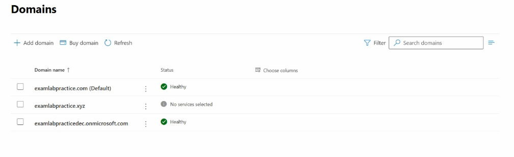
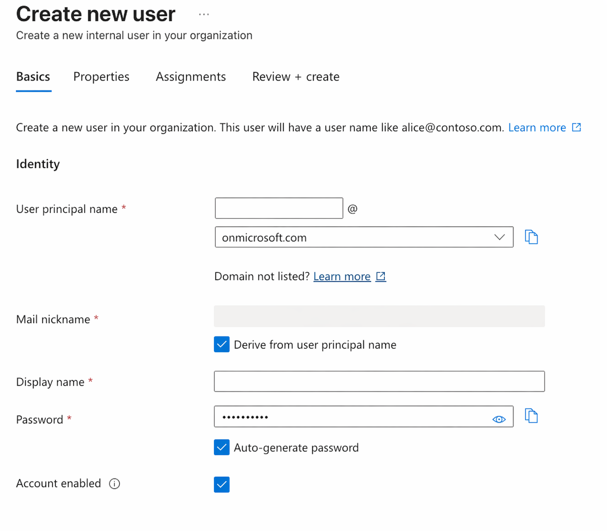
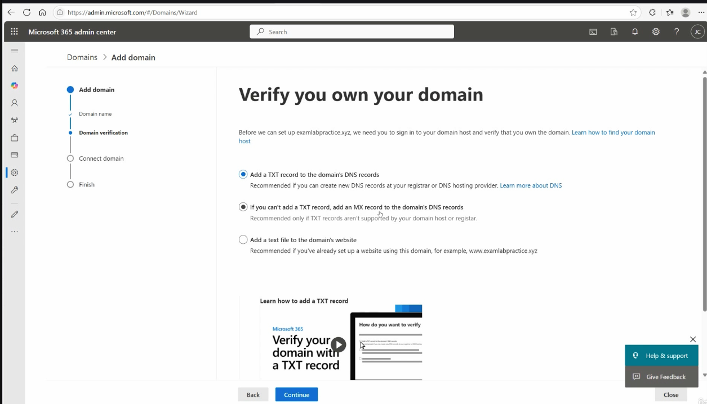
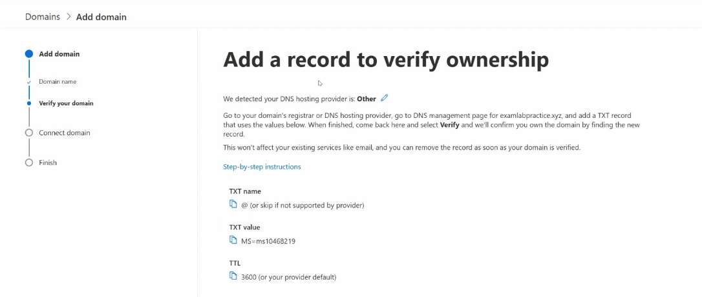
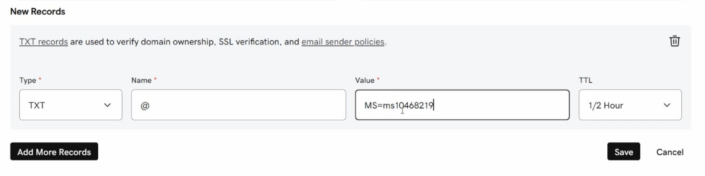
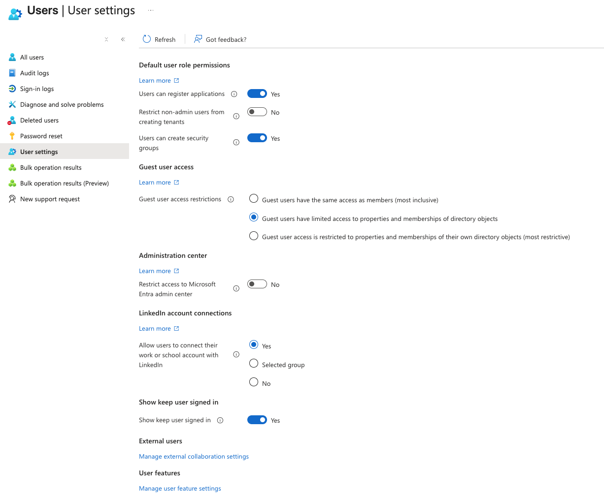
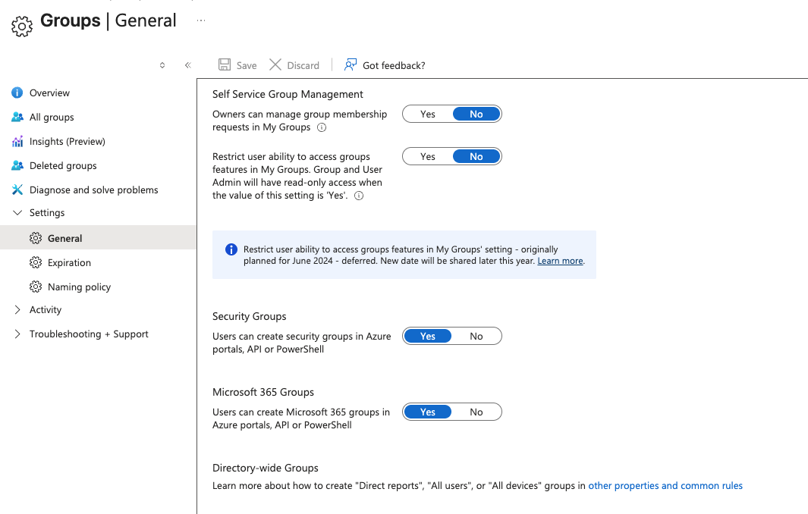

# Section 3: Configure and manage Microsoft Entra tenant

Section 3 moves from foundation into tenant administration. It explains how Microsoft Entra ID is managed across different portals, how administrative roles work, how to scope administration with administrative units, and how tenant-wide settings affect users, groups, devices, domains, and the sign-in experience.

> [!NOTE]
> This section maps primarily to the SC-300 skill area **Implement and manage user identities**. Key exam terms link to the [SC-300 glossary](../00-front-matter/glossary.md) on first meaningful use.

## 23. The First Concept to Know About Microsoft Cloud Services

### Core idea

Microsoft cloud services change frequently. Portal layouts, labels, feature locations, and product names can shift over time, so successful administrators learn the concept behind a task rather than memorizing one exact screen.

### What to know

- Microsoft 365, Azure, and Microsoft Entra admin experiences are updated continuously.
- Buttons and menu paths may differ from older screenshots or videos.
- The same administrative task can often be completed from more than one portal.
- When the UI changes, search by feature name and confirm the current behavior in Microsoft documentation.

### Practical mindset

| Situation | Study response |
|---|---|
| A menu moved | Search for the feature name, not only the old path |
| A product was renamed | Translate the old name to the current Microsoft Entra name |
| A portal looks different | Confirm whether the backend service is the same |
| A lab step fails | Check roles, licensing, tenant settings, and scope |

> [!TIP]
> Memory hook: Learn the service model, not just the click path.

## 24. Basics of Using the Microsoft Cloud Services Portals

### Core idea

Microsoft Entra ID can be managed from multiple portals. The interface may differ, but the identity objects usually live in the same [tenant](../00-front-matter/glossary.md#tenant) and the same cloud directory.

### What to know

- The Azure portal is still commonly used for Entra tenant and Azure resource administration.
- The Microsoft Entra admin center is the more identity-focused portal.
- The Microsoft 365 admin center can manage common users, groups, domains, licenses, and service administration tasks.
- Creating or changing a user in one portal affects the same backend directory.

### Portal comparison

| Portal | Main use | Identity relationship |
|---|---|---|
| Azure portal | Azure resources, subscriptions, resource access, and many Entra settings | Uses Microsoft Entra ID for identity and access |
| Microsoft Entra admin center | Identity, access, security, roles, apps, devices, and governance | Direct management experience for Entra ID |
| Microsoft 365 admin center | Microsoft 365 users, groups, licenses, domains, and service admin roles | Uses the same Entra directory underneath |

> [!WARNING]
> Exam trap: Different portals do not mean different directories. A user managed in Microsoft 365 is still an identity in Microsoft Entra ID.

## 25. Understanding Microsoft Entra ID Roles

### Core idea

Roles define what an identity is allowed to do. In Microsoft cloud administration, you must distinguish Microsoft Entra roles, Azure RBAC roles, and Microsoft 365 service roles.

### What to know

- Roles are permissions.
- Role assignments should follow the [least privilege](../00-front-matter/glossary.md#least-privilege) principle.
- Powerful roles should be limited, reviewed, and protected with Privileged Identity Management when available.
- Roles can be assigned to users, groups, and in some cases service principals.
- The right role family depends on what is being administered.

### Role families

| Role family | Controls | Examples |
|---|---|---|
| [Azure RBAC](../00-front-matter/glossary.md#azure-rbac) roles | Access to Azure resources at a specific scope | Owner, Contributor, Reader |
| Microsoft Entra roles | Directory and identity administration | Global Administrator, User Administrator, Security Reader, Cloud Application Administrator |
| Microsoft 365 roles | Administration of Microsoft 365 workloads and services | Exchange Administrator, SharePoint Administrator, Teams Administrator |

### Scope model

Azure RBAC role assignments are evaluated through scope:

```text
Management group > Subscription > Resource group > Resource
```

Assigning a role at a higher scope applies the permissions to lower scopes unless inheritance is limited or overridden by design.

### Key role examples

| Role | General meaning |
|---|---|
| Global Administrator | Highest privilege role for Microsoft Entra tenant administration |
| User Administrator | Manages users and groups without full tenant control |
| Security Reader | Views security information and settings |
| Security Administrator | Manages security-related settings |
| Cloud Application Administrator | Manages app registrations and enterprise applications |
| Owner | Full control over Azure resources and can grant access to others |
| Contributor | Can manage Azure resources but cannot grant access to others |
| Reader | View-only access to Azure resources |

> [!WARNING]
> Exam trap: Entra roles manage identity and directory tasks. Azure RBAC roles manage Azure resources. Microsoft 365 roles manage service administration.

> [!TIP]
> Memory hook: Entra roles are for identity, Azure RBAC is for resources, Microsoft 365 roles are for workloads.

## 26. Configure and Manage Built-in and Custom Microsoft Entra Roles

### Core idea

Microsoft Entra ID includes many built-in roles for common administrative tasks. Custom roles can be created when built-in roles are too broad or do not match the exact permission requirement.

### What to know

- Built-in roles are Microsoft-provided roles with predefined permissions.
- Custom roles allow more targeted permission sets.
- Built-in roles appear across the main admin experiences.
- Custom Entra roles are managed from the Entra/Azure side and may not appear in the Microsoft 365 admin center role list.
- Roles should be assigned to groups when practical, especially for repeatable administrative delegation.

### Built-in vs custom roles

| Role type | Best use | Management note |
|---|---|---|
| Built-in role | Standard admin job functions such as user, security, app, or service administration | Easier to understand, support, and audit |
| Custom role | Narrow permission requirements that built-in roles do not satisfy | Requires careful permission selection and documentation |

### Role assignment model

| Question | Meaning |
|---|---|
| Who? | The user, group, or service principal receiving the role |
| What? | The permissions included in the role definition |
| Where? | The scope where the role applies |

### Custom role considerations

- Start from the minimum permission set needed.
- Use a clear role name that describes the job function and tier.
- Document why the custom role exists.
- Review assignments regularly.
- Avoid custom roles when a built-in role already matches the requirement.

> [!WARNING]
> Exam trap: A custom Entra role may not show in the Microsoft 365 admin center role assignment experience. Manage custom Entra roles from the Entra/Azure role administration experience.

## 27. Recommend When to Use Administrative Units

### Core idea

[Administrative units](../00-front-matter/glossary.md#administrative-unit) scope administration to a subset of directory objects. They are used when an administrator should manage only specific users, groups, or devices instead of the whole tenant.

### What to know

- Administrative units are containers for Entra objects such as users, groups, and devices.
- They are used for delegated administration, not app access.
- A role can be assigned at the administrative unit scope.
- Administrative units are useful for departments, regions, subsidiaries, schools, contractors, or help desk boundaries.
- Groups grant access to resources; administrative units limit where admins can manage objects.

### Administrative units vs groups

| Feature | Administrative unit | Group |
|---|---|---|
| Primary purpose | Scope administration | Grant access or organize identities |
| Used for app/resource access | No | Yes |
| Used for delegated admin boundaries | Yes | Not by itself |
| Typical example | Help desk can reset passwords only for HR users | HR users get access to an HR application |

### Common use cases

| Scenario | Why an administrative unit helps |
|---|---|
| Department help desk | Support staff manage only their department’s users |
| Regional administration | Local IT manages only users and devices in a region |
| Executive separation | Sensitive accounts are isolated from normal help desk administration |
| Subsidiary support | Each business unit manages only its own staff |
| Contractor management | Contractor accounts can be managed without exposing all employee accounts |

> [!WARNING]
> Exam trap: If the requirement is “limit an admin to managing only these users,” think administrative unit, not group.

> [!TIP]
> Memory hook: Role is what, administrative unit is where, assignment is who.

## 28. Configure and Manage Administrative Units

### Core idea

Administrative units become useful when they contain members and have scoped role assignments. A restricted administrative unit adds stronger protection by blocking even some tenant-wide administrators from managing the objects unless explicitly assigned.

### What to know

- Administrative units can contain users, groups, and devices.
- Membership can be assigned manually or managed dynamically.
- Static membership allows an object to belong to multiple administrative units.
- Dynamic membership uses rules and has more limitations.
- Role assignments can be tenant-wide or administrative-unit scoped.
- A [restricted administrative unit](../00-front-matter/glossary.md#restricted-administrative-unit) limits management even for administrators who normally have broader tenant privileges.

### Basic process

| Step | Purpose |
|---:|---|
| 1 | Create the administrative unit |
| 2 | Add or define members |
| 3 | Assign an administrative role at the administrative unit scope |
| 4 | Test what the scoped admin can and cannot manage |
| 5 | Review whether restricted management is required |

### Behavior model

| Configuration | Result |
|---|---|
| Tenant-wide role assignment | Admin can act across the tenant according to role permissions |
| Administrative-unit scoped assignment | Admin can act only on objects inside that administrative unit |
| Restricted administrative unit | Only explicitly assigned admins can manage protected objects |

### Example outcome

| Admin | Role | Scope | Expected result |
|---|---|---|---|
| Tenant admin | User Administrator | Tenant | Can manage users across the tenant unless blocked by restricted AU behavior |
| Regional admin | User Administrator | Regional AU | Can manage only users inside that administrative unit |
| Help desk admin | Password Administrator | Department AU | Can reset passwords only for users in that administrative unit |

> [!WARNING]
> Exam trap: Restricted administrative units are stronger than normal scoped administration because they can block broader admins unless those admins are explicitly assigned.

## 29. Evaluate Effective Permissions for Microsoft Entra Roles

### Core idea

[Effective permissions](../00-front-matter/glossary.md#effective-permissions) are the real actions an identity can perform after role permissions, scope, and multiple assignments are considered together.

### What to know

- The role definition tells you what actions are allowed.
- The scope tells you where those actions apply.
- Multiple role assignments can combine permissions.
- Administrative unit scope can limit what an otherwise powerful role can manage.
- Documentation and role permission lists are more reliable than role names alone.

### Evaluation checklist

| Check | Question to answer |
|---|---|
| Role assignment | What roles does the identity have? |
| Role definition | What actions do those roles allow? |
| Scope | Do the permissions apply tenant-wide or only to an administrative unit? |
| Multiple roles | Are permissions combined from more than one assignment? |
| Restrictions | Is a restricted administrative unit or other boundary involved? |

### Common exam patterns

| Scenario | What to check first |
|---|---|
| User has a role but cannot perform an action | Scope limitation or missing permission |
| User can perform more than expected | Multiple role assignments or broad scope |
| Admin can manage some users but not others | Administrative unit membership or restricted AU behavior |
| Role name sounds right but task fails | Exact role permissions |

> [!TIP]
> Memory hook: Effective permissions equal what the role allows, where the scope applies, and who received the assignment.

## 30. Configure and Manage Domains in Microsoft Entra ID and Microsoft 365

### Core idea

Custom domains let an organization use its own verified domain name for sign-in and Microsoft 365 services instead of relying only on the default `.onmicrosoft.com` domain.

### What to know

- Every tenant receives a default `.onmicrosoft.com` domain.
- A [custom domain](../00-front-matter/glossary.md#custom-domain) must be verified before it can be used.
- Domain verification proves ownership through public DNS.
- A TXT record is the most common verification method.
- After verification, users can have sign-in names that use the custom domain.

The Domains page shows the tenant's default domain alongside any custom domains that have been added. In a lab, this is a quick way to confirm whether the custom domain exists, whether it is healthy, and whether services have been connected to it.



### Domain comparison

| Domain type | Example pattern | Typical use |
|---|---|---|
| Default tenant domain | `tenantname.onmicrosoft.com` | Created automatically with the tenant |
| Custom domain | `company.example` | Used for professional sign-in names, email, and services |

When creating a user, the selected domain becomes part of the user principal name. If the custom domain is not listed, verify that it has been added and validated before using it for user sign-in names.



### Verification process

| Step | Purpose |
|---:|---|
| 1 | Add the custom domain in Microsoft 365 or Entra |
| 2 | Copy the verification record value |
| 3 | Add the required DNS record at the domain registrar or DNS host |
| 4 | Wait for DNS propagation if needed |
| 5 | Verify the domain in Microsoft cloud admin portal |
| 6 | Use the domain for users and services |

The domain wizard normally offers several verification methods. TXT verification is the cleanest default choice because it proves ownership without changing mail flow or requiring a public website.



After choosing TXT verification, Microsoft provides the TXT name, value, and TTL guidance that must be recreated at the public DNS host for the domain.



At the DNS host or registrar, create a matching TXT record. The exact interface varies by provider, but the important part is that the record type, name, value, and TTL match what Microsoft expects.



### Key DNS records

| Record type | Role in this context |
|---|---|
| TXT | Commonly used to prove domain ownership |
| MX | Can be used for mail routing or sometimes verification |
| CNAME | Often used for service-specific name mapping |

> [!WARNING]
> Exam trap: Buying a domain is not enough. Microsoft must verify ownership through DNS before the domain can be used in the tenant.

## 31. Configure Company Branding Settings

### Core idea

[Company branding](../00-front-matter/glossary.md#company-branding) customizes the Microsoft sign-in experience for users. It improves recognition and user experience, but it does not grant permissions or strengthen access control by itself.

### What to know

- Branding can affect the sign-in page look and messaging.
- Common branding elements include logos, background images, colors, sign-in text, headers, and footers.
- Branding helps users recognize the legitimate organization sign-in experience.
- Branding does not replace Conditional Access, MFA, roles, or security policy.

### Branding elements

| Element | Purpose |
|---|---|
| Logo | Reinforces organization identity during sign-in |
| Background or color | Provides visual consistency |
| Sign-in text | Communicates a short login message |
| Header and footer | Adds organization-specific sign-in context |
| Layout options | Adjusts the look of the sign-in experience |

> [!WARNING]
> Exam trap: Company branding changes the user interface. It does not change authentication requirements, permissions, or role assignments.

## 32. Configure Tenant Properties, User Settings, Group Settings, and Device Settings

### Core idea

Tenant-wide settings define default behavior for the Microsoft Entra environment. These settings affect how users, groups, devices, guests, and security defaults behave across Microsoft cloud services.

### What to know

- Tenant properties describe the organization-level configuration.
- User settings control what users can create, access, or manage by default.
- Group settings control collaboration and group lifecycle behavior.
- Device settings control device registration, join behavior, and device-related security options.
- Some settings improve usability, while others reduce risk.

### Settings overview

| Settings area | Examples | Why it matters |
|---|---|---|
| Tenant properties | Tenant name, region, contacts, security defaults | Establishes global tenant configuration |
| User settings | App creation, tenant creation, group creation, admin center access | Controls default user capabilities |
| Guest settings | Guest access level and collaboration behavior | Reduces external-user exposure |
| Group settings | Self-service group management, expiration, naming policy | Controls collaboration and lifecycle |
| Device settings | Device join, registration, MFA requirement, device limits | Controls endpoint enrollment and identity |

User settings are a high-impact area because they define what regular users can do by default. Settings such as app registration, group creation, guest access, non-admin portal visibility, LinkedIn integration, and keep-me-signed-in behavior can all change the tenant's baseline security posture.



Group settings control how much self-service group management is allowed. For SC-300, pay close attention to whether users can create security groups or Microsoft 365 groups, because group creation can directly affect access management and collaboration sprawl.



### Security-related settings

| Setting | Study-guide meaning |
|---|---|
| [Security defaults](../00-front-matter/glossary.md#security-defaults) | Baseline Microsoft security settings for tenants without more advanced policy design |
| Guest access restrictions | Controls what guests can see and do in the directory |
| Non-admin portal restrictions | Limits what ordinary users can view in admin experiences |
| Group naming policy | Enforces naming standards and blocks restricted words |
| Group expiration | Helps remove temporary or stale groups |
| Device join limits | Controls how many devices users can join or register |

> [!WARNING]
> Exam trap: Tenant settings define default behavior, but assigned roles and policies can still change what a specific user or admin can do.

> [!TIP]
> Memory hook: Tenant settings define the environment; roles define administrative power; policies enforce access decisions.

## 33. Do Not Skip This Video

### Core idea

Some course videos that appear administrative or transitional still explain important setup assumptions, portal behavior, or exam expectations. Skipping them can create confusion later.

### What to know

- Short setup or warning lessons often clarify why later labs behave a certain way.
- Portal behavior can change, so conceptual reminders matter.
- If a lesson explains prerequisites, tenant behavior, or assignment workflow, treat it as part of the study path.

## 34. Redoing Simulations in the Course

### Core idea

Simulations are practice tools. Repeating them helps reinforce portal flow, terminology, and decision-making, but the goal is to understand the administrative concept rather than memorize a single simulated screen.

### What to know

- Repeating simulations is useful when a concept feels unclear.
- Treat simulations as guided practice, not as the only version of the portal.
- Document the concept learned, not proprietary step text or raw course instructions.
- When writing repository notes, use your own words and keep private or course-specific material out of GitHub.

### Repository note

For Section 3, assignment and lab notes should focus on original observations, sanitized screenshots, validation results, and cleanup notes. Avoid copying course instructions or publishing tenant-specific data.
