# Section 4: Create configure, and manage Microsoft Entra identities

Section 4 focuses on the identity objects administrators manage every day in Microsoft Entra ID: users, groups, devices, service principals, managed identities, custom security attributes, licenses, and automation through Microsoft Graph PowerShell.

> [!NOTE]
> This section maps primarily to the SC-300 skill area **Implement and manage user identities**. Key exam terms link to the [SC-300 glossary](../00-front-matter/glossary.md) on first meaningful use.

## 35. Understanding Concepts of Identities

### Core idea

Microsoft Entra ID is the central cloud directory for Microsoft identity. In day-to-day administration, the words identity and account are often used interchangeably, but the important idea is broader: identities can represent people, devices, applications, automation, and Azure resources.


### What to know

- Microsoft Entra ID stores and manages cloud identity objects.
- Some identity tasks can be done in more than one portal.
- Some actions are only available in a specific admin experience.
- On-premises identities can be synchronized to Entra ID for hybrid environments.
- PowerShell, Microsoft Graph, and Azure CLI are important for automation and bulk administration.

### Identity types

| Identity type | Represents | Typical use |
|---|---|---|
| [Member user](../00-front-matter/glossary.md#member-user) | Internal employee or organizational account | Sign in to Microsoft 365, Azure, and business apps |
| [Guest user](../00-front-matter/glossary.md#guest-user) | External collaborator invited through B2B collaboration | Limited collaboration access |
| [Service principal](../00-front-matter/glossary.md#service-principal) | Application or service identity in a tenant | App permissions, automation, API access |
| [Managed identity](../00-front-matter/glossary.md#managed-identity) | Azure-managed identity for a resource | Access Azure services without storing credentials |
| [Device identity](../00-front-matter/glossary.md#device-identity) | Device object in Microsoft Entra ID | Conditional Access, compliance, Intune, device state |

### Member and guest users

Member users are usually employees or internal accounts created directly in Entra ID or synchronized from on-premises Active Directory. Guest users are external identities invited for collaboration, usually through Microsoft Entra B2B.


### Hybrid identity

Hybrid identity connects on-premises Active Directory with Microsoft Entra ID so users can access both traditional and cloud resources with a more unified identity experience.

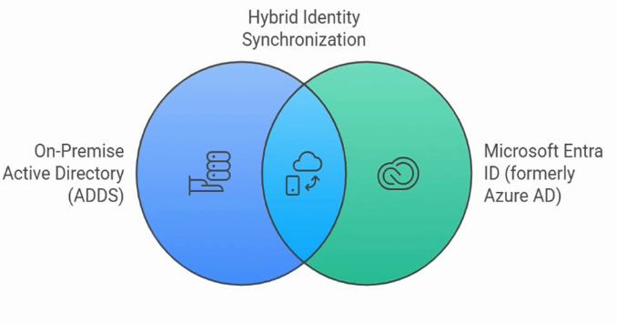

### Service principals and managed identities

Service principals represent applications or services in a tenant. Managed identities are a special type of identity for Azure resources that avoids storing credentials in code.


> [!WARNING]
> Exam trap: A user identity is not the only identity type in Entra ID. Applications, devices, and Azure resources can also have identities.

## 36. Create, Configure, and Manage Users

### Core idea

Users are the most familiar Entra identity objects. A user account typically has a display name, user principal name, sign-in settings, account state, assigned licenses, group memberships, and optional profile attributes.

### What to know

- The [user principal name](../00-front-matter/glossary.md#user-principal-name) is the sign-in name for the user.
- The domain portion of the UPN depends on verified tenant domains.
- Account enabled controls whether the user can sign in.
- Profile attributes support organization, filtering, dynamic group rules, and reporting.
- Licenses enable access to Microsoft 365 services.


### User creation flow

| Step | Purpose |
|---:|---|
| 1 | Create the user identity |
| 2 | Set sign-in name and domain |
| 3 | Configure profile attributes |
| 4 | Assign groups or roles if needed |
| 5 | Assign licenses if the user needs Microsoft 365 services |
| 6 | Confirm sign-in and access behavior |

> [!TIP]
> Memory hook: User identity first, attributes second, access third, license fourth.

## 37. Understand Microsoft Entra Group Types

### Core idea

Groups organize identities and simplify management. The correct group type depends on whether the goal is collaboration, email distribution, access control, or a combination of email and access.

### Group type overview

| Group type | Primary use | Email | Access control | Dynamic membership |
|---|---|---:|---:|---:|
| [Microsoft 365 group](../00-front-matter/glossary.md#microsoft-365-group) | Collaboration and Microsoft 365 workloads | Yes | Limited workload/resource scenarios | Yes, users only |
| Distribution group | Email distribution | Yes | No | No in Entra dynamic membership |
| [Mail-enabled security group](../00-front-matter/glossary.md#mail-enabled-security-group) | Email plus resource access | Yes | Yes | No in Entra dynamic membership |
| [Security group](../00-front-matter/glossary.md#security-group) | Access control | No | Yes | Yes, users or devices |

### Microsoft 365 groups

Microsoft 365 groups are collaboration-ready. They support shared resources such as mailbox, calendar, SharePoint, OneNote, Planner, and Teams-backed collaboration.

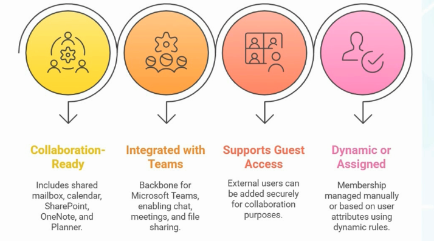

### Distribution groups

Distribution groups are for email distribution. They are useful for announcements and communication but are not used to assign permissions to resources.

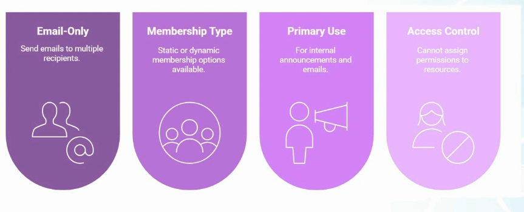

### Mail-enabled security groups

Mail-enabled security groups combine email capability with access control, but they do not provide the collaboration workspace experience of Microsoft 365 groups.

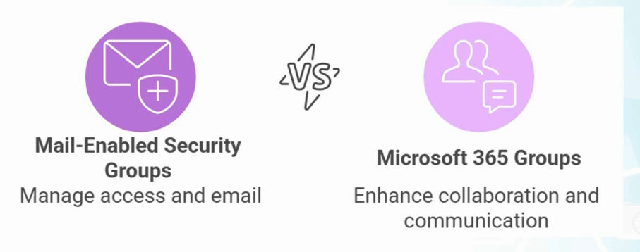

### Security groups

Security groups are primarily for access management. They can contain users, devices, and service principals, which makes them important for resource access and policy assignment.

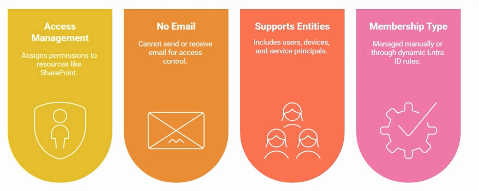

### Membership types

Groups can use assigned membership or dynamic membership. Assigned membership is manual. Dynamic membership uses rules based on user or device attributes.


> [!WARNING]
> Exam trap: Microsoft 365 groups can use dynamic user membership, but they do not support dynamic device membership. Use a security group for device-based dynamic membership.

## 38. Create, Configure, and Manage Groups in Admin Portals

### Core idea

Groups can be created from Microsoft 365 admin experiences or the Microsoft Entra/Azure portal. Regardless of where the group is created, the identity object lives in Microsoft Entra ID.

### What to know

- Microsoft 365 group creation focuses on collaboration settings such as owners, members, privacy, email address, and Teams integration.
- Entra group creation focuses on group type, role assignment capability, membership type, owners, members, and dynamic rules.
- Group owners can manage group membership and group settings depending on the group type and configuration.
- Private groups require owner approval or invitation; public groups are easier to discover and join.


### Group creation decisions

| Decision | Why it matters |
|---|---|
| Group type | Determines whether the group is for collaboration, email, or access |
| Membership type | Determines whether members are manual or rule-based |
| Owners | Determines who can manage the group |
| Members | Determines who receives access, email, or collaboration membership |
| Role assignment setting | Determines whether Microsoft Entra roles can be assigned to the group |

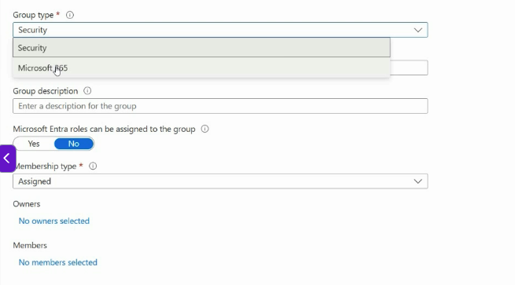

### Microsoft 365 group settings

Microsoft 365 groups include collaboration settings such as group email address, privacy, owners, members, and optional Teams-backed collaboration.

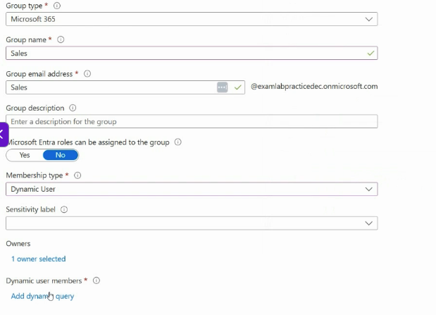

## 39. Configure Dynamic Group Membership Rules

### Core idea

[Dynamic membership groups](../00-front-matter/glossary.md#dynamic-membership-group) automatically add or remove members based on rules. This is valuable at scale because membership follows attributes instead of manual updates.

### What to know

- Dynamic user rules evaluate user attributes.
- Dynamic device rules evaluate device attributes.
- Rule processing is not always immediate.
- Dynamic groups cannot be manually edited like assigned groups.
- Use rule validation when possible before relying on a dynamic rule.

### Dynamic user rule example

Dynamic user groups can use attributes such as department or job title. For example, a group could include users where department equals Sales or job title starts with Sales.


### Dynamic device rule example

Dynamic device groups are useful for device targeting. For example, a security group can include Windows devices whose display name starts with a location prefix.


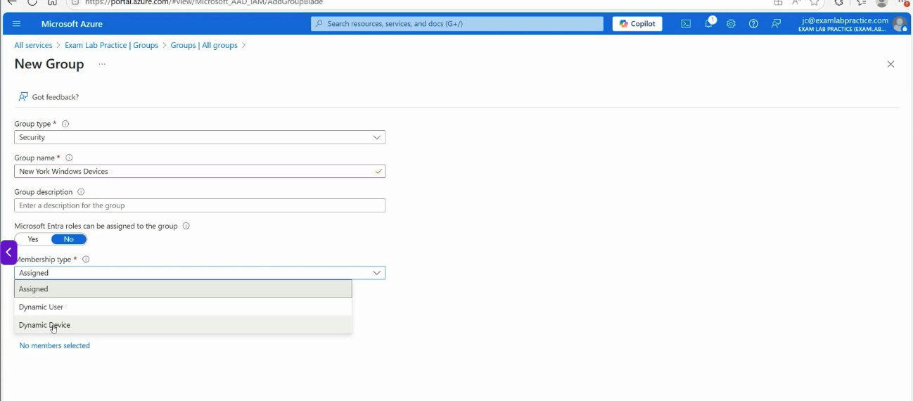

> [!WARNING]
> Exam trap: Dynamic membership is controlled by the rule. If a user or device does not match the rule, adding it manually is not the fix.

## 40. Manage Custom Security Attributes

### Core idea

[Custom security attributes](../00-front-matter/glossary.md#custom-security-attribute) are business-specific key-value pairs that can be defined and assigned to Entra objects. They can support access decisions, filtering, automation, and custom application logic.

### What to know

- Custom security attributes require specific roles.
- Global Administrator does not automatically have permission to read, define, or assign custom security attributes.
- Attribute Definition Administrator manages attribute sets and definitions.
- Attribute Assignment Administrator assigns attribute values to supported objects.
- Attribute sets group related custom security attributes.


### Required roles

| Role | Purpose |
|---|---|
| Attribute Definition Administrator | Defines attribute sets and custom security attribute definitions |
| Attribute Assignment Administrator | Assigns custom security attribute values to supported objects |


### Example: executive flag

A simple custom security attribute can mark whether a user is an executive. The attribute set groups the attribute definition, and the attribute itself defines the data type and allowed values.

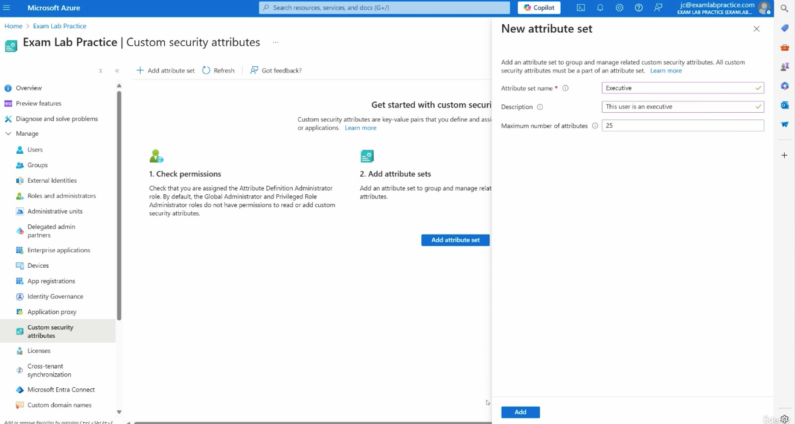


> [!WARNING]
> Exam trap: Custom security attributes are not ordinary profile fields. They have their own permission model and dedicated administrator roles.

## 41. Automate Bulk Operations

### Core idea

Bulk operations help administrators create, invite, or delete many users at once. They are useful when onboarding users from a spreadsheet or HR export.

### What to know

- Bulk create uses a CSV template.
- Download the template, edit it carefully, then upload it back.
- Use your own tenant domain and sanitized data.
- Bulk operations can take time to process.
- Always verify the result after the operation completes.


### Bulk create process

| Step | Purpose |
|---:|---|
| 1 | Download the CSV template |
| 2 | Fill in required user fields |
| 3 | Use the correct tenant domain for UPNs |
| 4 | Save the CSV |
| 5 | Upload the CSV in the bulk create workflow |
| 6 | Review processing results |
| 7 | Verify users were created correctly |

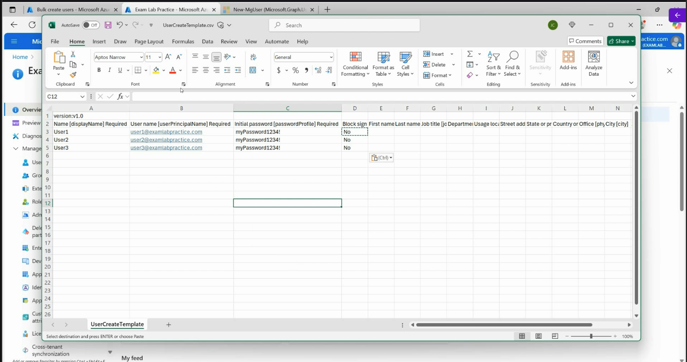

> [!TIP]
> Memory hook: Bulk import is only as clean as the CSV. Validate columns, domains, and passwords before upload.

## 42. Concepts of Microsoft Entra Device Register vs Device Join

### Core idea

Device identities represent devices in Microsoft Entra ID. The main device states are Microsoft Entra registered, Microsoft Entra joined, and Microsoft Entra hybrid joined.


### Device identity comparison

| Device state | Typical ownership | Sign-in model | Control level |
|---|---|---|---|
| [Microsoft Entra registered](../00-front-matter/glossary.md#microsoft-entra-registered-device) | Personal or BYOD | User signs in to Windows with personal/local account, then connects work account | Limited company control over work access |
| [Microsoft Entra joined](../00-front-matter/glossary.md#microsoft-entra-joined-device) | Organization-owned | User signs in with organizational account | Strong cloud management and policy control |
| [Microsoft Entra hybrid joined](../00-front-matter/glossary.md#microsoft-entra-hybrid-joined-device) | Organization-owned | Device is joined to on-premises AD and registered in Entra ID | Hybrid control across AD DS and Entra ID |

### What to know

- Registered usually means BYOD or personal device.
- Joined usually means cloud-first, organization-owned device.
- Hybrid joined usually means traditional AD DS plus Microsoft Entra ID.
- Device identity supports Conditional Access, Intune, compliance, and device inventory decisions.


> [!TIP]
> Memory hook: Registered is connected, joined is controlled, hybrid joined is connected to both AD DS and Entra ID.

## 43. Manage Device Join to Microsoft Entra ID

### Core idea

A Windows device can become Microsoft Entra joined during first-time setup when the user signs in with an organizational account.

### What to know

- The Microsoft Entra join flow commonly happens during Windows out-of-box experience.
- The user signs in with a work or school account.
- After setup, the device appears in Microsoft Entra ID under Devices.
- The device can then participate in cloud-based access and management scenarios.

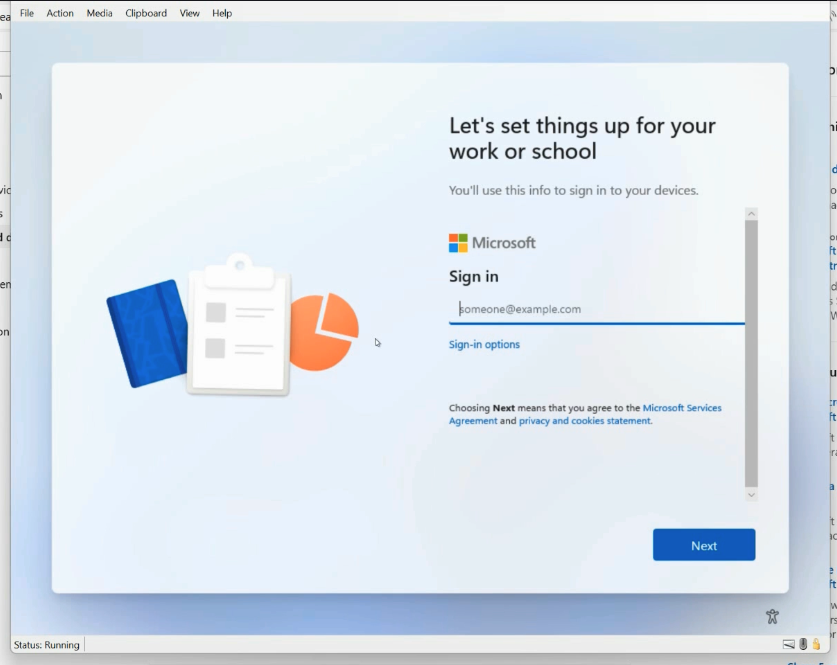

### Verification points

| Location | What to confirm |
|---|---|
| Windows settings | User is signed in with the organizational account |
| Microsoft Entra Devices | Device appears with Microsoft Entra joined state |
| Intune, if used | Device management and compliance state are visible |

> [!WARNING]
> Exam trap: Signing in with an organization account during setup can join the device. Connecting a work account after signing in with a personal account is usually registration, not join.

## 44. Manage Device Registration in Microsoft Entra ID

### Core idea

Device registration is the common BYOD pattern. The user keeps signing in to the device with a personal or local account, but adds a work or school account so company resources can apply work-related access controls.

### What to know

- Registration is not the same as join.
- Registration gives the organization a device identity for access decisions.
- The company has limited control compared to a joined device.
- Registration is common for personal laptops, phones, and tablets.


### Registered vs joined

| Question | Registered | Joined |
|---|---|---|
| Who owns the device? | Usually the user | Usually the organization |
| How does the user sign in? | Personal/local account | Organizational account |
| How much control does the company have? | Limited, focused on work access | Stronger device and policy control |
| Typical scenario | BYOD | Corporate-owned device |

## 45. Assign, Modify, and Report on Licenses

### Core idea

Microsoft 365 licenses enable services for users. Licenses can be assigned directly to users or indirectly through group-based licensing.

### What to know

- Licenses are commonly managed in the Microsoft 365 admin center.
- Direct assignment works for small numbers of users.
- [Group-based licensing](../00-front-matter/glossary.md#group-based-licensing) scales better for larger environments.
- License assignment only works if enough unassigned licenses are available.
- Usage reports help show whether services are being used.

### Licensing comparison

| Method | Best use | Risk |
|---|---|---|
| Direct user licensing | Small or exception-based assignments | Harder to maintain at scale |
| Group-based licensing | Department, role, or lifecycle-based licensing | Requires clean group membership |
| Usage reporting | Review adoption and activity | Reports do not replace access review |

> [!TIP]
> Memory hook: Direct licensing is simple; group-based licensing is scalable.

## 46. A Foundation of Administration with PowerShell

### Core idea

PowerShell is Microsoft’s command-line and automation shell. It is valuable because it makes repeated, remote, and large-scale administrative tasks easier than clicking through portals.

### What to know

- PowerShell commands commonly use Verb-Noun syntax.
- Parameters refine what a command does.
- Pipelines send output from one command into another.
- Variables store reusable values.
- Execution policy affects whether scripts can run.
- Microsoft Learn is the best reference for current syntax and examples.

### Core PowerShell concepts

| Concept | Example | Meaning |
|---|---|---|
| Verb-Noun | `Get-Service` | Command naming pattern |
| Parameter | `-Name winrm` | Additional instruction to the command |
| Pipeline | `|` | Sends output to the next command |
| Variable | `$computerName` | Stores a reusable value |
| Help | `Get-Help` | Displays command help |

### Example commands

```powershell
Get-Service
Get-Process
Get-Command -Verb Get
Get-Help Get-EventLog
Get-EventLog -LogName Security -Newest 10 | Format-List
```

> [!WARNING]
> Exam trap: PowerShell is not only a command prompt. Its value is automation, scale, repeatability, and remote administration.

## 47. Understanding Microsoft Graph vs Traditional PowerShell

### Core idea

[Microsoft Graph](../00-front-matter/glossary.md#microsoft-graph) is Microsoft’s unified API for Microsoft cloud services. Microsoft Graph PowerShell uses that API so administrators can manage cloud resources with modern authentication and a consistent command model.

### Why Graph matters

Traditional administration often required separate modules and connection methods for different services. Microsoft Graph provides a more unified approach across Microsoft Entra ID, Microsoft 365, Teams, Outlook, OneDrive, Intune, and other services.

### Comparison

| Area | Traditional modules | Microsoft Graph |
|---|---|---|
| Service model | Fragmented by product | Unified API surface |
| Authentication | Older methods may appear | Modern token-based authentication |
| Automation | Service-specific scripts | Better cross-service automation |
| Long-term direction | Some modules deprecated over time | Current strategic direction |
| Cross-platform fit | Mixed | Better fit for modern PowerShell |

> [!TIP]
> Memory hook: Traditional PowerShell was service-by-service; Graph is cloud-wide.

## 48. Installing and Connecting Microsoft Graph for PowerShell

### Core idea

Before using Microsoft Graph PowerShell, install the module and connect with the permissions, or scopes, needed for the task.

### What to know

- Install only the modules you need when possible.
- Use current Microsoft Graph PowerShell modules rather than older deprecated modules when a Graph command exists.
- Connect with the minimum scopes required.
- Admin consent may be required depending on the requested scope.

### Basic setup flow

| Step | Purpose |
|---:|---|
| 1 | Check execution policy if scripts are blocked |
| 2 | Install Microsoft Graph PowerShell module |
| 3 | Connect to Microsoft Graph |
| 4 | Request the required scopes |
| 5 | Run commands against Entra objects |

### Example commands

```powershell
Get-ExecutionPolicy
Install-Module Microsoft.Graph -Scope CurrentUser
Connect-MgGraph -Scopes "Group.ReadWrite.All", "User.ReadWrite.All"
```

> [!WARNING]
> Exam trap: Broad Graph scopes grant broad capability. Request only what the task requires.

## 49. Using PowerShell to Manage Users, Groups, and Bulk Operations

### Core idea

Microsoft Graph PowerShell can manage users, groups, licenses, and bulk operations in Microsoft Entra ID. The same identity objects are visible in the portals, but automation is faster and more repeatable.

### What to know

- `Get-MgUser` reads user objects.
- `New-MgUser` creates user objects.
- `Remove-MgUser` deletes user objects.
- CSV import allows bulk user creation or deletion.
- `Get-MgSubscribedSku` shows available license SKUs.
- `Set-MgUserLicense` assigns or removes licenses.
- `New-MgGroup` creates groups.
- `New-MgGroupMemberByRef` can add members by reference.

### Sanitized examples

```powershell
Connect-MgGraph -Scopes "Group.ReadWrite.All", "User.ReadWrite.All"

Get-MgUser -All

New-MgUser `
  -AccountEnabled:$true `
  -DisplayName "Example User" `
  -MailNickname "exampleuser" `
  -UserPrincipalName "exampleuser@contoso.example" `
  -PasswordProfile @{
    ForceChangePasswordNextSignIn = $true
    Password = "Use-a-secure-temporary-password"
  }
```

### Bulk creation pattern

```powershell
$PasswordProfile = @{
  Password = "Use-a-secure-temporary-password"
  ForceChangePasswordNextSignIn = $true
}

Import-Csv -Path ".\users.csv" | ForEach-Object {
  New-MgUser `
    -AccountEnabled:$true `
    -DisplayName $_.DisplayName `
    -MailNickname $_.MailNickname `
    -UserPrincipalName $_.UserPrincipalName `
    -PasswordProfile $PasswordProfile
}
```

### Group creation pattern

```powershell
New-MgGroup `
  -DisplayName "Example Group" `
  -MailEnabled:$true `
  -MailNickname "examplegroup" `
  -SecurityEnabled:$false `
  -GroupTypes @("Unified")
```

### Repository note

Assignment 2 and Assignment 3 belong in the `assignments/` folder when you document them. Keep the write-ups original, sanitized, and focused on what you configured, how you validated it, and what you cleaned up.

> [!TIP]
> Memory hook: Portals are good for learning; Graph PowerShell is good for repeatable administration.
