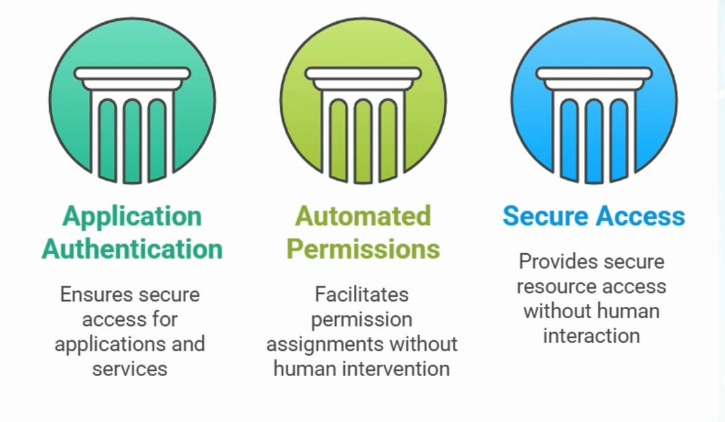

# Section 4: Create configure, and manage Microsoft Entra identities

Section 4 introduces the core identity objects managed in Microsoft Entra ID: users, groups, devices, service principals, managed identities, custom security attributes, licenses, and Microsoft Graph PowerShell automation.

> [!NOTE]
> This section maps primarily to the SC-300 skill area **Implement and manage user identities**. Key exam terms link to the [SC-300 glossary](../00-front-matter/glossary.md) on first meaningful use.

## 35. Understanding Concepts of Identities

### Core idea

Microsoft Entra ID is Microsoft’s cloud identity-based management system. It acts as the central directory store for cloud identities and can synchronize with on-premises Active Directory in hybrid environments.


### What to know

- Identity and account are often used interchangeably in Microsoft cloud administration.
- Microsoft Entra ID, formerly Azure AD, is the central cloud directory store.
- Identities can be synchronized from on-premises Active Directory Domain Services into Microsoft Entra ID.
- Not every identity task is available in every portal.
- PowerShell, Microsoft Graph, and Azure CLI are used for automation and advanced administration.


### Management surfaces

| Management surface | Common use |
|---|---|
| Azure portal | Azure resources, Entra ID, devices, groups, roles, and some identity configuration |
| Microsoft 365 admin center | Microsoft 365 users, licenses, groups, domains, and service administration |
| Microsoft Entra admin center | Identity-focused administration for users, groups, devices, apps, roles, and governance |
| On-premises Active Directory | Traditional domain identities synchronized to the cloud in hybrid environments |
| PowerShell / Microsoft Graph / Azure CLI | Automation, bulk operations, scripting, and repeatable administration |

> [!WARNING]
> Exam trap: Different portals can manage the same identity backend. A user created in Microsoft 365 still exists in Microsoft Entra ID.

### User identities

User identities represent human users who access Microsoft services.

| User type | Meaning |
|---|---|
| [Member user](../00-front-matter/glossary.md#member-user) | Internal employee or organizational user created in Entra ID or synchronized from on-premises Active Directory |
| [Guest user](../00-front-matter/glossary.md#guest-user) | External user invited through B2B collaboration, usually managed in a home directory but granted access to this tenant |


### Service principals

[Service principals](../00-front-matter/glossary.md#service-principal) represent applications or services that need to authenticate and access resources.

- They are created when an application is registered in Microsoft Entra ID.
- They are used for assigning permissions to applications and automation.
- They support secure access without human interaction.

Example: A web application that needs to read or write data through Microsoft Graph or access Azure Key Vault.



### Managed identities

[Managed identities](../00-front-matter/glossary.md#managed-identity) are special identities for Azure resources, such as virtual machines or function apps, so they can access supported Azure services without storing credentials.

| Type | Meaning |
|---|---|
| System-assigned | Tied to one Azure resource; lifecycle follows that resource |
| User-assigned | Standalone managed identity that can be reused across resources |

Example: An Azure VM accessing a storage account by using a system-assigned managed identity.


### Device identities

Each device that registers, joins, or hybrid joins Microsoft Entra ID receives a [device identity](../00-front-matter/glossary.md#device-identity).

- Device identities are used by Conditional Access, compliance evaluation, and Intune management.
- Microsoft Entra joined devices are typically organization-owned and cloud-managed.
- Microsoft Entra hybrid joined devices are connected to both on-premises Active Directory and Microsoft Entra ID.
- Microsoft Entra registered devices are commonly personal or BYOD devices.


## 36. Create, Configure, and Manage Users and Groups

### Core idea

Microsoft Entra groups organize users, devices, and service principals so administrators can manage access, collaboration, email distribution, and policy targeting at scale.

### Group types

| Group type | Main purpose | Important limitation |
|---|---|---|
| [Microsoft 365 group](../00-front-matter/glossary.md#microsoft-365-group) | Collaboration and Microsoft 365 shared resources | Does not contain device identities |
| Distribution group | Email communication | Cannot assign permissions to resources |
| [Mail-enabled security group](../00-front-matter/glossary.md#mail-enabled-security-group) | Email plus access control | Does not provide Microsoft 365 collaboration workspace features |
| [Security group](../00-front-matter/glossary.md#security-group) | Permissions, access control, and policy targeting | No email functionality by default |

### Microsoft 365 groups

Microsoft 365 groups are collaboration-ready groups. They include shared resources such as a mailbox, calendar, SharePoint site, OneNote, Planner, and Microsoft Teams integration.

- Useful for collaboration and teamwork.
- Supports guest access for external collaboration.
- Membership can be assigned manually or managed dynamically based on user attributes.


### Distribution groups

Distribution groups are email-only groups used to send messages to multiple recipients.

- Used for announcements and internal communication.
- Does not provide shared workspace features.
- Cannot be used to assign resource permissions.
- Microsoft 365 groups can sometimes cover similar communication needs while also providing collaboration features.


### Mail-enabled security groups

Mail-enabled security groups combine email capability with access control.

- Can receive email like a distribution group.
- Can be used to assign permissions to supported Microsoft 365 resources.
- Does not include Teams, shared calendar, or document libraries like Microsoft 365 groups.


### Security groups

Security groups are primarily used for permissions and policy targeting.

- Used to assign access to resources such as SharePoint sites, applications, and Intune policies.
- Can include users, devices, and service principals.
- Can use assigned membership or dynamic rules.
- Cannot send or receive email unless configured as mail-enabled security groups.


### Assigned vs dynamic groups

| Membership type | How it works | Best use |
|---|---|---|
| Assigned | Members are manually added or removed by an administrator | Small groups, fixed membership, precise control |
| Dynamic | Members are automatically added or removed by rules based on attributes | Large environments, lifecycle automation, department or device targeting |

> [!WARNING]
> Exam trap: If membership is dynamic, the rule controls the members. You do not manually add or remove members from the group.

## 38. Create, Configure, and Manage Groups in the Microsoft 365 Admin Center

### Core idea

The Microsoft 365 admin center is commonly used to create Microsoft 365 groups because it emphasizes collaboration settings such as group owners, members, email address, privacy, and Teams integration.

### Group owner

A group owner can manage group membership and settings. Depending on the group type and configuration, an owner may be able to add or remove members, manage group conversations, rename the group, or update the group description.

### Assigned group process

1. Add a group owner.
2. Add group members.
3. Configure settings:
   - Group email address, such as `finance`.
   - Privacy, such as private or public.
   - Whether to create a Microsoft Team for the group.

### Privacy behavior

| Privacy setting | Meaning |
|---|---|
| Private | Users generally need to be invited or approved by an owner |
| Public | Users can discover and join more easily |

> [!TIP]
> Memory hook: Microsoft 365 admin center group creation is collaboration-first.

## 38. Create, Configure, and Manage Groups in the Azure Portal

### Core idea

Groups can also be created in the Azure portal or Microsoft Entra admin center. It does not matter where the group is created; the group object still lives in Microsoft Entra ID.

### Basic process

1. Open the Azure portal.
2. Go to Microsoft Entra ID.
3. Open Groups.
4. Select New group.


### Choose group type

In the Azure/Entra portal, the main group type choices are Security and Microsoft 365.


### Choose membership type

The membership type controls whether group members are added manually or by dynamic rule.


### Group settings

When creating a group, review the group name, description, owners, members, role assignment setting, and membership type before creating it.


### Dynamic user rules

Dynamic user rules can target users based on attributes such as department or job title.

Example: Department equals Sales or job title starts with Sales.


### Security group for devices

Security groups can use dynamic device membership. This is useful for scenarios such as targeting all Windows devices that follow a naming pattern.


### Dynamic device rule example

The example rule targets devices where the display name starts with a location prefix and the device operating system equals Windows.


### What to know

- Dynamic rules can take time to evaluate and populate membership.
- If the rule is wrong, fix the rule or the source attributes.
- Security groups support dynamic device membership; Microsoft 365 groups do not.

> [!WARNING]
> Exam trap: To create a dynamic group containing Windows devices, use a security group with dynamic device membership.

## 40. Manage Custom Security Attributes

### Core idea

[Custom security attributes](../00-front-matter/glossary.md#custom-security-attribute) are name-value pairs that store business-specific data on supported Microsoft Entra objects. They can support access control, Conditional Access design, custom application logic, filtering, and automation.

### What to know

- Custom security attributes are not ordinary user profile fields.
- They have a separate permissions model.
- Attribute sets organize related custom security attributes.
- Attribute definitions specify the attribute name, data type, and allowed behavior.

### Start in custom security attributes

In the Entra portal, open Custom security attributes. The portal reminds you to check permissions, add attribute sets, and manage attributes.


### Assign required roles

To define and assign custom security attributes, assign the appropriate roles:

- Attribute Assignment Administrator
- Attribute Definition Administrator


### Create an attribute set

An attribute set groups related custom security attributes. In this example, an Executive attribute set is used for executive-related values.


### Create an attribute

The `isExecutive` attribute can be configured as a Boolean value to flag whether a user is an executive.


> [!WARNING]
> Exam trap: Global Administrator does not automatically have all custom security attribute permissions. Use the dedicated attribute roles.

## 41. Automate Bulk Operations by Using Microsoft Tools

### Core idea

Bulk operations let administrators create, invite, or delete many users at once. This is useful when HR or another business process provides a spreadsheet of new employees.

### Bulk user creation path

Use the Azure portal flow:

```text
Microsoft Entra ID > Users > Bulk operations > Bulk create
```

### Basic process

1. Download the CSV template.
2. Open the template in Excel or another spreadsheet tool.
3. Fill in the user details.
4. Use your tenant domain for user names.
5. Set passwords and sign-in options.


6. Save the file.
7. Upload it back through Bulk create.


8. Wait for processing.
9. Verify that the users were created.

### Important notes

- Portal screens can change over time.
- Use your own tenant and domain, not lab demo values.
- Bulk operations are useful for large onboarding waves.
- A similar workflow exists in the Microsoft 365 admin center for adding multiple active users.
- The identities still go back to Microsoft Entra ID.

> [!TIP]
> Memory hook: Download template, fill CSV, upload, verify.

## 42. Concepts of Entra ID Device Register vs Device Join

### Core idea

Device identity types describe how a device relates to Microsoft Entra ID and how much control the organization has over it.


### Registered device

Best memory hook: **BYOD**.

A personal device is registered to Microsoft Entra ID so the user can access company resources.

- User signs in to the device with a personal or local account.
- Company can restrict access to company data and apps.
- Company does not fully control the entire device.
- Common for personal laptops, phones, and tablets.

Key point: personal device plus limited company control.

### Microsoft Entra joined device

A company device is joined directly to Microsoft Entra ID.

- User signs in with an organizational Entra ID account.
- Device is usually owned by the organization.
- Company has stronger control.
- Better for locking down and managing company devices.

Key point: company device plus organizational account sign-in.

### Microsoft Entra hybrid joined device

A hybrid joined device is used when an organization has both on-premises Active Directory and Microsoft Entra ID.

- Device is connected to traditional AD DS and represented in Microsoft Entra ID.
- Common in older or transitioning enterprise environments.
- Supports hybrid identity and device scenarios.

Key point: company device connected to both AD DS and Microsoft Entra ID.

### Quick comparison

| Type | Device ownership | Sign-in type | Control level |
|---|---|---|---|
| [Microsoft Entra registered](../00-front-matter/glossary.md#microsoft-entra-registered-device) | Usually user-owned | Personal/local account | Limited |
| [Microsoft Entra joined](../00-front-matter/glossary.md#microsoft-entra-joined-device) | Usually company-owned | Organizational account | High |
| [Microsoft Entra hybrid joined](../00-front-matter/glossary.md#microsoft-entra-hybrid-joined-device) | Usually company-owned | AD/Entra connected | High |

> [!TIP]
> Memory hook: Registered equals personal device connected to work. Joined equals work device controlled by company. Hybrid joined equals work device connected to both AD DS and Entra ID.

## 43. Manage Device Join to Microsoft Entra ID

### Core idea

A new Windows device can become Microsoft Entra joined during the Windows out-of-box experience when the user signs in with an organizational Entra ID account.

### Process shown

1. Start a fresh Windows setup.
2. Go through normal setup steps:
   - Confirm location.
   - Confirm keyboard layout.
   - Wait for update checks.
3. At the sign-in step, enter an organizational account that exists in Microsoft Entra ID.


4. Authenticate with the password.
5. Continue and finish setup.
6. Windows signs in with the organizational account.
7. The device becomes Microsoft Entra joined.

### How to prove the join worked

On the Windows device:

- Open Settings.
- Confirm the signed-in user is the Entra ID organizational account.
- Note the generated machine name.

In Microsoft Entra ID:

- Go to Devices.
- Find the device.
- Confirm the join type shows Microsoft Entra joined.

### Important distinction

| Setup choice | Result |
|---|---|
| Organizational account during setup | Device becomes Microsoft Entra joined |
| Personal account during setup | Device does not join; it may be registered later |

> [!WARNING]
> Exam trap: Joining during first-time setup and registering later from a personal profile are different outcomes.

## 44. Manage Device Registrations in Microsoft Entra ID

### Core idea

Device registration is the common personal-device scenario. The user signs in to Windows with a personal or local account, then adds a work or school account under Access work or school.


### Process shown

1. On the personal Windows device, open:

```text
Settings > Accounts > Access work or school
```

2. Select Connect.


3. Enter the organizational Entra ID account.
4. Sign in with work credentials.
5. Wait while Windows registers the device and applies work-related policy.

### Result

- The device appears in Microsoft Entra ID.
- The join type shows registered, not joined.
- The user still signs in to Windows with the personal or local account.
- Company control is more limited than with a joined device.

### Registered vs joined

| Question | Registered | Joined |
|---|---|---|
| Who owns the device? | Usually the user | Usually the organization |
| How does the user sign in? | Personal/local account | Organizational account |
| How much control does the company have? | Limited, focused on work access | Stronger device and policy control |
| Typical scenario | BYOD | Corporate-owned device |

## 45. Assign, Modify, and Report on Licenses

### Core idea

Microsoft 365 licenses enable services for users. Licenses can be assigned directly to users or indirectly through group-based licensing.

### Where to manage licenses

Use the Microsoft 365 admin center:

```text
Billing > Licenses
```

From there, administrators can:

- See available licenses.
- Check who has a license.
- Assign licenses directly to users.
- Review license availability.

### Direct user licensing

Direct assignment works when only a small number of users need a license or when an exception is required.

### Group-based licensing

[Group-based licensing](../00-front-matter/glossary.md#group-based-licensing) is better at scale.

1. Create a group.
2. Add users who should receive the license.
3. Assign the license to the group.
4. Confirm enough unassigned licenses are available.

### Buying and comparing licenses

- Use Marketplace or Purchase services, depending on the tenant experience and region.
- Compare license plans before selecting one.
- Monitor usage through license assignment views and reports.

### Important notes

- Tenants may show different license options.
- Menu names can differ by region and tenant configuration.
- Group-based licensing only works if licenses are available.

> [!TIP]
> Memory hook: Direct licensing is simple; group-based licensing is scalable.

## 46. A Foundation of Administration with PowerShell

### Core idea

PowerShell is Microsoft’s command-line and automation tool. It is used across Windows, Azure, Microsoft 365, Exchange Online, Teams, SharePoint, Defender, and Purview.

### Why use PowerShell instead of the GUI?

PowerShell is useful when you need to:

- Automate repeated tasks.
- Manage many objects or machines at once.
- Export results.
- Script administrative work.
- Work remotely.

### Basic concepts

| Concept | Example | Meaning |
|---|---|---|
| Verb-Noun syntax | `Get-Service` | PowerShell command naming pattern |
| Parameter | `-Name winrm` | Adds detail or filtering to a command |
| Tab completion | `Get-S` then `Tab` | Cycles through matching commands |
| Pipeline | `|` | Sends output from one command to another |
| Variable | `$computerName` | Stores a reusable value |

### Core commands

```powershell
Get-Service
Get-Service -Name winrm
Start-Service -Name winrm
Stop-Service -Name winrm
Get-Process
Get-Command
Get-Command -Verb Get
Get-Command -Noun net*
Get-Help Get-EventLog
```

### Event log example

```powershell
Get-EventLog -LogName Security -Newest 10 | Format-List
```

This gets the newest 10 Security log entries and formats them as a list.

### Export output

```powershell
Get-EventLog -LogName Security -Newest 10 |
  Format-List |
  Out-File C:\security_log.txt
```

### Variables

```powershell
$computerName = "CLIENT10"
Get-EventLog -LogName Security -ComputerName $computerName -Newest 10
```

### Execution policy

```powershell
Get-ExecutionPolicy
Set-ExecutionPolicy -ExecutionPolicy Bypass
```

> [!WARNING]
> Exam trap: PowerShell is not valuable because it is “another terminal.” It is valuable because it makes administration repeatable, scriptable, and scalable.

## 47. Understanding Microsoft Graph vs Traditional PowerShell

### Core idea

[Microsoft Graph](../00-front-matter/glossary.md#microsoft-graph) is Microsoft’s unified API endpoint for interacting with many Microsoft cloud services. Microsoft Graph PowerShell uses Graph so administrators can manage Microsoft cloud services through a modern, unified interface.

### Why Microsoft moved toward Graph

Traditional Microsoft cloud administration was fragmented:

- Different modules for different services.
- Different connection methods.
- Older remoting methods.
- Legacy authentication patterns.
- Frequent deprecations of older modules.

Microsoft Graph provides a more unified, secure, scalable, and future-ready platform.

### Graph vs traditional PowerShell

| Area | Traditional modules | Microsoft Graph |
|---|---|---|
| Scope | Service-specific | Unified Microsoft cloud API |
| Authentication | Older methods may appear | Modern token-based authentication |
| Automation | Fragmented by service | Better cross-service automation |
| Platform fit | Mixed | Better cross-platform fit |
| Long-term direction | Some modules deprecated | Microsoft’s strategic direction |

### When to use Graph

Use Microsoft Graph when:

- Working with modern Microsoft 365 or Azure cloud services.
- Building automation for long-term use.
- A Graph-based replacement exists.
- You need a consistent approach across services.

Use older tools only when a Graph-based replacement is not available.

> [!TIP]
> Memory hook: Traditional PowerShell was service-by-service; Microsoft Graph is cloud-wide.

## 48. Installing and Connecting Microsoft Graph for PowerShell

### Core idea

Before using Microsoft Graph PowerShell, install the module and connect with the permissions, or scopes, required for the task.

### Process

1. Check execution policy if scripts are blocked.

```powershell
Get-ExecutionPolicy
```

2. Adjust execution policy only if appropriate for the admin workstation.

```powershell
Set-ExecutionPolicy -ExecutionPolicy Bypass
```

3. Install Microsoft Graph PowerShell.

```powershell
Install-Module Microsoft.Graph -Scope CurrentUser
```

4. Connect with the required scopes.

```powershell
Connect-MgGraph -Scopes "Group.ReadWrite.All", "User.ReadWrite.All"
```

### What scopes are

Scopes are the permissions requested by the Graph session. Examples:

| Scope | Meaning |
|---|---|
| `Group.ReadWrite.All` | Read and write group objects |
| `User.ReadWrite.All` | Read and write user objects |

> [!WARNING]
> Exam trap: Broad Graph scopes grant broad capability. Request only what the task requires.

## 49. Using PowerShell to Manage Users, Groups, and Bulk Operations

### Core idea

PowerShell with Microsoft Graph can manage Microsoft Entra ID objects such as users, groups, licenses, and bulk operations. It affects the same identities visible in Microsoft 365 and Entra portals.

### Connect to Microsoft Graph

```powershell
Connect-MgGraph -Scopes "Group.ReadWrite.All", "User.ReadWrite.All"
```

### View users

```powershell
Get-MgUser -All
```

### Create a single user

```powershell
New-MgUser `
  -AccountEnabled:$true `
  -DisplayName "Example User" `
  -MailNickname "exampleuser" `
  -UserPrincipalName "exampleuser@contoso.example" `
  -PasswordProfile @{
    ForceChangePasswordNextSignIn = $true
    Password = "Use-a-secure-temporary-password"
  }
```

### Delete a user

```powershell
$user = Get-MgUser -Filter "userPrincipalName eq 'exampleuser@contoso.example'"
if ($user) {
  Remove-MgUser -UserId $user.Id -Confirm:$false
}
```

### Bulk create users from CSV

Example CSV structure:

```csv
DisplayName,MailNickname,UserPrincipalName
Example User,exampleuser,exampleuser@contoso.example
Sales User,salesuser,salesuser@contoso.example
Support User,supportuser,supportuser@contoso.example
```

Bulk create pattern:

```powershell
$PasswordProfile = @{
  Password = "Use-a-secure-temporary-password"
  ForceChangePasswordNextSignIn = $true
}

Import-Csv -Path ".\users.csv" | ForEach-Object {
  New-MgUser `
    -AccountEnabled:$true `
    -DisplayName $_.DisplayName `
    -MailNickname $_.MailNickname `
    -UserPrincipalName $_.UserPrincipalName `
    -PasswordProfile $PasswordProfile
}
```

### Bulk delete users from CSV

```powershell
Import-Csv -Path ".\users.csv" | ForEach-Object {
  $user = Get-MgUser -Filter "userPrincipalName eq '$($_.UserPrincipalName)'"
  if ($user) {
    Remove-MgUser -UserId $user.Id -Confirm:$false
  }
}
```

### View available licenses

```powershell
Get-MgSubscribedSku |
  Select-Object SkuPartNumber, SkuId, ConsumedUnits, PrepaidUnits
```

### Assign a license

```powershell
Set-MgUserLicense `
  -UserId "exampleuser@contoso.example" `
  -AddLicenses @{ SkuId = "00000000-0000-0000-0000-000000000000" } `
  -RemoveLicenses @()
```

### Create a Microsoft 365 group

```powershell
New-MgGroup `
  -DisplayName "Example Group" `
  -MailEnabled:$true `
  -MailNickname "examplegroup" `
  -SecurityEnabled:$false `
  -GroupTypes @("Unified")
```

### Add members to a group

```powershell
New-MgGroupMemberByRef
```

This cmdlet adds a user to a group by reference to the user object ID.

### Repository note

Assignment 2 and Assignment 3 belong in the `assignments/` folder when you document them. Keep write-ups original, sanitized, and focused on what you configured, how you validated it, and what you cleaned up.

> [!TIP]
> Memory hook: Portals are good for learning; Graph PowerShell is good for repeatable administration.
