# Section 4: Create configure, and manage Microsoft Entra identities

Section 4 focuses on the identity objects that administrators create, configure, and manage in Microsoft Entra ID: users, groups, devices, service principals, managed identities, custom security attributes, licenses, and automation through Microsoft Graph PowerShell.

> [!NOTE]
> This section maps primarily to the SC-300 skill area **Implement and manage user identities**. Key exam terms link to the [SC-300 glossary](../00-front-matter/glossary.md) on first meaningful use.

## 35. Understanding Concepts of Identities

### Core idea

Microsoft Entra ID is the central cloud directory for Microsoft identity. An identity can represent a person, a device, an application, an automation process, or an Azure resource.

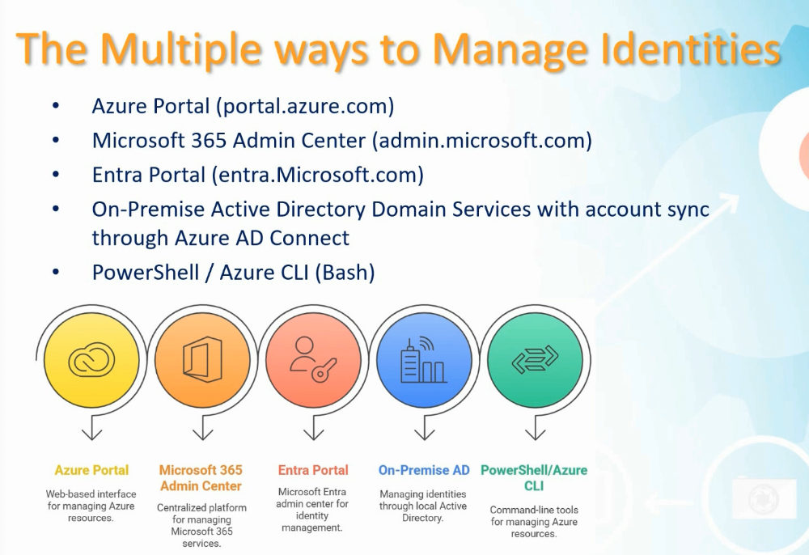

### What to know

- Microsoft Entra ID stores cloud identity objects used across Microsoft 365, Azure, and integrated applications.
- Some identity tasks can be managed from more than one portal, but the objects still live in the same tenant.
- On-premises Active Directory identities can be synchronized to Microsoft Entra ID for hybrid environments.
- PowerShell, Microsoft Graph, and Azure CLI matter because they support automation and bulk operations.

### Identity types

| Identity type | Represents | Common use |
|---|---|---|
| [Member user](../00-front-matter/glossary.md#member-user) | Internal employee or organizational account | Sign in to Microsoft 365, Azure, and apps |
| [Guest user](../00-front-matter/glossary.md#guest-user) | External collaborator invited into the tenant | B2B collaboration with limited access |
| [Service principal](../00-front-matter/glossary.md#service-principal) | Application or service identity | App permissions, automation, API access |
| [Managed identity](../00-front-matter/glossary.md#managed-identity) | Azure-managed workload identity | Access Azure services without stored secrets |
| [Device identity](../00-front-matter/glossary.md#device-identity) | Device object in Entra ID | Conditional Access, compliance, Intune, inventory |

### Member vs guest users

Member users are usually employees or internal accounts. Guest users are external identities invited through collaboration scenarios. The distinction matters because guest access is normally more limited and governed differently.

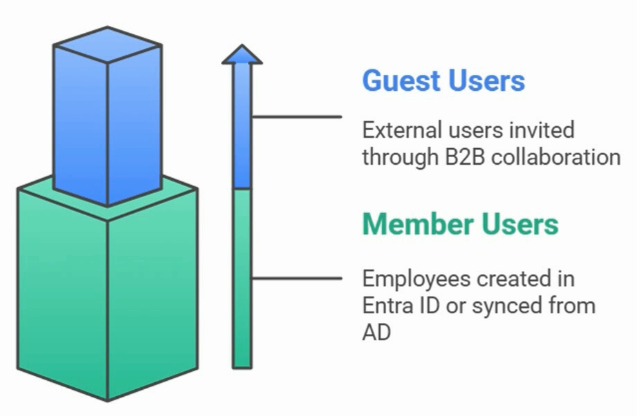

### Workload identities

Applications and Azure resources also need identities. A service principal is the tenant-local identity for an application. A managed identity is an Azure-managed identity that lets a resource authenticate without storing a password or secret in code.

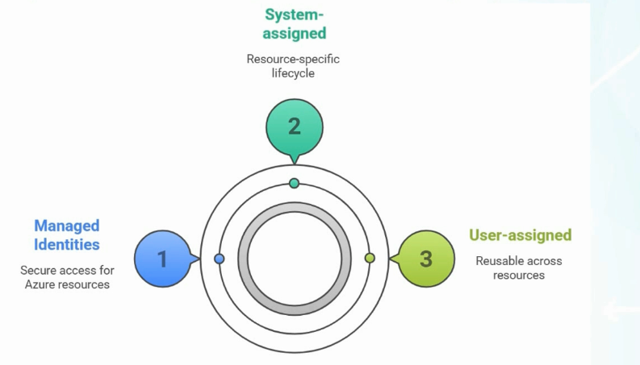

> [!WARNING]
> Exam trap: Do not think “identity” only means “human user.” SC-300 expects you to recognize users, guests, devices, applications, service principals, and managed identities.

## 36. Create, Configure, and Manage Users

### Core idea

Users are the primary human identities in Microsoft Entra ID. A user object includes sign-in information, account state, profile attributes, group membership, role assignments, and license assignments.

### What to know

- The [user principal name](../00-front-matter/glossary.md#user-principal-name) is the sign-in name for the user.
- The domain portion of the UPN must use a domain available in the tenant.
- Account enabled controls whether the user can sign in.
- Profile attributes support reporting, filtering, dynamic groups, and administrative workflows.
- Licenses enable access to Microsoft 365 services.


### User creation flow

| Step | Purpose |
|---:|---|
| 1 | Create the user identity |
| 2 | Choose the UPN and verified domain |
| 3 | Configure required profile attributes |
| 4 | Add group memberships if needed |
| 5 | Assign licenses if the user needs Microsoft 365 services |
| 6 | Validate sign-in and access behavior |

> [!TIP]
> Memory hook: Identity first, attributes second, access third, license fourth.

## 37. Understand Microsoft Entra Group Types

### Core idea

Groups simplify management by letting administrators assign access, collaboration, email distribution, or policy targeting to a collection of identities. The group type determines what the group can do.

### Group type overview

| Group type | Best for | Email | Access control | Dynamic membership |
|---|---|---:|---:|---:|
| [Microsoft 365 group](../00-front-matter/glossary.md#microsoft-365-group) | Collaboration and Microsoft 365 workloads | Yes | Limited workload/resource scenarios | Users only |
| Distribution group | Email distribution | Yes | No | No Entra dynamic membership |
| [Mail-enabled security group](../00-front-matter/glossary.md#mail-enabled-security-group) | Email plus access control | Yes | Yes | No Entra dynamic membership |
| [Security group](../00-front-matter/glossary.md#security-group) | Permissions, policies, and access management | No | Yes | Users or devices |

### How to choose

| Requirement | Recommended group type |
|---|---|
| Team collaboration with mailbox, calendar, SharePoint, or Teams | Microsoft 365 group |
| Send email to many recipients only | Distribution group |
| Assign permissions and also use an email address | Mail-enabled security group |
| Assign access, policies, or device/user targeting | Security group |
| Target Windows devices dynamically | Security group with dynamic device membership |

> [!WARNING]
> Exam trap: Microsoft 365 groups are collaboration groups. Security groups are the safer default answer for access control and device targeting.

## 38. Create, Configure, and Manage Groups

### Core idea

Groups can be created from Microsoft 365 admin experiences or from Microsoft Entra/Azure portal experiences. Regardless of where a group is created, the identity object is part of Microsoft Entra ID.

### What to know

- Microsoft 365 group creation focuses on collaboration settings such as owners, members, email address, privacy, and Teams integration.
- Entra group creation focuses on group type, role assignment capability, membership type, owners, members, and dynamic rules.
- Group owners can manage group membership and settings depending on configuration.
- Private groups require approval or invitation; public groups are easier to discover and join.

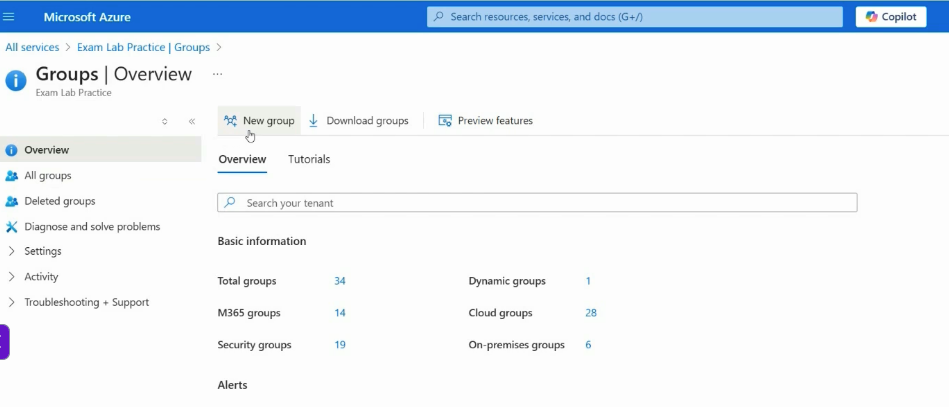

### Group creation decisions

| Decision | Why it matters |
|---|---|
| Group type | Determines collaboration, email, and access behavior |
| Membership type | Determines whether membership is manual or rule-based |
| Owners | Determines who can manage the group |
| Members | Determines who receives access or collaboration membership |
| Role assignment capability | Determines whether Entra roles can be assigned to the group |

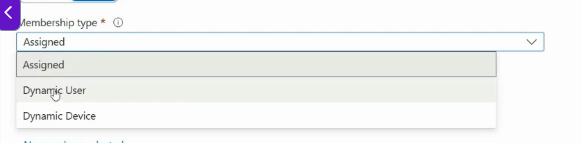

### Membership types

| Membership type | Meaning | Best use |
|---|---|---|
| Assigned | Members are manually added and removed | Small or fixed groups |
| Dynamic user | Users are added by rule based on attributes | Department, job title, location, lifecycle automation |
| Dynamic device | Devices are added by rule based on device attributes | Device targeting, policy assignment, platform/location groups |

## 39. Configure Dynamic Group Membership Rules

### Core idea

[Dynamic membership groups](../00-front-matter/glossary.md#dynamic-membership-group) automatically update membership based on user or device attributes. They reduce manual work and make group membership follow directory data.

### What to know

- Dynamic user rules evaluate user attributes.
- Dynamic device rules evaluate device attributes.
- Dynamic groups cannot be manually edited like assigned groups.
- Rule processing can take time.
- Bad source attributes create bad group membership, so attribute hygiene matters.

### Dynamic user rule example

A dynamic user group can include users based on department or job title. This supports scenarios such as “all Sales users” or “all users whose job title starts with Sales.”

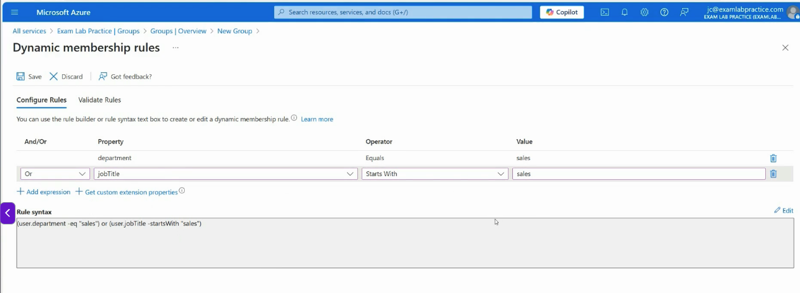

### Dynamic device rule example

A dynamic device group can include devices based on display name, operating system, ownership, or other device properties. This is useful for targeting policies to Windows devices or location-based device groups.

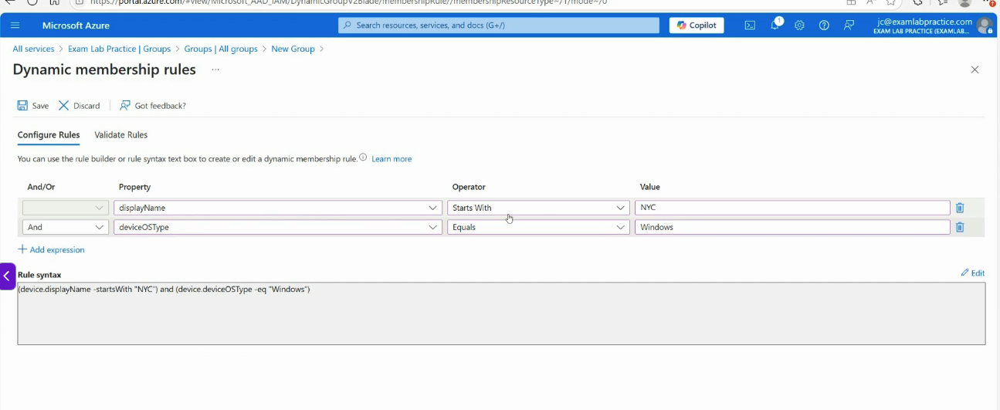

> [!WARNING]
> Exam trap: If membership is dynamic, fix the rule or source attributes. Do not try to manage membership manually.

## 40. Manage Custom Security Attributes

### Core idea

[Custom security attributes](../00-front-matter/glossary.md#custom-security-attribute) are business-specific key-value pairs assigned to supported Microsoft Entra objects. They can support filtering, access decisions, automation, and application logic.

### What to know

- Custom security attributes have a separate permission model.
- Global Administrator does not automatically manage custom security attributes.
- Attribute Definition Administrator defines attribute sets and attributes.
- Attribute Assignment Administrator assigns attribute values to supported objects.
- Attribute sets group related attributes.

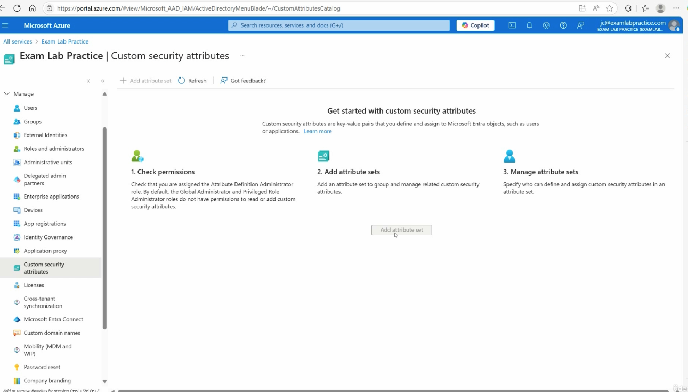

### Required roles

| Role | Purpose |
|---|---|
| Attribute Definition Administrator | Defines attribute sets and attribute definitions |
| Attribute Assignment Administrator | Assigns custom security attribute values |

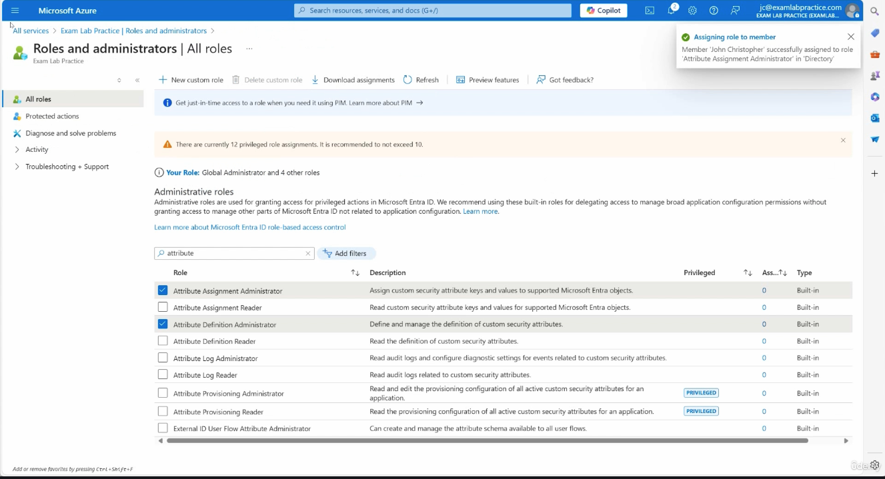

### Example: executive flag

An attribute set can group a custom attribute such as `isExecutive`. That attribute can then store a Boolean value used by administrative workflows, application logic, or future policy design.

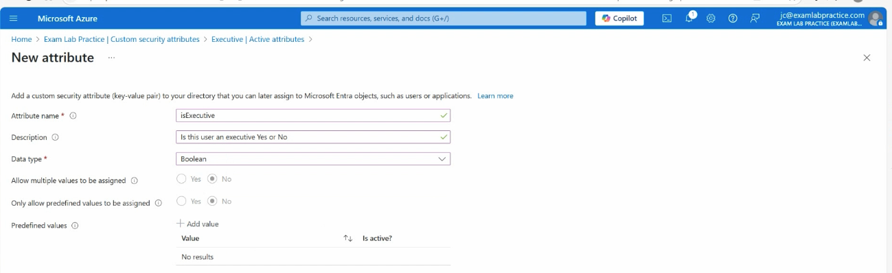

> [!WARNING]
> Exam trap: Custom security attributes are not normal profile fields. They require dedicated roles and should be designed intentionally.

## 41. Automate Bulk Operations

### Core idea

Bulk operations help administrators create, invite, or delete many users at once. They are useful for onboarding batches of users from a spreadsheet or HR export.

### What to know

- Bulk create uses a CSV template.
- The CSV must use the correct tenant domain for UPNs.
- Bulk operations can take time to process.
- Always verify results after upload.
- Use sanitized test data in labs and repo screenshots.

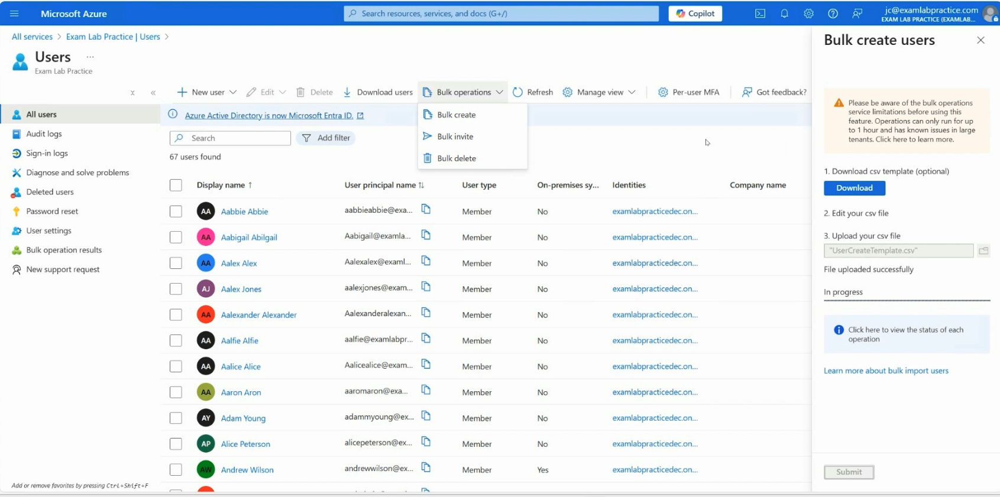

### Bulk create process

| Step | Purpose |
|---:|---|
| 1 | Download the CSV template |
| 2 | Fill in required user fields |
| 3 | Use the correct tenant domain |
| 4 | Save the CSV |
| 5 | Upload it through the bulk create workflow |
| 6 | Review processing results |
| 7 | Confirm users were created correctly |

> [!TIP]
> Memory hook: Bulk import is only as clean as the CSV.

## 42. Concepts of Microsoft Entra Device Register vs Device Join

### Core idea

Device identities represent devices in Microsoft Entra ID. The three major states are Microsoft Entra registered, Microsoft Entra joined, and Microsoft Entra hybrid joined.

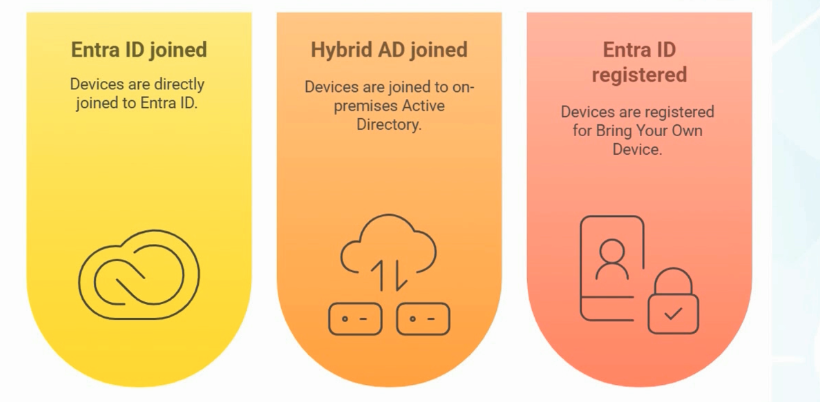

### Device identity comparison

| Device state | Typical ownership | Sign-in model | Control level |
|---|---|---|---|
| [Microsoft Entra registered](../00-front-matter/glossary.md#microsoft-entra-registered-device) | Personal or BYOD | Personal/local Windows sign-in plus connected work account | Limited control over work access |
| [Microsoft Entra joined](../00-front-matter/glossary.md#microsoft-entra-joined-device) | Organization-owned | Organizational account sign-in | Strong cloud management and policy control |
| [Microsoft Entra hybrid joined](../00-front-matter/glossary.md#microsoft-entra-hybrid-joined-device) | Organization-owned | Joined to AD DS and represented in Entra ID | Hybrid control across AD DS and cloud |

### What to know

- Registered usually means BYOD.
- Joined usually means cloud-first, organization-owned device.
- Hybrid joined usually means traditional AD DS plus Microsoft Entra ID.
- Device identity supports Conditional Access, Intune, compliance, and reporting.

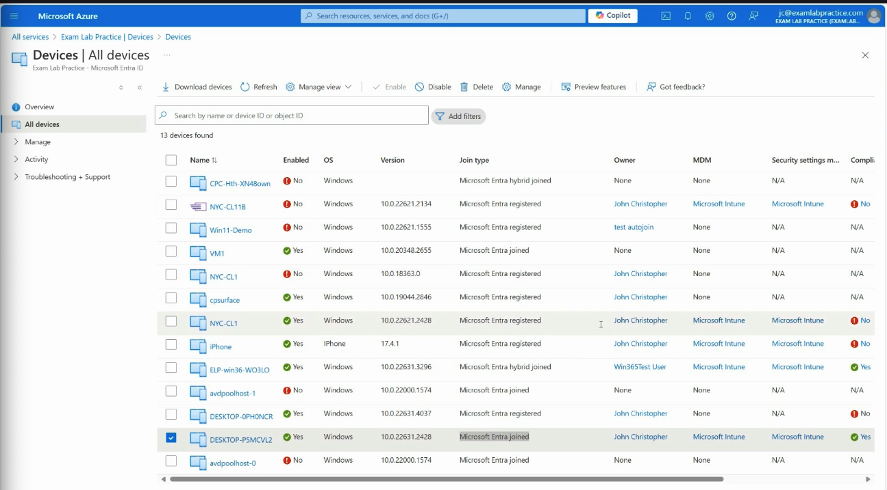

> [!TIP]
> Memory hook: Registered is connected, joined is controlled, hybrid joined is connected to both.

## 43. Manage Device Join to Microsoft Entra ID

### Core idea

A Windows device can become Microsoft Entra joined during first-time setup when the user signs in with an organizational work or school account.

### What to know

- The join flow commonly happens during Windows setup.
- The user signs in with an organizational account.
- The device appears in Microsoft Entra ID under Devices.
- The device can then participate in cloud access and management scenarios.

### Verification points

| Location | What to confirm |
|---|---|
| Windows settings | User is signed in with the organizational account |
| Microsoft Entra Devices | Device shows Microsoft Entra joined |
| Intune, if used | Management and compliance state appear |

> [!WARNING]
> Exam trap: Signing in with an organization account during setup can join the device. Connecting a work account later from a personal Windows profile usually registers the device.

## 44. Manage Device Registration in Microsoft Entra ID

### Core idea

Device registration is the common BYOD pattern. The user keeps signing in to Windows with a personal or local account, then connects a work or school account so company resources can apply work-related access controls.

### What to know

- Registration is not the same as join.
- Registration creates a device identity for access decisions.
- The organization has less control than it would over a joined device.
- Registration is common for personal laptops, phones, and tablets.

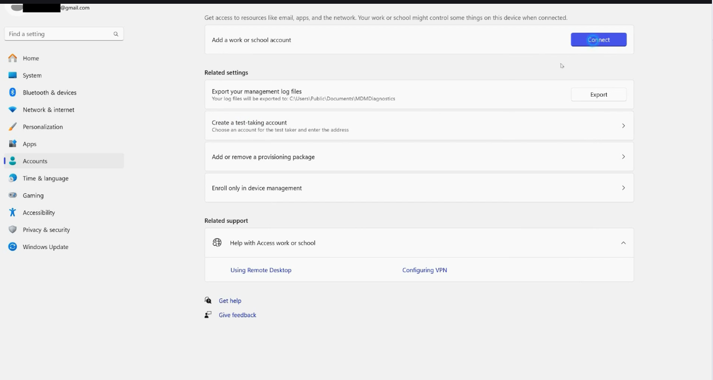

### Registered vs joined

| Question | Registered | Joined |
|---|---|---|
| Who owns the device? | Usually the user | Usually the organization |
| How does the user sign in? | Personal/local account | Organizational account |
| How much control does the company have? | Limited, focused on work access | Stronger device and policy control |
| Typical scenario | BYOD | Corporate-owned device |

## 45. Assign, Modify, and Report on Licenses

### Core idea

Microsoft 365 licenses enable services for users. Licenses can be assigned directly to users or indirectly through groups.

### What to know

- Direct license assignment is simple for small numbers of users.
- [Group-based licensing](../00-front-matter/glossary.md#group-based-licensing) scales better for large environments.
- Group-based licensing requires enough available licenses.
- Reports help identify usage and adoption, but they do not replace access reviews.

### Licensing comparison

| Method | Best use | Risk |
|---|---|---|
| Direct user licensing | Small or exception-based assignments | Harder to maintain at scale |
| Group-based licensing | Department, role, or lifecycle-based licensing | Requires clean group membership |
| Usage reporting | Review service activity and adoption | Does not prove access is still appropriate |

> [!TIP]
> Memory hook: Direct licensing is simple; group-based licensing is scalable.

## 46. A Foundation of Administration with PowerShell

### Core idea

PowerShell is Microsoft’s command-line and automation shell. It is useful because repeated or large-scale administrative work can be scripted instead of performed manually.

### Core concepts

| Concept | Example | Meaning |
|---|---|---|
| Verb-Noun | `Get-Service` | Command naming pattern |
| Parameter | `-Name winrm` | Adds detail to a command |
| Pipeline | `|` | Sends output to the next command |
| Variable | `$computerName` | Stores a reusable value |
| Help | `Get-Help` | Displays command help |

### Example commands

```powershell
Get-Service
Get-Process
Get-Command -Verb Get
Get-Help Get-EventLog
Get-EventLog -LogName Security -Newest 10 | Format-List
```

> [!WARNING]
> Exam trap: PowerShell is not just a command prompt. Its value is automation, scale, repeatability, and remote administration.

## 47. Understanding Microsoft Graph vs Traditional PowerShell

### Core idea

[Microsoft Graph](../00-front-matter/glossary.md#microsoft-graph) is Microsoft’s unified API for Microsoft cloud services. Microsoft Graph PowerShell uses that API to manage Microsoft Entra ID and Microsoft 365 objects with modern authentication.

### Comparison

| Area | Traditional modules | Microsoft Graph |
|---|---|---|
| Service model | Fragmented by product | Unified API surface |
| Authentication | Older methods may appear | Modern token-based authentication |
| Automation | Service-specific scripts | Better cross-service automation |
| Long-term direction | Some modules deprecated over time | Current strategic direction |

> [!TIP]
> Memory hook: Traditional PowerShell was service-by-service; Graph is cloud-wide.

## 48. Installing and Connecting Microsoft Graph for PowerShell

### Core idea

Before using Microsoft Graph PowerShell, install the module and connect with the permissions, or scopes, needed for the task.

### Basic setup flow

| Step | Purpose |
|---:|---|
| 1 | Check execution policy if scripts are blocked |
| 2 | Install Microsoft Graph PowerShell |
| 3 | Connect to Microsoft Graph |
| 4 | Request required scopes |
| 5 | Run commands against Entra objects |

### Example commands

```powershell
Get-ExecutionPolicy
Install-Module Microsoft.Graph -Scope CurrentUser
Connect-MgGraph -Scopes "Group.ReadWrite.All", "User.ReadWrite.All"
```

> [!WARNING]
> Exam trap: Broad Graph scopes grant broad capability. Request only what the task requires.

## 49. Using PowerShell to Manage Users, Groups, and Bulk Operations

### Core idea

Microsoft Graph PowerShell can manage users, groups, licenses, and bulk operations in Microsoft Entra ID. The same objects are visible in the portal, but automation is faster and more repeatable.

### Common cmdlets

| Cmdlet | Use |
|---|---|
| `Get-MgUser` | Read users |
| `New-MgUser` | Create users |
| `Remove-MgUser` | Delete users |
| `Get-MgSubscribedSku` | View license SKUs |
| `Set-MgUserLicense` | Assign or remove licenses |
| `New-MgGroup` | Create groups |
| `New-MgGroupMemberByRef` | Add group members by object reference |

### Sanitized user creation pattern

```powershell
Connect-MgGraph -Scopes "Group.ReadWrite.All", "User.ReadWrite.All"

New-MgUser `
  -AccountEnabled:$true `
  -DisplayName "Example User" `
  -MailNickname "exampleuser" `
  -UserPrincipalName "exampleuser@contoso.example" `
  -PasswordProfile @{
    ForceChangePasswordNextSignIn = $true
    Password = "Use-a-secure-temporary-password"
  }
```

### Bulk creation pattern

```powershell
$PasswordProfile = @{
  Password = "Use-a-secure-temporary-password"
  ForceChangePasswordNextSignIn = $true
}

Import-Csv -Path ".\users.csv" | ForEach-Object {
  New-MgUser `
    -AccountEnabled:$true `
    -DisplayName $_.DisplayName `
    -MailNickname $_.MailNickname `
    -UserPrincipalName $_.UserPrincipalName `
    -PasswordProfile $PasswordProfile
}
```

### Repository note

Assignment 2 and Assignment 3 belong in the `assignments/` folder when you document them. Keep the write-ups original, sanitized, and focused on what you configured, how you validated it, and what you cleaned up.

> [!TIP]
> Memory hook: Portals are good for learning; Graph PowerShell is good for repeatable administration.
