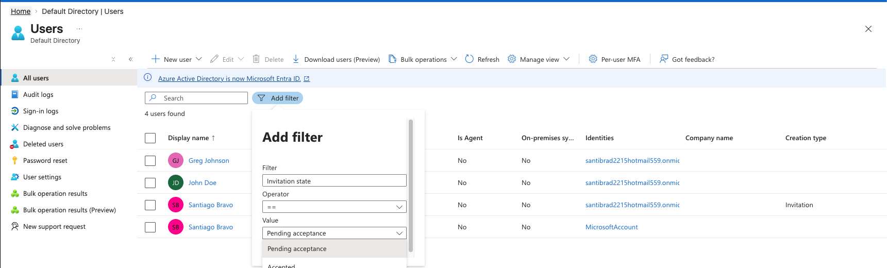
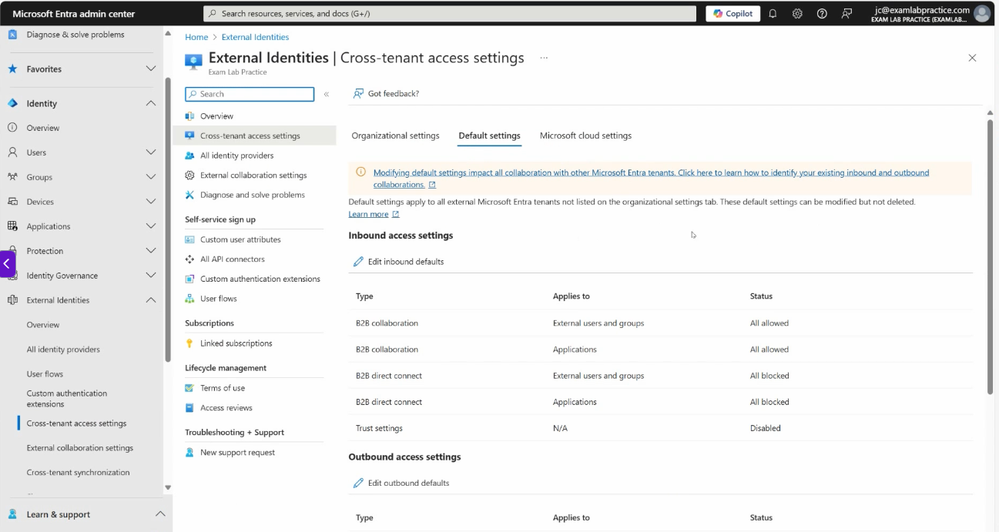
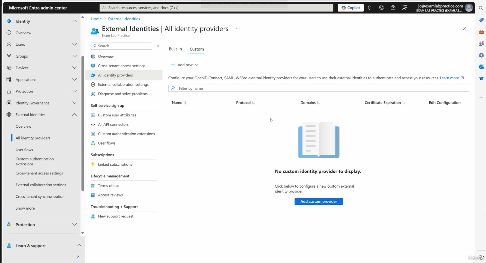
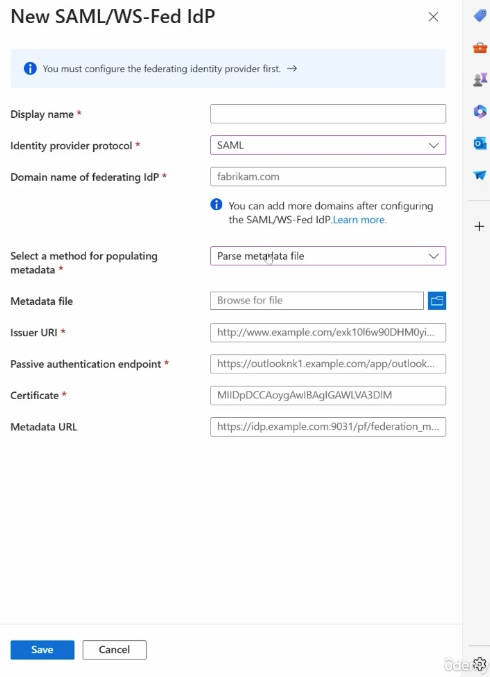

# Section 5: Implement and manage Identities for external users and tenants

This section introduces Microsoft Entra external identity features used to collaborate with users and organizations outside the tenant. The main focus is controlling guest access, inviting and managing external users, configuring cross-tenant trust, synchronizing users between tenants, and supporting external identity providers.

> [!NOTE]
> Section 5 is about controlled collaboration. External users should be able to work with the organization, but only through intentional invitation, access, tenant trust, and identity provider settings.

## 50. Manage External Collaboration Settings in Microsoft Entra ID

### Core idea

External collaboration settings define how outside users can be invited into a Microsoft Entra tenant, what guest users can see, whether guests can leave the organization, and which external domains are allowed or blocked.

Portal path:

```text
Microsoft Entra admin center > Identity > External Identities > Overview > External collaboration settings
```

### What to know

- External collaboration is part of [Microsoft Entra External ID](../00-front-matter/glossary.md#external-identity).
- External users can sign in with their own identity instead of using a separate internal account.
- These users commonly represent vendors, contractors, consultants, partners, or temporary collaborators.
- The configuration should balance ease of collaboration with security and directory privacy.

### Guest user access restrictions

Guest access restrictions control how much directory information a [Guest User](../00-front-matter/glossary.md#guest-user) can see after being invited into the tenant.

| Guest access setting | Meaning | Security posture |
|---|---|---|
| Same access as members | Guests can view most directory information similarly to internal members. | Least restrictive |
| Limited access | Guests can view some properties and group membership information, but not everything. | Balanced/default-oriented |
| Most restrictive access | Guests can view only properties and memberships of their own directory objects. | Most restrictive |

> [!WARNING]
> Guest visibility is not the same thing as application access. A guest may exist in the directory, but they still need access to the right group, app, SharePoint site, Teams workspace, or role.

### Guest invite settings

Organizations can control who is allowed to invite guest users.

| Invite setting | What it allows |
|---|---|
| Anyone in the organization | Any internal user can invite guests. |
| Members and selected admin roles | Member users and users with selected administrative roles can invite guests. |
| Specific roles only | Only users with roles such as Guest Inviter or User Administrator can invite guests. |
| No one | Guest invitations are blocked, including for administrators. |

### Self-service sign-up

Self-service sign-up allows external users to register themselves through configured user flows. This is useful when onboarding external users to specific applications without manually inviting each account.

If self-service sign-up is disabled, guests must be invited directly by the organization.

### External user leave settings

External user leave settings determine whether guest users can remove themselves from the organization. Allowing guests to leave is generally better for privacy and transparency because the external user can end the relationship when access is no longer needed.

### Collaboration restrictions

Collaboration restrictions control which external domains can be invited.

| Restriction mode | Use case |
|---|---|
| Allow invitations to any domain | Open collaboration model. |
| Deny invitations to specific domains | Mostly open model with specific blocked domains. |
| Allow invitations only to specific domains | Tightly controlled partner/vendor model. |

These restrictions work alongside [Cross-Tenant Access Settings](../00-front-matter/glossary.md#cross-tenant-access-settings). Domain allow/block lists determine whether an invitation is permitted, while cross-tenant access settings define trust and access behavior between tenants.

> [!TIP]
> Memory hook: external collaboration settings answer "who can invite guests, what can guests see, and which domains are allowed?"

## 51. Invite External Users Individually or in Bulk

### Core idea

Microsoft Entra lets administrators invite external users one at a time or in bulk. The user keeps their own identity, but the resource tenant creates a guest object so access can be assigned and governed.

### Individual external user invitation

Portal path:

```text
portal.azure.com > Microsoft Entra ID > Users > New user > Invite external user
```

### Process overview

1. Open Microsoft Entra ID.
2. Go to **Users**.
3. Select **New user**.
4. Choose **Invite external user**.
5. Enter the external user's email address.
6. Add the display name.
7. Optionally add a custom invitation message.
8. Optionally CC yourself on the invitation email.
9. Optionally configure a redirect URL for after invitation redemption.
10. Add profile properties if needed.
11. Assign groups or roles only when required.
12. Review and send the invitation.

### Invitation options

| Option | Why it matters |
|---|---|
| Custom invite message | Gives the guest context about why they are receiving the invitation. |
| CC yourself | Helps track that the invitation was sent. |
| Redirect URL | Sends the user to a specific app or landing page after accepting. |
| Groups | Grants access through existing access-control design. |
| Roles | Should be assigned carefully and only when needed. |

> [!WARNING]
> Inviting a guest user creates the collaboration identity, but it does not automatically mean the guest can access everything. Access still depends on group membership, app assignment, SharePoint/Teams permissions, roles, Conditional Access, and tenant policies.

### Bulk inviting external users

Bulk invite is useful when onboarding several external users at once, such as vendor staff, partner users, consultants, or contractors.

Process:

1. Go to **Microsoft Entra ID > Users**.
2. Select **Bulk operations**.
3. Choose **Bulk invite**.
4. Download the CSV template.
5. Fill in the required invitee information.
6. Save the CSV file.
7. Upload the CSV file.
8. Submit the bulk invitation job.
9. Review the bulk operation results.
10. Verify the guest users were added to the directory.

> [!TIP]
> Bulk invite is best for repeatable onboarding. Individual invite is best for one-off collaborators.

## 52. Manage External Accounts in Microsoft Entra

### Core idea

External accounts are managed much like internal user accounts. The main difference is that administrators must identify guest users and understand their invitation state before managing access, properties, licensing, or lifecycle.

### Filtering and identifying external users

Use filters to locate external users by invitation state.



Useful filters include:

- **Invitation state = Pending acceptance**
- **Invitation state = Accepted**
- **User type = Guest**

| Invitation state | Meaning |
|---|---|
| Pending acceptance | The invitation was sent, but the external user has not completed redemption. |
| Accepted | The guest user accepted the invitation and completed the sign-in flow. |

### Managing external user accounts

After opening a guest user's profile, administrators can manage many of the same areas used for regular users.

- Edit profile properties.
- Delete the user.
- Reset password where applicable.
- Review account details.
- Review group or role assignments.
- Disable the account if access should stop temporarily.

### Licensing external users

Guest users can be assigned licenses when a scenario requires licensed Microsoft 365 or application features. In many tenant workflows, licensing is handled from:

```text
admin.microsoft.com > Billing > Licenses
```

Licensing should be intentional. A guest account should not receive a license unless the business scenario requires it and the organization has available licenses.

### Deactivating vs deleting

| Action | When to use it |
|---|---|
| Disable or deactivate | Access should stop, but the account record may still be needed for audit, later reactivation, or review. |
| Delete | The guest relationship is no longer needed and the account should be removed from the tenant. |

> [!TIP]
> For troubleshooting guest onboarding, start with invitation state. It quickly tells you whether the problem is invitation redemption or post-invitation access.

## 53. Implement Cross-Tenant Access Settings

### Core idea

Cross-tenant access settings define trust and access behavior between Microsoft Entra tenants. They are used when organizations need controlled collaboration with another company, partner, subsidiary, or related tenant.

Portal path:

```text
Microsoft Entra admin center > Identity > External Identities > Cross-tenant access settings
```



### Adding another organization

The relationship usually starts from **Organizational settings**, where an administrator adds the external organization by tenant ID or verified domain name.

The partner organization normally provides this information from its own tenant overview page. After the organization is added, administrators can configure inbound access, outbound access, trust settings, and tenant restrictions.

### Inbound access

[Inbound Access](../00-front-matter/glossary.md#inbound-access) controls what users, groups, applications, and services from the external tenant can do in your tenant.

| Inbound setting area | What it controls |
|---|---|
| B2B collaboration | Whether external users and groups can be invited into your tenant. |
| Applications | Whether external users can access applications in your tenant. |
| B2B direct connect | Collaboration scenarios such as Teams shared channels. |
| Trust settings | Whether your tenant trusts signals from the other tenant, such as MFA or compliant device claims. |

### Outbound access

[Outbound Access](../00-front-matter/glossary.md#outbound-access) controls what your users and groups can do in the partner tenant.

| Outbound setting area | What it controls |
|---|---|
| B2B collaboration | Whether your users can collaborate with the external tenant. |
| Applications | Whether your users can access external applications in that tenant. |
| B2B direct connect | Whether your users can use supported direct collaboration features. |

> [!WARNING]
> Do not confuse inbound and outbound. Inbound protects your tenant from external users and apps. Outbound controls where your users can go outside your tenant.

### Tenant restrictions

[Tenant Restrictions](../00-front-matter/glossary.md#tenant-restrictions) can block access to specific external tenants or external applications. This provides another layer of control for organizations that want to prevent collaboration with untrusted tenants.

### Microsoft cloud settings

Microsoft cloud settings support collaboration across Microsoft cloud environments, such as Azure commercial, Azure Government, and Azure operated by 21Vianet. These settings are especially relevant for regulated organizations that collaborate across cloud boundaries.

### What to know for SC-300

- Cross-tenant access settings are about tenant-to-tenant trust.
- They include both default settings and organization-specific settings.
- Trust settings can reduce friction by trusting MFA or compliant device claims from another tenant.
- B2B collaboration and B2B direct connect are related but not identical.

> [!TIP]
> Memory hook: cross-tenant access settings answer "which tenant do we trust, in which direction, and for which collaboration scenario?"

## 54. Implement and Manage Cross-Tenant Synchronization

### Core idea

[Cross-Tenant Synchronization](../00-front-matter/glossary.md#cross-tenant-synchronization) automates the creation, update, and removal of B2B collaboration users across Microsoft Entra tenants. It is useful for closely related tenants, acquisitions, subsidiaries, or multitenant organizations that need smoother access across environments.

Portal path:

```text
Microsoft Entra admin center > Identity > External Identities > Cross-tenant synchronization
```

### What to know

- It is more integrated than manually inviting individual guests.
- It is built on Microsoft Entra provisioning.
- It creates and maintains B2B users in the target tenant.
- The source tenant controls which users and groups are in scope.
- The target tenant must allow synchronization into the tenant.
- It can support automatic lifecycle behavior when users leave scope.

### Normal guest invitation vs cross-tenant synchronization

| Scenario | Normal guest invitation | Cross-tenant synchronization |
|---|---|---|
| Best for | Occasional collaboration | Close tenant relationships |
| Account creation | Manual or bulk invitation | Automated provisioning |
| Lifecycle management | Mostly manual unless governed separately | Automated based on source scope |
| User experience | Guest redeems invitation | Can support smoother automatic redemption scenarios |
| Typical use | Contractors, vendors, one-off partners | Subsidiaries, acquisitions, multitenant organizations |

### Process overview

1. Confirm the partner tenant relationship and trust requirements.
2. Configure cross-tenant access settings.
3. Allow synchronization into the target tenant.
4. Create a cross-tenant synchronization configuration.
5. Enter the target tenant ID.
6. Choose manual or automatic provisioning behavior.
7. Scope the users and groups to synchronize.
8. Review attribute mappings.
9. Test provisioning with a small set first.
10. Monitor provisioning status and errors.

> [!WARNING]
> Cross-tenant synchronization is not a tenant migration tool. The synchronized users still authenticate against their source tenant.

> [!TIP]
> Memory hook: guest invitation is "invite this person." Cross-tenant synchronization is "keep these users represented in that tenant."

## 55. Configure External Identity Providers Including SAML and WS-Fed

### Core idea

An [Identity Provider](../00-front-matter/glossary.md#identity-provider) authenticates users. Microsoft Entra can use built-in and custom identity providers so external users can sign in with identities managed outside your tenant.

### Built-in identity provider options

Common built-in options include:

- Microsoft Entra ID
- Email one-time passcode
- Google
- Facebook

These options help external users redeem invitations or complete sign-up flows without the organization creating a full internal identity for each person.

### Custom identity providers

Custom identity providers support more advanced integration with external authentication systems.



| Protocol | What it is used for |
|---|---|
| OpenID Connect | Modern identity protocol commonly used for web and cloud applications. |
| SAML | Federation protocol commonly used with enterprise identity providers and SaaS applications. |
| WS-Fed | Federation protocol often found in older Microsoft and enterprise federation scenarios. |

### Federation setup

When configuring a SAML or WS-Fed provider, the identity provider owner normally provides federation metadata and certificate details.



Typical setup information includes:

- Display name.
- Identity provider protocol.
- Federated identity provider domain.
- Metadata file or metadata URL.
- Issuer URI.
- Passive authentication endpoint.
- Certificate.

If a metadata file or metadata URL is available, configuration is usually cleaner because Microsoft Entra can import the provider details rather than requiring every value to be typed manually.

> [!WARNING]
> Federation depends on accurate metadata, endpoints, domains, and certificates. If any of those values are wrong or expired, sign-in can fail even when the invitation and user object are correct.

> [!TIP]
> Memory hook: the identity provider answers "who proves this user's identity?"

## Assignment 4: Configure External Collaboration Settings

### Core idea

Assignment 4 aligns to the external collaboration settings covered in this section. The goal is to configure collaboration so the tenant only allows the intended external access pattern.

### What to document

- The external collaboration settings you changed.
- The guest access restriction selected.
- The guest invitation control selected.
- Any domain allow or deny restrictions configured.
- The reason those settings match the requested scenario.
- Sanitized evidence that the configuration was saved.

### Repository note

The assignment write-up should live under:

```text
assignments/section-05-assignment-04-external-collaboration-settings.md
```

Keep the final assignment evidence sanitized. Do not include tenant IDs, private domains, real usernames, subscription details, or raw course simulation links.
