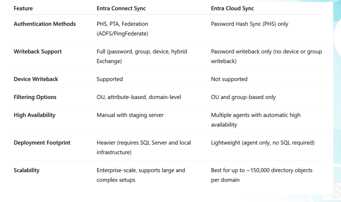
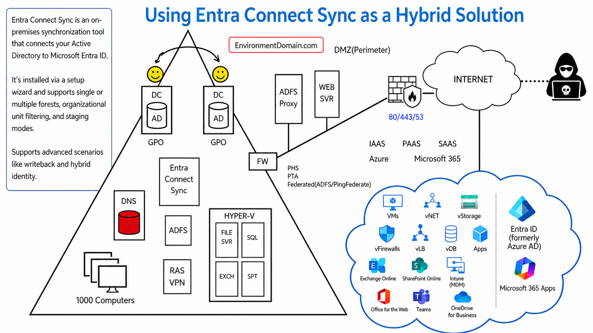
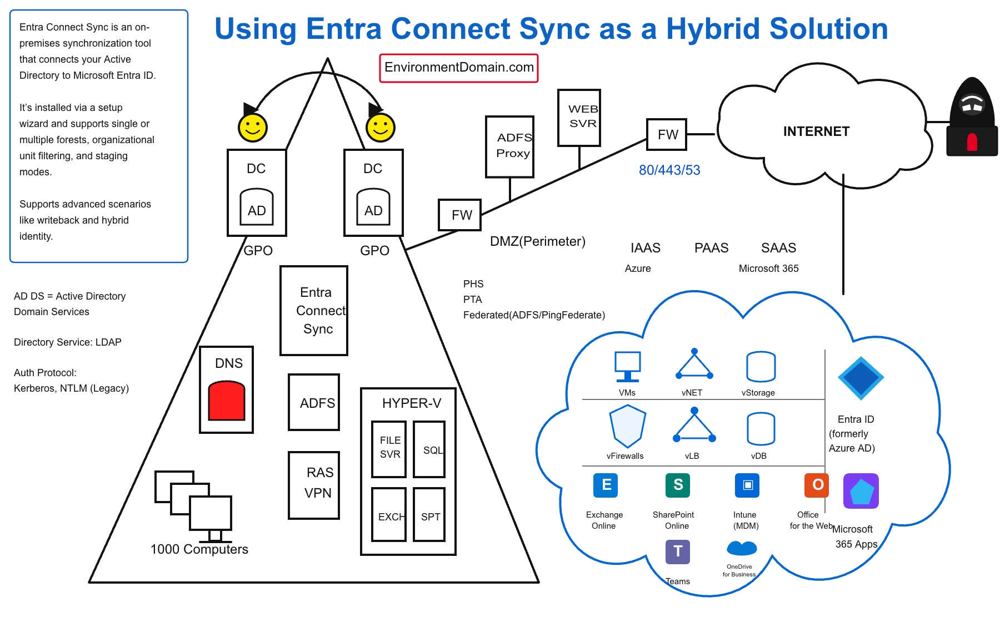
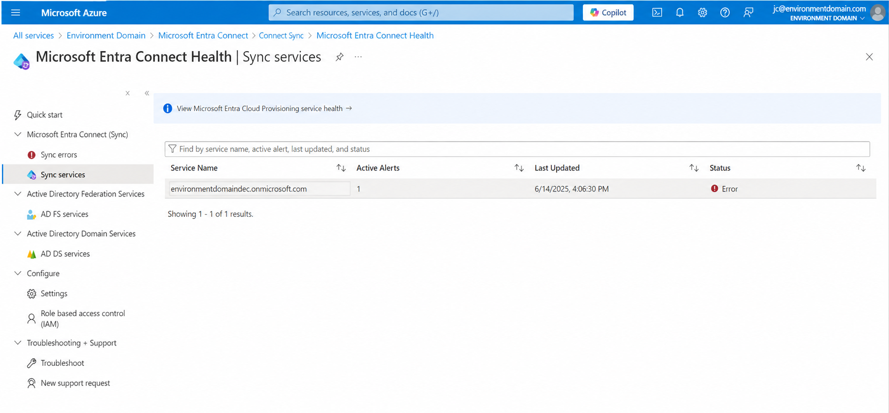

# Section 6: Implement and manage hybrid identity

This section focuses on connecting on-premises Active Directory Domain Services (AD DS) with Microsoft Entra ID. The goal is to understand the major hybrid identity tools, authentication choices, synchronization options, troubleshooting tools, and health monitoring views.

> [!NOTE]
> Hybrid identity is not only "sync users to the cloud." It includes how identities synchronize, where passwords are validated, whether sign-in is cloud or federated, what gets written back to AD DS, and how you monitor sync health.

## 56. Entra Connect Sync, Entra Cloud Sync, PHS, PTA, AD FS, and SSO

### Core idea

Hybrid identity lets users authenticate in an on-premises AD DS environment and also use Microsoft Entra ID for Microsoft 365, Azure, and cloud application access. Microsoft provides two main synchronization models:

| Tool | Best description |
|---|---|
| Microsoft Entra Connect Sync | Full-featured on-premises sync tool for complex hybrid identity. |
| Microsoft Entra Cloud Sync | Lightweight, cloud-managed sync using provisioning agents. |



### Entra Connect Sync

Microsoft Entra Connect Sync is installed on an on-premises server and configured through a setup wizard. It is the more complete hybrid identity option.

It supports:

- Single or multiple forests.
- OU filtering.
- Domain and attribute filtering.
- Staging mode for standby sync servers.
- Password writeback.
- Group writeback scenarios.
- Device writeback scenarios.
- Hybrid Exchange and other advanced hybrid identity requirements.

### Entra Connect Sync sign-in methods

| Sign-in method | How it works | Best fit |
|---|---|---|
| Password Hash Synchronization (PHS) | A hash of the user's password hash is synchronized to Microsoft Entra ID. Cloud authentication happens in Entra ID. | Default and simplest cloud authentication model. |
| Pass-through Authentication (PTA) | Microsoft Entra receives the sign-in request, then validates the password through on-premises agents. | Organizations that want passwords validated against on-prem AD DS in real time. |
| Federation with AD FS | Microsoft Entra redirects authentication to Active Directory Federation Services. | Advanced, compliance-heavy, or smart card/federation scenarios. |
| Federation with PingFederate | Similar federation model using PingFederate instead of AD FS. | Organizations already standardized on PingFederate. |

### Password Hash Synchronization

PHS is one of the most common hybrid sign-in methods. The user can sign in to Microsoft cloud services using the same password they use on-premises, but the cloud validates the sign-in.

Key benefits:

- Simple deployment compared with federation.
- Good availability because Microsoft Entra ID can authenticate users directly.
- Supports leaked credential detection for synced hybrid accounts.
- Can be used as a backup sign-in method for some federated designs.

> [!WARNING]
> PHS does not synchronize plain-text passwords. It synchronizes a processed hash derived from the on-premises password hash.

### Pass-through Authentication

PTA uses lightweight on-premises authentication agents. When a user signs in to Microsoft Entra ID, the password validation is passed through to the on-premises AD DS environment.

Key benefits:

- Password validation remains on-premises.
- On-premises policies such as account lockout can be enforced.
- Multiple agents can be installed for high availability.
- Works with Conditional Access.

### Federation with AD FS

Federation uses an on-premises identity provider, such as AD FS, to authenticate users. Microsoft Entra ID trusts the federated identity provider and accepts the resulting token or assertion.

Best fit:

- Smart card or certificate-heavy authentication designs.
- Advanced third-party MFA or custom authentication requirements.
- Organizations with strict requirements to keep primary authentication on-premises.

Main drawback:

- More infrastructure to maintain.
- Certificate lifecycle matters.
- AD FS availability becomes part of cloud sign-in availability.

### Seamless Single Sign-On

Seamless SSO can be enabled with PHS or PTA. It uses Kerberos-based authentication so users on corporate, domain-joined devices can access Microsoft cloud services without repeatedly typing their password.

> [!IMPORTANT]
> Seamless SSO works with PHS and PTA. It is not the same thing as AD FS federation.

### Entra Cloud Sync

Microsoft Entra Cloud Sync is a lighter, cloud-managed sync option. It uses small on-premises provisioning agents and is configured in the Microsoft Entra admin center.

It can synchronize:

- Users.
- Groups.
- Contacts.

It is designed for simpler and cloud-first hybrid identity environments. It avoids the heavier local sync engine footprint used by Entra Connect Sync.

### Main comparison

| Feature | Entra Connect Sync | Entra Cloud Sync |
|---|---|---|
| Management model | Installed and configured on-premises. | Cloud-managed from the Entra portal. |
| Local footprint | Heavier sync server. | Lightweight provisioning agents. |
| Authentication methods | PHS, PTA, AD FS federation, PingFederate federation. | PHS-focused cloud sync model. |
| Filtering | OU, domain, and attribute-based options. | Scoping filters, commonly OU or group based. |
| Writeback | Broader writeback capabilities. | Supports SSPR password writeback in supported scenarios. |
| High availability | Staging server model; failover is not fully automatic. | Multiple agents can provide easier redundancy. |
| Best fit | Complex enterprise hybrid identity. | Simpler cloud-first hybrid identity. |

### When to use each one

| Use Entra Connect Sync when you need... | Use Entra Cloud Sync when you need... |
|---|---|
| PTA or federation. | Basic cloud-managed synchronization. |
| Advanced writeback features. | Lightweight agent deployment. |
| Hybrid Exchange or complex forest needs. | Simpler OU or group scoped sync. |
| Large, mature, or complex AD DS environments. | Easier setup and management. |

> [!TIP]
> Memory hook: Connect Sync is the full toolbox. Cloud Sync is the lightweight agent model.

### Common exam traps

| Trap | Correct exam thinking |
|---|---|
| "Cloud Sync replaces Connect Sync for every scenario." | No. Cloud Sync is simpler, but Connect Sync still matters for advanced hybrid needs. |
| "PTA stores password hashes in Microsoft Entra." | No. PTA validates passwords through on-premises agents. |
| "PHS syncs plain passwords." | No. PHS syncs a processed password hash, not plain text. |
| "Seamless SSO requires AD FS." | No. Seamless SSO works with PHS or PTA. |
| "Federation is always more secure." | Not automatically. Federation adds infrastructure, certificates, and availability dependencies. |

## 57. Draw Out PHS, PTA, and AD FS Authentication Flows

### Core idea

The easiest way to remember hybrid authentication is to ask: where is the password validated?

| Method | Where password validation happens | What to remember |
|---|---|---|
| PHS | Microsoft Entra ID | Cloud validates sign-in using synced password hash data. |
| PTA | On-premises AD DS through PTA agents | Cloud receives sign-in, but on-prem validates the password. |
| AD FS | On-premises federation service | Cloud redirects authentication to the federation provider. |





### Password Hash Synchronization flow

1. User signs in to a Microsoft cloud app.
2. Microsoft Entra ID validates the sign-in in the cloud.
3. Entra ID uses the synchronized password hash data from AD DS.
4. Conditional Access, MFA, and risk controls can still apply.

Best fit:

- Most common cloud authentication model.
- Strong baseline for many hybrid tenants.
- Good backup option for federated environments.

### Pass-through Authentication flow

1. User signs in to a Microsoft cloud app.
2. Microsoft Entra ID receives the request.
3. PTA agent sends validation to on-premises AD DS.
4. AD DS validates the password.
5. Microsoft Entra ID completes the sign-in if validation succeeds.

Best fit:

- Organizations that want on-premises password validation.
- Environments that need on-prem lockout or password policy behavior to remain central.

### AD FS federation flow

1. User starts sign-in to Microsoft Entra ID.
2. Entra ID detects the federated domain.
3. User is redirected to AD FS or the federation provider.
4. AD FS authenticates the user.
5. Federation token is sent back through the sign-in flow.
6. Microsoft Entra ID grants access if the token and policy checks succeed.

Best fit:

- Smart card environments.
- Advanced federation requirements.
- Existing federation investments.

### Authentication method table

| Method | Infrastructure | User experience | Operational risk |
|---|---|---|---|
| PHS | Lowest. Entra Connect Sync or Cloud Sync handles password hash sync. | Simple sign-in using same password. | Lower on-prem dependency during cloud sign-in. |
| PTA | PTA agents on-premises. | Similar to PHS from the user perspective. | Sign-in depends on healthy PTA agents and AD DS availability. |
| AD FS | AD FS servers, proxies, certificates, and network publishing. | Can support advanced federated SSO. | Highest infrastructure and certificate dependency. |

> [!TIP]
> Memory hook: PHS validates in the cloud, PTA validates through agents, AD FS redirects to federation.

### Common exam traps

| Trap | Correct exam thinking |
|---|---|
| "All three methods require AD FS." | No. Only federation uses AD FS. |
| "PTA and PHS are the same because users type the same password." | User experience may look similar, but validation location is different. |
| "Cloud Sync supports all Connect Sync sign-in methods." | No. Cloud Sync is not the full Connect Sync replacement. |
| "AD FS removes the need for Conditional Access." | No. Conditional Access can still evaluate access in Entra-based flows. |

## 58. Fix Synchronization Issues Before Hybrid Setup with IDFix

### Core idea

IDFix is a Microsoft tool used before synchronizing on-premises AD DS objects to Microsoft Entra ID. It finds and helps fix attribute values that may be valid on-premises but invalid or problematic in the cloud.

### Why IDFix matters

Older AD DS environments often contain legacy naming, duplicate attributes, invalid characters, or formatting issues. These can block or break synchronization.

Common problem areas:

- User Principal Name (UPN).
- Proxy addresses.
- Mail attributes.
- Duplicate values.
- Invalid characters.
- Unsupported formatting.

### Example from the notes

A user named Sam Jones was created in Active Directory with a space in the account login name. On-premises AD DS allowed the value, but Microsoft Entra ID does not allow spaces in the user sign-in name. IDFix detected the object and flagged a character error.

### IDFix actions

| Action | Meaning |
|---|---|
| Edit | Fix the detected value. |
| Remove | Remove the problematic object from consideration. |
| Complete | Mark the issue as handled. |

### Important distinction

The display name can still be friendly, such as `Sam Jones`. The problem is usually the sign-in attribute, such as the account name or UPN, not the display name.

> [!TIP]
> Memory hook: IDFix is the preflight check before syncing AD DS to Entra ID.

### Common exam traps

| Trap | Correct exam thinking |
|---|---|
| "If AD DS accepts the attribute, Entra ID will also accept it." | No. Cloud identity has its own validation rules. |
| "IDFix is used after every normal sync cycle." | No. It is mainly a preparation and remediation tool for directory attribute issues. |
| "Display name spacing causes the same problem as UPN spacing." | The sign-in/account attribute is the critical one. Display names can contain spaces. |

## 59. Implement and Manage Microsoft Entra Connect Sync with Password Hash Sync

### Goal

Set up Microsoft Entra Connect Sync so selected on-premises AD DS users, groups, or devices synchronize to Microsoft Entra ID. In this walkthrough pattern, Password Hash Synchronization is selected as the sign-in method.

### High-level workflow

| Step | What happens | Why it matters |
|---|---|---|
| 1 | Prepare AD DS objects. | Put only intended objects in scope. |
| 2 | Prepare the server. | Avoid install and browser/download issues. |
| 3 | Download Entra Connect Sync. | Get the sync tool from Microsoft Entra. |
| 4 | Choose Customize. | Express settings may sync more than intended. |
| 5 | Select PHS. | Cloud authentication uses synced password hash data. |
| 6 | Enable Seamless SSO if needed. | Improves sign-in experience for domain-joined users. |
| 7 | Connect Entra ID and AD DS. | Establish the cloud and forest connections. |
| 8 | Configure OU filtering. | Sync only the chosen OU. |
| 9 | Review optional features. | Choose writeback or extension options if needed. |
| 10 | Start sync and verify. | Confirm users appear in Microsoft Entra ID. |

### 1. Prepare Active Directory objects

Create a dedicated OU for the objects that should synchronize.

Example OU:

```text
Entra Connect Sync
```

Example users from the notes:

- Jerry Jones.
- Phil Roberts.
- Sally Williamson.

This makes OU filtering cleaner and avoids syncing the entire domain by accident.

### 2. Prepare the server

On the server where Entra Connect Sync is installed:

- Open Server Manager.
- Turn off Internet Explorer Enhanced Security Configuration if it blocks the setup experience.
- Confirm the server can reach Microsoft cloud endpoints.

### 3. Download Entra Connect Sync

Portal path:

```text
Microsoft Entra admin center > Identity > Hybrid management > Microsoft Entra Connect
```

You can also reach related settings from the Azure portal under Microsoft Entra ID.

### 4. Choose custom setup

Choose **Customize** instead of **Express settings** when you need control over:

- OU filtering.
- Authentication method.
- Optional features.
- Writeback settings.

> [!WARNING]
> Express settings are easy, but they can sync more than you intended. For lab or scoped production deployments, custom setup is safer.

### 5. Choose Password Hash Synchronization

Select **Password Hash Synchronization** when you want Microsoft Entra ID to validate cloud sign-ins using synchronized password hash data.

### 6. Enable Seamless SSO

Seamless SSO can be enabled during setup. It helps domain-joined users access Microsoft cloud services without repeatedly entering credentials.

### 7. Connect Entra ID and the on-prem forest

The wizard requires:

- A Microsoft Entra administrator account.
- On-premises forest credentials.
- A service account for sync, either automatically created or manually provided.

### 8. Configure OU filtering

Select only the intended OU, such as:

```text
Entra Connect Sync
```

This ensures only selected users, groups, or devices synchronize.

### 9. Review identity matching and optional features

User matching commonly uses UPN-style sign-in names. If a custom domain is not verified in Microsoft Entra ID, users may appear with the tenant's default `onmicrosoft.com` domain.

Optional features can include:

| Feature | What it does |
|---|---|
| Password writeback | Lets cloud password changes or resets write back to on-premises AD DS. |
| Group writeback | Writes supported cloud groups back to on-premises scenarios. |
| Device writeback | Supports device-related hybrid scenarios. |
| Directory extension attribute sync | Syncs selected custom AD DS attributes. |

### 10. Complete and verify

After setup:

1. Start synchronization.
2. Open Microsoft Entra ID.
3. Go to **Users**.
4. Search for the synced users.
5. Confirm they show as on-premises synchronized users.

### Main takeaway

Entra Connect Sync with PHS is a strong default for hybrid identity when you need a full sync engine and cloud authentication.

> [!TIP]
> Memory hook: Create OU, customize setup, choose PHS, filter the OU, start sync, verify users.

### Common exam traps

| Trap | Correct exam thinking |
|---|---|
| "Express setup is always best." | Custom setup is needed when filtering or optional feature control matters. |
| "OU filtering happens after users sync." | OU filtering should be planned before starting sync. |
| "Password writeback is the same as password hash sync." | No. PHS sends password hash data to Entra. Password writeback sends cloud password changes back to AD DS. |
| "A staging server automatically takes over." | Staging mode supports standby scenarios, but automatic failover is not the default behavior. |

## 60. Implement and Manage Microsoft Entra Cloud Sync with Password Hash Sync

### Core idea

Microsoft Entra Cloud Sync synchronizes identities from on-premises AD DS to Microsoft Entra ID using a lightweight provisioning agent. Configuration is handled from the Microsoft Entra portal.

### Important prerequisite

If Entra Connect Sync is already installed, do not install Cloud Sync on the same machine. Keep the sync architecture clean and avoid unsupported overlap on the same server.

### High-level setup flow

| Step | Action |
|---|---|
| 1 | Prepare or create the on-premises AD DS environment. |
| 2 | Create the OU and users that should sync. |
| 3 | Open Microsoft Entra Connect > Cloud Sync. |
| 4 | Download and install the provisioning agent. |
| 5 | Authenticate to Microsoft Entra ID. |
| 6 | Provide on-premises domain admin credentials. |
| 7 | Create a Cloud Sync configuration. |
| 8 | Configure scoping filters. |
| 9 | Review and enable the configuration. |
| 10 | Verify the synchronized user in Microsoft Entra ID. |

### Provisioning agent

The provisioning agent connects the on-premises AD DS environment to Microsoft Entra Cloud Sync. It is the lightweight connector that makes Cloud Sync work.

### Scoping filters

Scoping filters decide which objects synchronize. In the notes, sync was limited to a specific OU by copying the OU's distinguished name from Active Directory Users and Computers and using it in the Cloud Sync configuration.

Example concept:

```text
OU=CloudSyncUsers,DC=environmentdomain,DC=com
```

### Example user

The walkthrough created a user named Samantha Willis inside the scoped OU. After Cloud Sync was enabled, the user appeared in Microsoft Entra ID as an on-premises synchronized user.

### Cloud Sync strengths

- Lightweight agent model.
- Cloud-managed configuration.
- Easier redundancy with multiple agents.
- Good for simpler hybrid identity needs.
- Useful for disconnected AD DS domain scenarios.

### Cloud Sync limitations

- Not the full feature equivalent of Entra Connect Sync.
- Does not support every advanced hybrid scenario.
- Authentication and writeback choices are more limited than Connect Sync.

> [!TIP]
> Memory hook: Provisioning Agent connects it, scoping filter limits it, review and enable starts it.

### Common exam traps

| Trap | Correct exam thinking |
|---|---|
| "Cloud Sync needs the same heavy sync server as Connect Sync." | No. Cloud Sync uses lightweight provisioning agents. |
| "Cloud Sync should be installed on the same machine as Connect Sync." | Avoid that. Use separate architecture. |
| "Scoping filters are optional in every design." | For controlled sync, scoping filters are the key way to avoid syncing too much. |
| "Cloud Sync supports every Connect Sync feature." | No. It is intentionally lighter. |

## 61. Implement and Manage Microsoft Entra Connect Health

### Core idea

Microsoft Entra Connect Health helps monitor and troubleshoot hybrid identity synchronization. It answers the question: is sync healthy?

Portal path:

```text
Microsoft Entra admin center > Identity > Hybrid management > Microsoft Entra Connect > Connect Health
```



### What Connect Health helps monitor

| Area | What it helps detect |
|---|---|
| Sync errors | Duplicate attributes, invalid values, and object synchronization problems. |
| Sync services | Health and status of synchronization services. |
| Agents | Whether health agents are installed, reporting, and healthy. |
| AD DS services | Domain controller and directory-related health when configured. |
| AD FS services | Federation server health when federation is used. |
| Troubleshooting and support | Diagnostic guidance and support request flow. |

### Health agents

The Connect Health agent reports health information to Microsoft Entra. If the agent is missing, damaged, or corrupted, it can be reinstalled.

Health agents can be used with:

- Entra Connect Sync servers.
- Domain controllers.
- AD FS servers.

### Sync errors

Sync errors show why objects may not be synchronizing correctly. A common example is a duplicate attribute error.

Examples:

- Duplicate UPN.
- Duplicate proxy address.
- Invalid attribute value.
- Object conflict.

### Sync services

Sync services show whether the synchronization service is reporting healthy status. This helps distinguish between:

- A specific object problem.
- A broader service or agent health issue.

### Settings and support

Settings can include options related to Microsoft support access to health data. Troubleshooting and Support provides guided help and support request options.

> [!TIP]
> Memory hook: Connect Sync asks "does it sync?" Connect Health asks "is the sync healthy?"

### Common exam traps

| Trap | Correct exam thinking |
|---|---|
| "Connect Health performs the synchronization." | No. Connect Sync or Cloud Sync performs sync. Connect Health monitors health. |
| "Duplicate attribute errors are fixed only in the cloud." | Usually fix the source object in on-premises AD DS. |
| "If one user fails to sync, the whole sync engine is broken." | Not always. Check object-level sync errors before assuming service failure. |
| "Connect Health is only for Connect Sync." | It can also monitor other hybrid components, such as AD DS and AD FS, when configured. |

## Section Review Checklist

- [ ] I can explain the difference between Entra Connect Sync and Entra Cloud Sync.
- [ ] I can identify when to use PHS, PTA, or AD FS.
- [ ] I know that Seamless SSO works with PHS and PTA, not AD FS.
- [ ] I can explain why IDFix is used before synchronization.
- [ ] I can describe the main Connect Sync setup flow.
- [ ] I can describe the main Cloud Sync setup flow.
- [ ] I can explain what scoping filters do.
- [ ] I can use Connect Health to distinguish sync errors from service health problems.

## Final Memory Hooks

| Topic | Memory hook |
|---|---|
| Entra Connect Sync | Full toolbox for complex hybrid identity. |
| Entra Cloud Sync | Lightweight cloud-managed sync agent model. |
| PHS | Password hash data goes to the cloud; cloud validates sign-in. |
| PTA | Password validation passes through to on-prem agents. |
| AD FS | Sign-in redirects to federation. |
| Seamless SSO | Kerberos-based convenience for PHS/PTA users on corporate devices. |
| IDFix | Preflight check for AD DS attributes before sync. |
| Connect Health | Monitoring and troubleshooting for hybrid identity health. |
