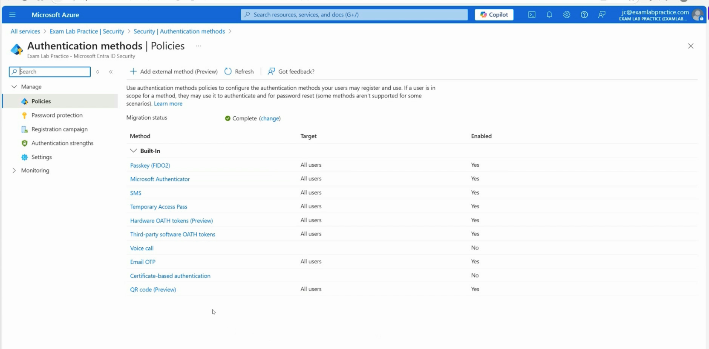
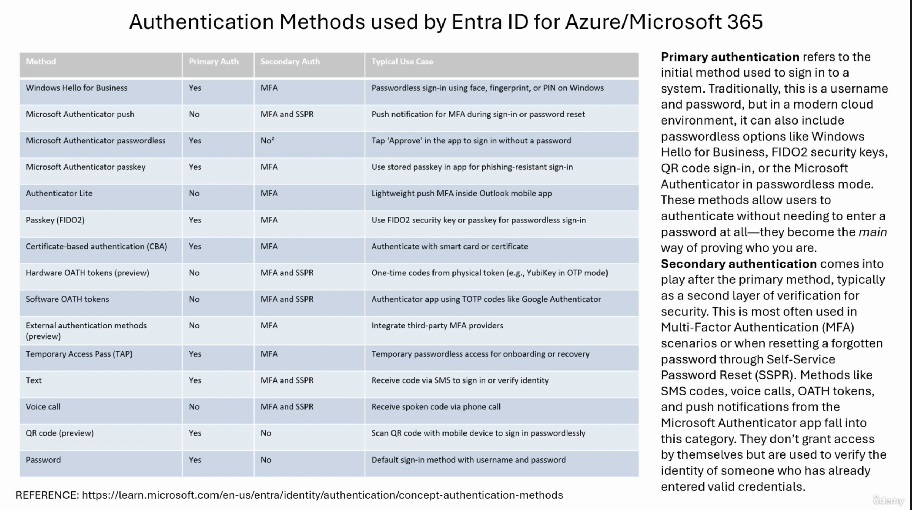
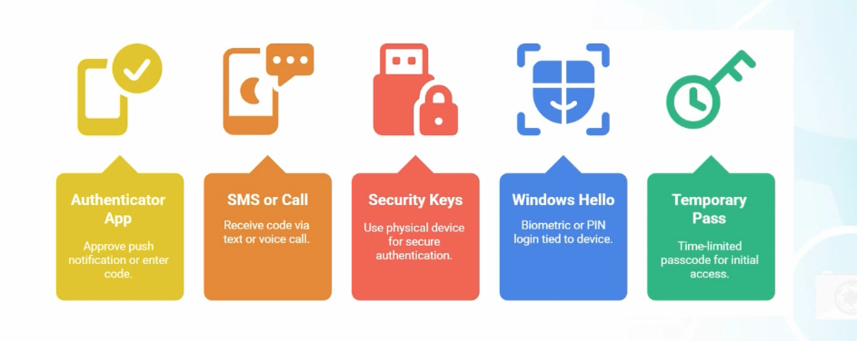
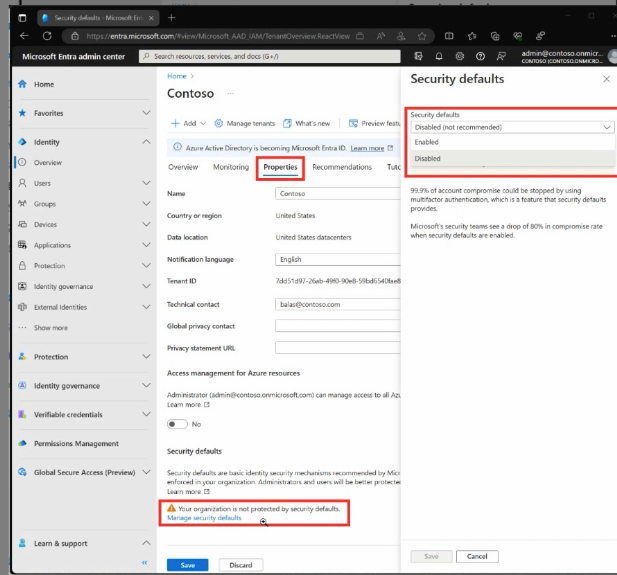
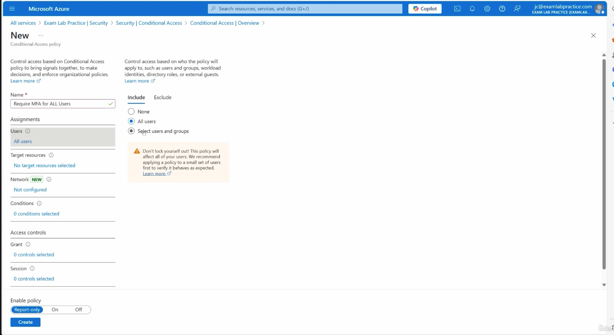
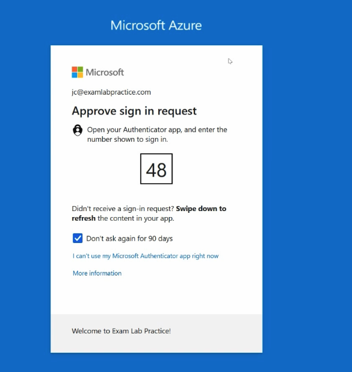
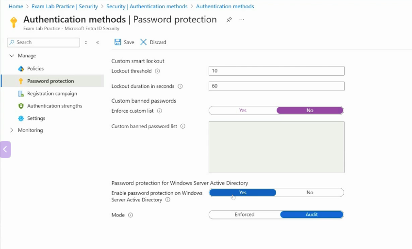

# Section 7: Plan, Implement and manage hybrid Identity

This section focuses on authentication, tenant-wide MFA, self-service password reset, and password protection in Microsoft Entra ID. These topics matter in hybrid identity because cloud authentication decisions often affect users who still depend on on-premises Active Directory, synchronized accounts, or password writeback.

> [!NOTE]
> Section 7 is not only about "how users sign in." It is about planning authentication methods, enforcing MFA, enabling recovery, and making password choices safer across cloud and hybrid environments.

## 62. Plan for Authentication

### Core idea

[Authentication](../00-front-matter/glossary.md#authentication) is the process of verifying a user's identity before granting access to an application, service, device, or data. Microsoft Entra ID acts as the central [Identity Provider](../00-front-matter/glossary.md#identity-provider) for Microsoft 365, Azure, and many third-party applications.

### Authentication vs authorization

| Concept | Question it answers | Example |
|---|---|---|
| Authentication | Who are you? | A user signs in with a password, passkey, certificate, or Microsoft Authenticator. |
| Authorization | What are you allowed to do? | After sign-in, the user can access Teams, Azure resources, or an app based on permissions. |

> [!WARNING]
> Authentication and authorization are not the same. A successful sign-in proves identity, but access still depends on assignments, roles, app permissions, Conditional Access, and resource-level authorization.

### Main authentication methods

Microsoft Entra supports traditional, passwordless, certificate-based, temporary, and token-based authentication patterns.

| Method | What to remember |
|---|---|
| Password | Traditional sign-in method and still common, but weaker by itself. |
| Microsoft Authenticator | Supports MFA, push approval, number matching, and passwordless sign-in. |
| FIDO2 / passkeys | Strong phishing-resistant authentication using a hardware key or device-backed passkey. |
| Certificate-Based Authentication (CBA) | Uses X.509 certificates, often with smart cards or high-security environments. |
| Temporary Access Pass (TAP) | Time-limited passcode used for onboarding, recovery, and registering stronger methods. |
| Windows Hello for Business | Passwordless device-based sign-in using PIN or biometrics. |
| OATH tokens | One-time passcode methods used as secondary authentication. |

### Modern protocols

Microsoft Entra works with modern application authentication and federation protocols.

| Protocol | Why it matters |
|---|---|
| OAuth 2.0 | Used for delegated authorization and access tokens for APIs. |
| OpenID Connect | Adds identity sign-in on top of OAuth 2.0. |
| SAML | Common enterprise federation protocol for SSO. |
| WS-Federation | Federation protocol still seen in some Microsoft and legacy enterprise scenarios. |

### MFA and authentication strength

Multi-factor authentication requires two or more different factor types.

| Factor type | Examples |
|---|---|
| Something you know | Password, PIN |
| Something you have | Phone, hardware security key, smart card |
| Something you are | Fingerprint, facial recognition |

Authentication strength can be used with Conditional Access to require stronger combinations of methods.

| Strength level | Meaning |
|---|---|
| Basic MFA | Allows common MFA combinations such as password plus Authenticator, SMS, or voice. |
| Passwordless MFA | Requires passwordless methods such as Windows Hello for Business or Microsoft Authenticator passwordless sign-in. |
| Phishing-resistant MFA | Requires stronger methods such as FIDO2/passkeys, Windows Hello for Business, or certificate-based authentication. |

### Token-based access

After sign-in, Microsoft Entra issues tokens that apps and APIs use instead of repeatedly asking for the user's password.

| Token | Purpose |
|---|---|
| ID token | Tells the app who the user is. |
| Access token | Allows an app or client to access a protected API or resource. |
| Refresh token | Lets the client request new tokens without prompting the user every time. |

Tokens support [Single Sign-On](../00-front-matter/glossary.md#single-sign-on), delegated API access, application integration, and Conditional Access enforcement.

> [!TIP]
> Memory hook: authentication proves identity, authorization grants permission, and tokens carry the signed proof apps use after sign-in.

## 63. Implement and Manage Authentication Methods, Certificates, TAP, OATH, and FIDO2

### Core idea

Authentication methods are configured in Microsoft Entra so users can sign in, complete MFA, and recover accounts through SSPR.

Portal path:

```text
Microsoft Entra admin center > Protection > Authentication methods
```



### What authentication methods are used for

- Sign-in to Azure and Microsoft 365.
- [Multi-Factor Authentication](../00-front-matter/glossary.md#multi-factor-authentication).
- [Self-Service Password Reset](../00-front-matter/glossary.md#self-service-password-reset).
- Passwordless authentication.
- Account recovery and onboarding.

### Primary vs secondary authentication

Primary authentication is the initial method used to sign in. Secondary authentication is a second layer of verification, often used for MFA or password reset.



| Method | Primary use | Secondary use | Typical use case |
|---|---|---|---|
| Password | Yes | No | Default username and password sign-in. |
| Windows Hello for Business | Yes | MFA | Passwordless Windows sign-in using PIN or biometrics. |
| Microsoft Authenticator push | No | MFA and SSPR | Push approval or number matching after initial sign-in. |
| Microsoft Authenticator passwordless | Yes | No | App-based passwordless approval. |
| FIDO2 / passkeys | Yes | MFA | Phishing-resistant passwordless sign-in. |
| Certificate-Based Authentication | Yes | MFA | Smart card or certificate-based sign-in. |
| Hardware/software OATH tokens | No | MFA and SSPR | One-time passcodes from a token or authenticator app. |
| Temporary Access Pass | Yes | MFA | Temporary passwordless access for onboarding or recovery. |
| SMS / voice | Varies | MFA and SSPR | Simple phone-based verification. |
| QR code sign-in | Yes | No | Passwordless sign-in using QR code flow where supported. |

### Key methods to remember

| Method | Best fit | Exam trap |
|---|---|---|
| CBA | Smart card, government, high-security, certificate-based environments. | Strong, but certificate lifecycle and revocation must be managed. |
| TAP | First sign-in, lost device, recovery, registering stronger methods. | Temporary by design; do not treat it as a permanent credential. |
| OATH tokens | One-time passcode scenarios, including hardware token use. | OATH is not OAuth. OATH tokens generate OTP codes; OAuth is an authorization framework. |
| Microsoft Authenticator | MFA, number matching, passwordless sign-in. | A push approval is not the same as phishing-resistant authentication. |
| FIDO2 / passkeys | Shared devices, frontline workers, privileged users, phishing-resistant sign-in. | Strong method, but key loss and device compatibility need planning. |

> [!TIP]
> Memory hook: TAP gets users started, Authenticator keeps MFA practical, and FIDO2/passkeys raise the bar for phishing resistance.

## 64. Concepts of Tenant-Wide Multi-Factor Authentication Settings

### Core idea

[Multi-Factor Authentication](../00-front-matter/glossary.md#multi-factor-authentication) requires two or more different factor types before access is granted. It reduces the impact of stolen passwords because the attacker still needs another factor.

### What MFA protects against

- Phishing.
- Password spraying.
- Credential stuffing.
- Replay of stolen passwords.
- Unauthorized access after password compromise.

Microsoft states that security defaults help protect against common identity attacks such as password spray, replay, and phishing, and that more than 99.9% of these common identity-related attacks are stopped by MFA and blocking legacy authentication.

### Common MFA methods



| Method | Strength |
|---|---|
| Microsoft Authenticator | Stronger than SMS/voice; supports number matching and passwordless scenarios. |
| SMS or phone call | Easy to deploy, but less resistant to phishing and phone-based attacks. |
| FIDO2 security keys | Phishing-resistant and strong for high-value accounts. |
| Windows Hello for Business | Passwordless, device-bound authentication. |
| Temporary Access Pass | Temporary onboarding or recovery method. |

### Deployment options

| Option | Best fit | Limitation |
|---|---|---|
| Security Defaults | Simple baseline protection for smaller or less customized tenants. | Limited customization. |
| Conditional Access MFA | Targeted MFA based on users, apps, risk, locations, devices, and conditions. | Requires planning and licensing. |
| Risk-based MFA | Challenges users when risk is detected. | Requires Microsoft Entra ID P2 capabilities. |

### Licensing view

| MFA approach | Common licensing requirement |
|---|---|
| Security Defaults | Available at no extra cost in Microsoft Entra ID Free / Microsoft 365 scenarios. |
| Conditional Access MFA | Requires Microsoft Entra ID P1 or licensing that includes it. |
| Risk-based / adaptive MFA | Requires Microsoft Entra ID P2 or licensing that includes it. |

> [!WARNING]
> Two methods from the same factor category do not create true MFA. Password plus PIN is still "something you know."

> [!TIP]
> Memory hook: MFA should combine different factor types, not just multiple secrets.

## 65. Implement and Manage Tenant-Wide Multi-Factor Authentication Settings

### Core idea

Tenant-wide MFA can be enforced broadly with Security Defaults or more precisely through Conditional Access. Authentication Methods controls which methods users can register and use.

### Where to configure it

Security Defaults:

```text
Microsoft Entra admin center > Identity > Overview > Properties > Manage security defaults
```



Authentication Methods:

```text
Microsoft Entra admin center > Protection > Authentication methods
```

Conditional Access:

```text
Microsoft Entra admin center > Protection > Conditional Access
```

### Security Defaults vs Conditional Access

| Feature | Security Defaults | Conditional Access |
|---|---|---|
| Purpose | Baseline Microsoft-recommended protections. | Granular policy-based access control. |
| MFA targeting | Broad tenant-wide behavior. | Selected users, groups, roles, apps, conditions, and risks. |
| Customization | Limited. | High. |
| Best for | Simple tenants without advanced policy needs. | Organizations that need targeted and risk-aware access control. |
| Important note | Cannot be used as the main strategy when replacing it with Conditional Access policies. | Requires careful exclusions to prevent lockout. |

### Conditional Access MFA process



A common Conditional Access MFA policy flow:

1. Create a new Conditional Access policy.
2. Select users or groups.
3. Select target resources or cloud apps.
4. Configure conditions if needed.
5. Under **Grant**, choose **Require multifactor authentication**.
6. Start in report-only mode when testing.
7. Enable the policy after validation.

> [!WARNING]
> Be careful with "All users" policies. Exclude emergency access accounts and test in report-only mode before turning on broad enforcement.

### Real sign-in example

When MFA is required, Microsoft Entra can prompt the user to approve the request in Microsoft Authenticator and enter the number shown on the sign-in screen.



### Quick takeaway

- Security Defaults equals simple baseline protection.
- Conditional Access equals targeted MFA enforcement.
- Authentication Methods equals which methods users can register and use.

> [!TIP]
> Memory hook: methods define what users can use; Conditional Access defines when they must use it.

## 66. Configure and Deploy Self-Service Password Reset

### Core idea

[Self-Service Password Reset](../00-front-matter/glossary.md#self-service-password-reset) lets users reset their own passwords after proving their identity through registered verification methods. It is the Microsoft Entra version of a secure "forgot password" workflow.

### Why SSPR matters

- Reduces help desk workload.
- Allows users to recover access faster.
- Works with the same authentication method planning used for MFA.
- Can support hybrid users through password writeback.

### Where to enable it

```text
Microsoft Entra admin center > Identity > Protection > Password reset
```

SSPR can be enabled for:

- Selected groups.
- All users.

### Authentication methods for SSPR

SSPR depends on authentication methods to verify the user. Those methods are managed through:

```text
Microsoft Entra admin center > Protection > Authentication methods
```

Examples include:

- Microsoft Authenticator.
- Email OTP where supported.
- SMS.
- Voice call.
- OATH tokens.
- Security questions, if enabled.

### Hybrid environment support

In hybrid identity environments, SSPR can use password writeback so a cloud password reset is written back to on-premises AD DS.

Important settings may include:

- Enable password writeback for synced users.
- Allow users to unlock accounts without resetting their password.

> [!WARNING]
> For synced users, password writeback is the key hybrid concept. Without writeback, a cloud-side reset may not update the password where the user's on-premises identity is authoritative.

> [!TIP]
> Memory hook: SSPR recovers the user; password writeback brings that recovery back to on-premises AD DS.

## 67. Implement and Manage Microsoft Entra Password Protection

### Core idea

Microsoft Entra Password Protection helps block weak, common, and organization-specific passwords. In hybrid environments, it can also extend banned password protection to on-premises Active Directory Domain Services.

### Cloud vs hybrid password behavior

| User type | Password policy behavior |
|---|---|
| Cloud-only user | Primarily follows Microsoft Entra / Microsoft 365 cloud password settings. |
| Synced hybrid user | Usually follows on-premises AD DS and Group Policy password rules. |

### Password expiration policy

For cloud identities, password expiration can be reviewed from:

```text
admin.microsoft.com > Settings > Org settings > Security & privacy > Password expiration policy
```

Microsoft generally recommends not forcing periodic password expiration unless there is a specific requirement. Stronger controls such as MFA, Conditional Access, password protection, and risk detection are usually more valuable than frequent password rotation.

### Password Protection settings

Portal path:

```text
Microsoft Entra admin center > Protection > Authentication methods > Password protection
```



### What to configure

| Setting | Meaning |
|---|---|
| Lockout threshold | Number of failed sign-ins allowed before lockout. |
| Lockout duration | How long the lockout lasts. |
| Custom banned password list | Organization-specific terms users cannot use in passwords. |
| Password protection for Windows Server AD | Extends banned-password protection to on-premises AD DS when deployed. |
| Mode | Audit logs attempts; Enforce blocks weak passwords. |

### Custom banned passwords

The custom banned password list should include organization-specific terms attackers might guess.

Examples:

- Company name.
- Product names.
- Brand names.
- Local city names.
- Sports teams or mascots associated with the organization.
- Common internal terms.

### Windows Server Active Directory integration

Password Protection for Windows Server Active Directory does not replace traditional AD DS password policy. It extends Microsoft Entra banned-password evaluation to on-premises password change and reset events when the required agents are deployed.

| Mode | Behavior |
|---|---|
| Audit | Logs what would have been blocked, but does not block the password. |
| Enforce | Blocks passwords that match the banned password evaluation. |

> [!WARNING]
> Audit mode for on-premises Password Protection is for impact review. It does not stop weak passwords until enforcement is enabled.

> [!TIP]
> Memory hook: AD password policy controls complexity and expiration; Entra Password Protection blocks bad password choices.

## Assignment 6: Enable QR Code Support and Require MFA for All Users

### Core idea

This assignment aligns to authentication methods and MFA enforcement. The goal is to enable QR code support where required and configure MFA for all intended users.

### What to document

- Authentication method setting changed.
- MFA enforcement approach used.
- Targeted users or groups.
- Any exclusions, especially emergency access accounts.
- Sanitized evidence that the policy or method setting was saved.

### Repository note

The assignment write-up should live under:

```text
assignments/section-07-assignment-06-qr-code-mfa-conditional-access.md
```

## Assignment 7: Enable SSPR for All Users and Enable Email OTP

### Core idea

This assignment aligns to SSPR and authentication method configuration. The goal is to allow users to reset passwords and enable Email OTP as a supported method where appropriate.

### What to document

- SSPR scope selected.
- Authentication methods enabled for reset or verification.
- Email OTP configuration.
- Any hybrid password writeback settings, if used.
- Sanitized evidence that the settings were saved.

### Repository note

The assignment write-up should live under:

```text
assignments/section-07-assignment-07-sspr-email-otp.md
```

Do not include raw simulation links, tenant IDs, private domains, real usernames, object IDs, or subscription details in the assignment documentation.
