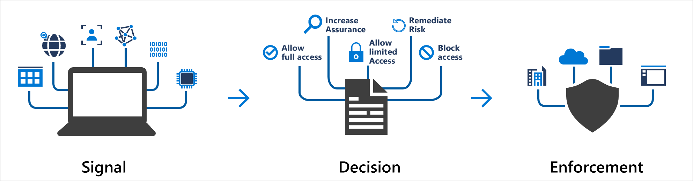
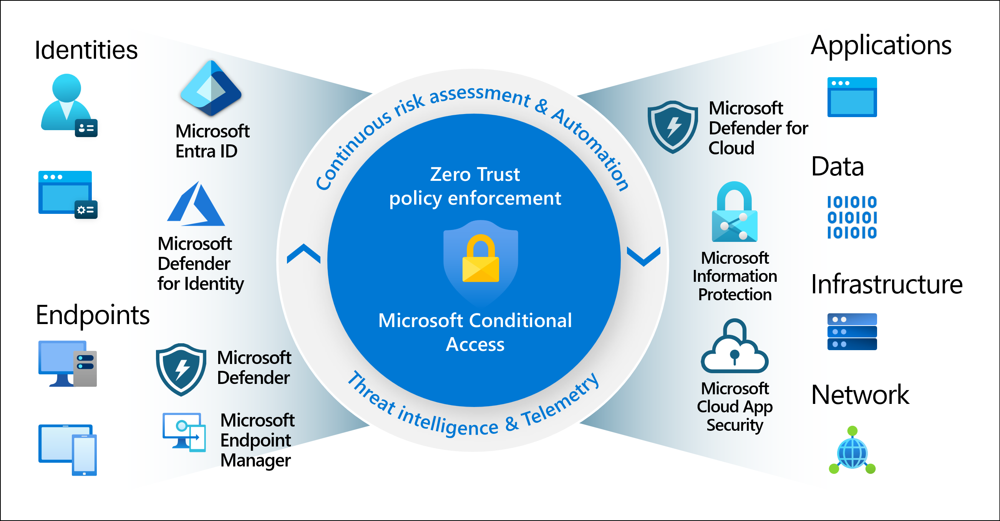
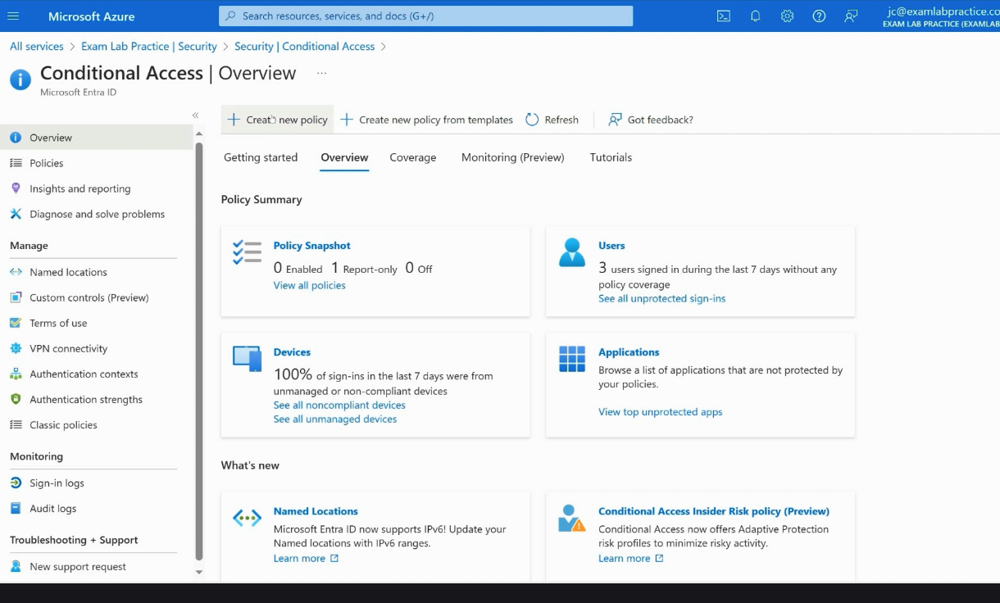
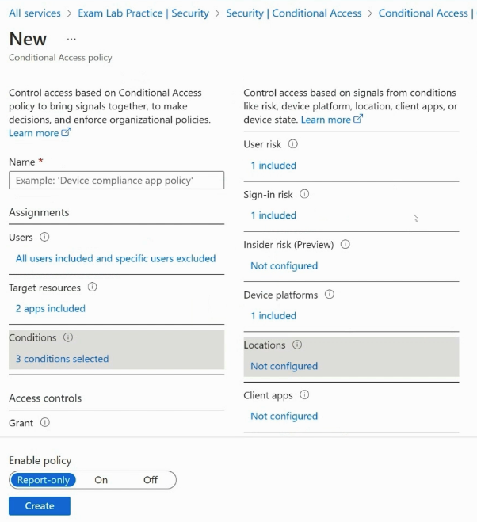
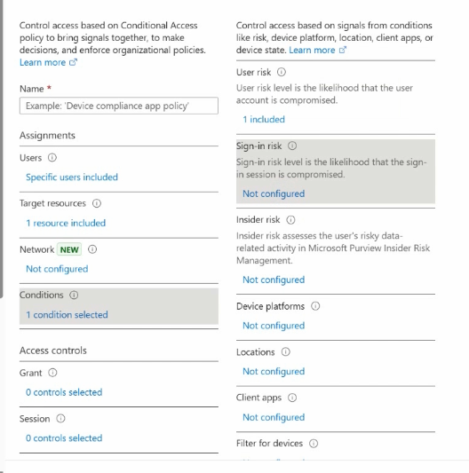
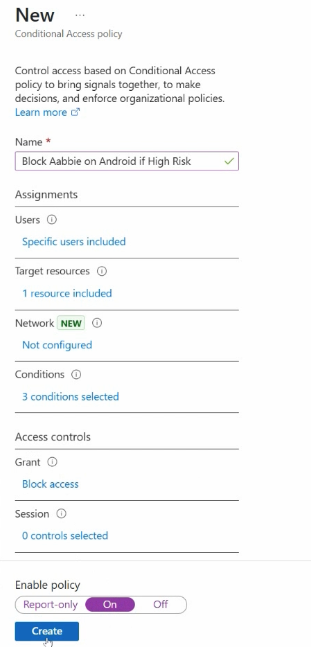
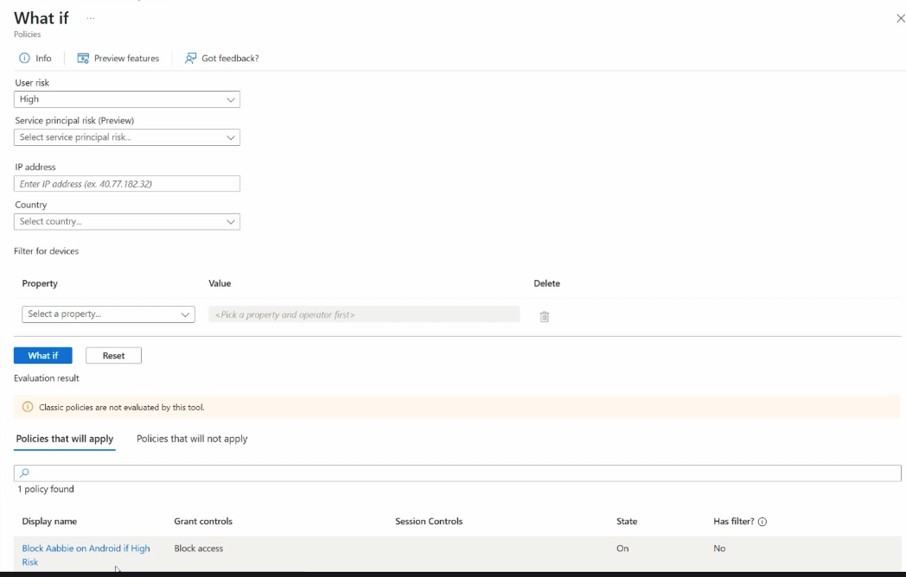
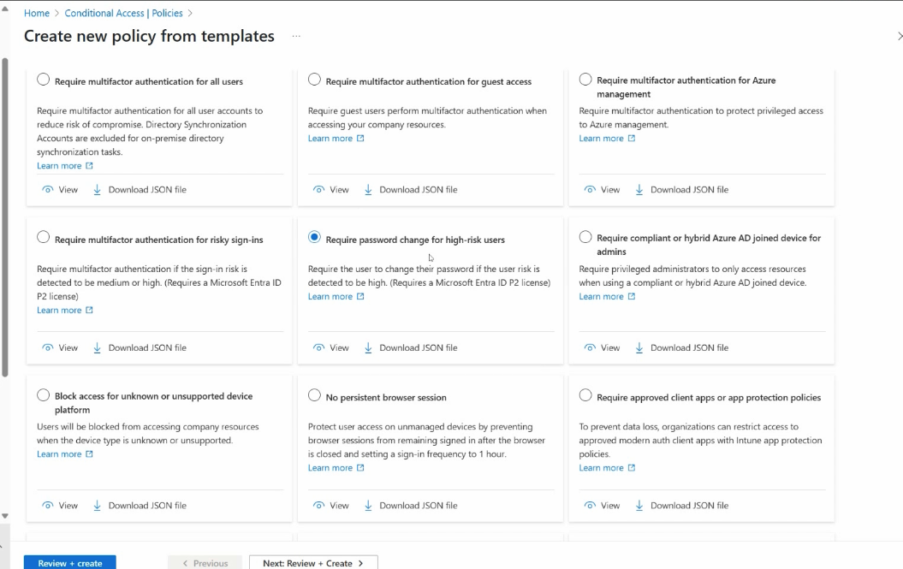

# Section 8: Plan, Implement and manage Microsoft Entra Conditional Access

This section covers Microsoft Entra Conditional Access planning, policy construction, testing, troubleshooting, and template-based deployment. Conditional Access is one of the most important SC-300 topics because it connects identity, device posture, application access, risk, location, and enforcement into one policy model.

> [!NOTE]
> Conditional Access is not just "turn on MFA." It is the Microsoft Entra policy engine that decides when access should be allowed, blocked, or allowed only after extra requirements are met.

## 68. Plan Conditional Access Policies

### Core idea

[Conditional Access](../00-front-matter/glossary.md#conditional-access) is Microsoft Entra's policy engine for access control. It evaluates signals from users, devices, apps, locations, and risk to decide whether access should be allowed, blocked, or allowed with extra controls.

### Why Conditional Access matters

Modern users access company resources from many locations, devices, networks, and apps. Conditional Access helps balance two competing goals:

- Let users work from anywhere.
- Protect company apps, data, and identities.

This is especially important in BYOD and cloud-first environments where a simple network boundary is no longer enough.

### How Conditional Access works

Conditional Access follows the same basic pattern:

1. Signals are collected.
2. A decision is made.
3. Enforcement happens.



This fits the Zero Trust mindset: access is evaluated based on context instead of being trusted only because the user signed in once.

### Common signals



| Signal | What it can evaluate |
|---|---|
| User or group | Who the user is and what group or role they belong to. |
| Location | IP address, country, trusted named location, or unknown network. |
| Device | Device platform, compliance state, hybrid join state, or device filters. |
| Application | Which cloud app, action, or authentication context is being accessed. |
| Risk | User risk, sign-in risk, insider risk, or service principal risk where supported. |
| Client app | Browser, mobile app, desktop client, or legacy authentication behavior. |

### Microsoft integrations involved

Conditional Access can use context from several Microsoft security and management services.

| Service | Why it matters |
|---|---|
| Microsoft Entra ID Protection | Provides user risk and sign-in risk signals. |
| Microsoft Defender for Identity | Helps detect identity threats in hybrid environments. |
| Microsoft Defender for Endpoint | Provides endpoint and device risk context. |
| Microsoft Defender for Cloud Apps | Supports session controls and app control scenarios. |
| Microsoft Intune | Provides device compliance and app protection policy context. |
| Microsoft Purview / Information Protection | Helps protect sensitive data scenarios. |

### Common decisions

Conditional Access policies usually lead to one of two outcomes.

| Decision | Meaning |
|---|---|
| Block access | Deny the sign-in or resource access completely. |
| Grant access with controls | Allow access only if extra requirements are satisfied. |

Common grant controls include:

- Require MFA.
- Require authentication strength.
- Require device to be marked compliant.
- Require Microsoft Entra hybrid joined device.
- Require approved client app.
- Require app protection policy.
- Require password change.
- Require terms of use.

> [!WARNING]
> Conditional Access does not grant permissions to the resource. It decides whether access is allowed after authentication and resource authorization are evaluated.

> [!TIP]
> Memory hook: Conditional Access is "if this sign-in has these conditions, then enforce this control."

## 69. Implement Conditional Access Policy Assignments and Controls

### Core idea

A Conditional Access policy defines who is targeted, what resource is protected, which conditions trigger the policy, and what controls are enforced.

Portal path:

```text
Microsoft Entra admin center > Protection > Conditional Access
```



### Where policies can be created

Conditional Access policies can be reached from different admin experiences, but they ultimately connect back to Microsoft Entra Conditional Access.

- Azure portal.
- Microsoft Entra admin center.
- Intune admin center.

### Main parts of a policy

| Policy area | Question it answers |
|---|---|
| Name | What is this policy for? |
| Users | Who does the policy apply to? |
| Target resources | What app, action, or authentication context is protected? |
| Conditions | When should the policy apply? |
| Grant controls | What must happen before access is granted? |
| Session controls | How should the session behave after access is granted? |
| Enable policy | Is the policy Off, On, or Report-only? |

### Assignments

Assignments define who the policy applies to.

You can target:

- All users.
- Specific users.
- Specific groups.
- Directory roles.
- External users and guests.

You can also configure exclusions, such as:

- Emergency access accounts.
- Break-glass administrators.
- Specific service accounts where appropriate.
- Users being used for staged testing.

> [!WARNING]
> A broad policy without exclusions can lock administrators out. Emergency access accounts should be excluded from restrictive Conditional Access policies and monitored separately.

### Target resources

Target resources define what the policy protects.

Examples include:

- All cloud apps.
- Selected cloud apps such as Office 365 or Windows 365.
- User actions.
- Authentication contexts.

### Conditions

Conditions define when the policy applies.



Common conditions include:

- User risk.
- Sign-in risk.
- Insider risk.
- Device platform.
- Locations.
- Client apps.
- Device filters.

### Access controls

Once assignments and conditions match, the policy can block access or grant access with requirements.

| Control type | Examples |
|---|---|
| Block | Block access completely. |
| Grant | Require MFA, authentication strength, compliant device, hybrid joined device, approved app, app protection policy, password change, or terms of use. |
| Session | App-enforced restrictions, Conditional Access App Control, sign-in frequency, persistent browser behavior, or continuous access evaluation. |

### Policy state

| State | Use case |
|---|---|
| Off | Policy is saved but not evaluated for enforcement. |
| Report-only | Policy impact is logged without enforcing the result. |
| On | Policy is active and enforced. |

> [!TIP]
> Memory hook: assignments are who, target resources are what, conditions are when, controls are what happens, and state is whether the policy is active.

## 70. Test and Troubleshoot Conditional Access Policies

### Core idea

Conditional Access should be tested before broad enforcement. The best troubleshooting tool is **What If**, which simulates whether a policy applies under selected sign-in conditions.

### Test policy example

A small test policy might block a specific user when risk and device conditions match.

Example policy:

```text
Block Aabbie on Android if High Risk
```

This example means:

- The selected user is targeted.
- The resource is selected, such as Office 365 or all cloud apps.
- User risk is high.
- Sign-in risk is high.
- Device platform is Android.
- The grant control is Block access.



### Creating the block policy



Process:

1. Create a new Conditional Access policy.
2. Select a limited test user or group.
3. Select the target resource.
4. Configure risk conditions.
5. Configure device platform as Android.
6. Select **Block access** under grant controls.
7. Start with report-only or a tightly scoped test.
8. Turn the policy on only after confirming the expected behavior.

### What If tool

The What If tool lets you simulate policy evaluation without needing to reproduce the exact sign-in manually.



You can test inputs such as:

- User.
- Cloud app or resource.
- Device platform.
- Client app.
- IP address or country.
- User risk.
- Sign-in risk.
- Device filter values.

The result shows:

- Policies that will apply.
- Policies that will not apply.
- Grant controls such as Block access or Require MFA.
- Session controls.
- Policy state.

### Troubleshooting mindset

Use What If and sign-in logs together:

| Tool | Best use |
|---|---|
| What If | Predict whether policies should apply before or during testing. |
| Sign-in logs | Review what actually happened during a real sign-in. |
| Report-only logs | Understand policy impact before enforcement. |

> [!WARNING]
> What If does not evaluate classic policies, and it is still a simulation. For real sign-ins, always confirm with sign-in logs.

> [!TIP]
> Memory hook: What If predicts policy behavior; sign-in logs prove what actually happened.

## 71. Create a Conditional Access Policy from a Template

### Core idea

Conditional Access templates are Microsoft-provided policy starters for common security scenarios. They help administrators create standard protections faster without building every setting manually.

Portal path:

```text
Microsoft Entra admin center > Protection > Conditional Access > Policies > New policy from template
```



### Why templates are useful

- They speed up common policy creation.
- They provide Microsoft-recommended starting points.
- They help admins understand the required settings for a scenario.
- They can be reviewed before creation.
- They can often be started in report-only mode.

### Common template examples

| Template type | Purpose |
|---|---|
| Require MFA for administrators | Protect privileged access. |
| Require MFA for all users | Reduce identity compromise risk. |
| Require MFA for guest access | Protect external collaboration. |
| Block legacy authentication | Stop older clients that do not support modern authentication. |
| Require compliant or hybrid joined device | Restrict access based on managed device posture. |
| Require approved client app or app protection policy | Protect mobile app access with Intune-related controls. |

### Block legacy authentication example

Blocking legacy authentication is a common template because legacy protocols often cannot satisfy modern MFA or Conditional Access requirements. Attackers frequently target these older flows because they are less protected.

### Report-only mode

Report-only mode is the safest first step for many templates. It lets the administrator see what the policy would have affected without enforcing the policy.

Review report-only impact from:

```text
Microsoft Entra admin center > Monitoring and health > Sign-in logs
```

> [!WARNING]
> Blocking legacy authentication is important, but test first. Older devices, mail clients, scripts, or service dependencies may still rely on legacy auth.

> [!TIP]
> Memory hook: templates are policy starters, not policy substitutes. Review scope, exclusions, state, and impact before enforcing.

## Assignment 8: Create a Conditional Access Policy That Blocks High-Risk Android Access

### Core idea

Assignment 8 aligns to Conditional Access assignments, conditions, grant controls, and testing. The scenario is to create a policy that blocks high-risk Android access.

### What to document

- Policy name.
- Targeted users or groups.
- Target resources or cloud apps.
- User risk and sign-in risk settings.
- Device platform condition.
- Grant control set to block access.
- Policy state used during testing.
- What If or sign-in log evidence.

### Repository note

The assignment write-up should live under:

```text
assignments/section-08-assignment-08-block-high-risk-android-conditional-access.md
```

Do not include raw simulation links, tenant IDs, private domains, real usernames, object IDs, or subscription details in the assignment documentation.
