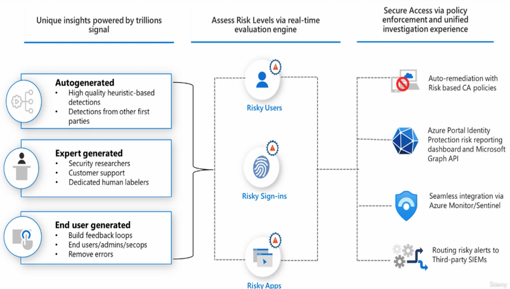
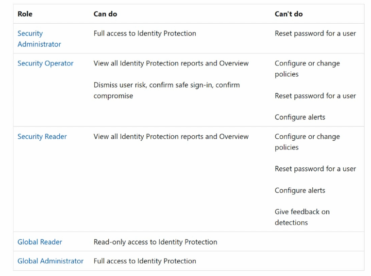

# Section 9: Manage Risk by using Microsoft Entra ID Protection

This section covers Microsoft Entra ID Protection, risky users, risky sign-ins, risk detections, risk-based Conditional Access, and the administrative roles used to investigate and remediate identity risk.

> [!NOTE]
> Identity Protection detects risk. Conditional Access enforces the response. Keep those two ideas connected throughout this section.

## 72. Understanding Entra ID Identity Protection and User Sign-In Risk Policies

### Core idea

[Identity Protection](../00-front-matter/glossary.md#identity-protection) helps organizations detect, investigate, and remediate identity-based risks. It was formerly called Azure AD Identity Protection.

Its main job is to answer a practical security question:

```text
Is this user really who they claim to be?
```

### What Identity Protection helps detect

Identity Protection is designed to help defend against:

- Stolen passwords.
- Compromised accounts.
- Suspicious sign-ins.
- Abnormal user behavior.
- Leaked credentials.
- Risky authentication patterns.

### How it works

Identity Protection uses several sources to evaluate identity risk:

| Signal source | Why it matters |
|---|---|
| Microsoft threat intelligence | Uses Microsoft's broad security telemetry to identify suspicious behavior. |
| Machine learning and heuristics | Detects unusual patterns and anomalies. |
| Expert research | Improves detections based on known attacker techniques. |
| User and admin feedback | Helps improve risk classification over time. |
| Sign-in and identity behavior | Looks for suspicious access patterns, leaked credentials, and abnormal activity. |

### Core risk concepts



| Risk concept | What it means | Example |
|---|---|---|
| Risky sign-in | A specific sign-in attempt appears suspicious. | A user signs in from New York, then appears to sign in from China minutes later. |
| Risky user | The user account itself may be compromised. | Leaked credentials, repeated suspicious behavior, or abnormal activity tied to the identity. |
| Risk detection | The detected event or signal that contributed to risk. | Anonymous IP, unfamiliar sign-in properties, password spray, or leaked credentials. |

> [!WARNING]
> User risk and sign-in risk are different. User risk is about the account. Sign-in risk is about one authentication attempt.

### Common sign-in risk detections

| Detection | What it suggests |
|---|---|
| Atypical or impossible travel | Sign-ins appear from locations that are unlikely within the travel time. |
| Anonymous IP address | The sign-in came through anonymizing infrastructure. |
| Malicious IP address | The source IP is associated with known malicious activity. |
| Password spray | A common attack pattern using a few passwords across many users. |
| Unfamiliar sign-in properties | The sign-in does not match normal user behavior. |
| Suspicious browser | Browser behavior appears unusual or suspicious. |
| Token-related risk | Token use or refresh behavior appears suspicious. |
| Verified threat actor IP | Microsoft has associated the IP with known threat actor activity. |

### Common user risk detections

| Detection | What it suggests |
|---|---|
| Leaked credentials | The user's credentials were found in a credential leak. |
| Anomalous user activity | The account is behaving differently from its normal pattern. |
| User-reported suspicious activity | A user reported activity they did not recognize. |
| Threat intelligence detection | Microsoft intelligence indicates possible compromise. |
| Suspicious token activity | There may be an attempt to abuse or access tokens. |

### How Identity Protection responds

Identity Protection can integrate with [Conditional Access](../00-front-matter/glossary.md#conditional-access) and security monitoring tools to respond to risk.

Possible actions include:

- Block the user.
- Require MFA.
- Require password change.
- Revoke sessions.
- Confirm the user is compromised.
- Dismiss risk when it is determined to be safe.
- Send data to Microsoft Sentinel, Azure Monitor, or SIEM tools.

> [!TIP]
> Memory hook: Identity Protection detects the smoke; Conditional Access decides whether to block the door, require proof, or force cleanup.

### Microsoft ecosystem integrations

| Integration | Why it matters |
|---|---|
| Conditional Access | Enforces risk-based access decisions. |
| Azure Monitor | Supports monitoring and log workflows. |
| Microsoft Sentinel | Supports SIEM investigation and response. |
| Defender services | Adds broader security context from identity, endpoint, cloud, and app signals. |

### Licensing takeaway

| License level | Identity Protection capability |
|---|---|
| Microsoft Entra ID Free | Very limited Identity Protection visibility and controls. |
| Microsoft Entra ID P1 | Limited risk information and reporting capabilities. |
| Microsoft Entra ID P2 | Full Identity Protection capability, including risk policies, reports, advanced detections, and remediation controls. |

> [!WARNING]
> High-yield exam point: full Identity Protection features require Microsoft Entra ID P2.

### Roles

Identity Protection access depends on role assignment.



| Role | Can do | Cannot do / limitation |
|---|---|---|
| Global Administrator | Full access to Identity Protection and tenant administration. | Should not be used for daily work unless necessary. |
| Security Administrator | Full access to Identity Protection. | Cannot reset a user's password from Identity Protection role capability alone. |
| Security Operator | View reports, view overview, dismiss user risk, confirm safe sign-in, and confirm compromise. | Cannot configure policies, reset user passwords, or configure alerts. |
| Security Reader | View Identity Protection reports and overview. | Cannot configure policies, reset passwords, configure alerts, or give feedback on detections. |
| Global Reader | Read-only access to Identity Protection. | Cannot remediate or configure. |

### Quick takeaway

- Identity Protection detects risky users and risky sign-ins.
- It uses threat intelligence, AI, heuristics, and behavior analysis.
- It works closely with Conditional Access.
- Microsoft Entra ID P2 is the key license for full functionality.

## 73. Enabling and Monitoring Entra Identity Protection User and Sign-In Risk Policies

### Core idea

Risk-based enforcement is now mainly handled through Conditional Access. Older standalone Identity Protection policies have been replaced by the newer Conditional Access approach.

### Where to configure it

You can reach the configuration from several paths:

```text
entra.microsoft.com > Protection > Identity Protection > Risk-based Conditional Access
```

```text
Microsoft Entra admin center > Protection > Conditional Access
```

Different portals may lead to the same Conditional Access policy configuration area.

### User risk vs sign-in risk

| Risk type | What it measures | Common levels | Best response example |
|---|---|---|---|
| User risk | Likelihood that the account itself is compromised. | Low, Medium, High | Require password change or block until remediated. |
| Sign-in risk | Likelihood that a specific sign-in attempt is suspicious. | No risk, Low, Medium, High | Require MFA or block the sign-in. |

> [!TIP]
> Memory hook: user risk follows the account; sign-in risk follows the login event.

### Example risk-based Conditional Access policy

The transcript example creates a policy with this logic:

| Policy setting | Example value |
|---|---|
| Users | All users |
| User risk | Medium or High |
| Sign-in risk | Medium or High |
| Grant control | Grant access but require MFA |
| Policy name | Medium or high require MFA Entra ID |
| Policy state | On |

### Why this policy is useful

Instead of immediately blocking access, the policy adds a mitigation step. If Microsoft Entra identifies medium or high user or sign-in risk, the user must prove identity with MFA before access is granted.

This is a common risk-based access pattern:

```text
If risk is medium/high, then require stronger proof.
```

### Other access control options

Risk-based Conditional Access can enforce controls such as:

- Require MFA.
- Require authentication strength.
- Require compliant device.
- Require Microsoft Entra hybrid joined device.
- Require approved client app.
- Require app protection policy.
- Require password change.
- Require terms of use.

### Policy state options

| State | Meaning |
|---|---|
| On | Enforce the policy. |
| Off | Save the policy without evaluating it. |
| Report-only | Log what would have happened without enforcing the policy. |

> [!WARNING]
> Use report-only mode when testing broad risk policies. A risk-based policy can affect real users quickly if scoped too broadly.

### Testing and generating risk signals

Testing Identity Protection is different from testing a normal policy because risk signals depend on detection logic. A risky sign-in might be generated by suspicious behavior, but Microsoft controls how and when detections appear.

Examples that may generate suspicious sign-in signals include:

- Private or incognito browser sign-ins.
- Repeated failed password attempts.
- Sign-ins from unusual locations.
- Activity that resembles impossible travel.

> [!WARNING]
> Do not create unsafe activity in a real production tenant just to force a risk detection. Use a lab tenant and keep test accounts isolated.

### Where to review results

Identity Protection reports commonly include:

| Report | What it shows |
|---|---|
| Risky users | Users whose account risk needs review. |
| Risky sign-ins | Sign-in attempts that were evaluated as risky. |
| Risk detections | The specific detections that contributed to risk. |

### Risky user actions

For a risky user, administrators may be able to:

- Confirm user was compromised.
- Dismiss user risk.
- Confirm user is safe.
- Reset password.
- Revoke sessions.
- Block the user.

### Quick takeaway

- Identity Protection detects risk.
- Conditional Access enforces the response.
- User risk is about the account.
- Sign-in risk is about one login.
- A common policy pattern is medium/high risk requiring MFA or remediation.
