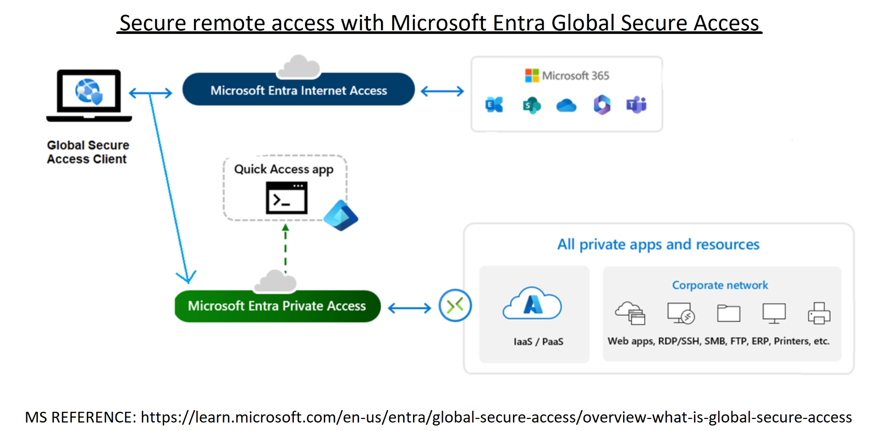

# Section 11: Implement Global Secure Access

This section introduces Microsoft Entra Global Secure Access, including Microsoft Entra Internet Access, Microsoft Entra Private Access, traffic forwarding profiles, remote network connectivity, and the Global Secure Access client.

> [!NOTE]
> Global Secure Access is Microsoft Entra's identity-centric approach to secure remote access. Think of it as modern Zero Trust access for internet, Microsoft 365, and private app traffic.

## 79. Introduction to Global Secure Access

### Core idea

Microsoft Entra Global Secure Access combines Microsoft Entra Internet Access and Microsoft Entra Private Access into a unified Security Service Edge solution. It provides secure access to internet destinations, Microsoft services, and private corporate resources through identity-aware policy enforcement.



### What it combines

| Component | Purpose |
|---|---|
| Microsoft Entra Internet Access | Secures internet and SaaS access with identity-centric controls. |
| Microsoft Entra Private Access | Provides Zero Trust access to private apps and internal resources without relying on a traditional VPN model. |
| Global Secure Access client | Routes supported client traffic through Global Secure Access based on traffic forwarding profiles. |
| Remote network connectivity | Connects branch or remote networks without installing the client on every individual device. |

### Why it matters

Traditional remote access often depended on remote access servers, perimeter network designs, and VPNs. Global Secure Access is meant to provide a more modern access model for users who work from anywhere and need secure access to company resources.

### Key benefits

| Benefit | Why it matters |
|---|---|
| Unified solution | Internet Access and Private Access are managed through Microsoft Entra. |
| Identity-centric security | Access decisions are tied to users, devices, Conditional Access, and Zero Trust policies. |
| Remote network connectivity | Branch locations can be connected without installing the client on every endpoint. |
| Web content filtering | Organizations can block inappropriate, malicious, or unsafe sites by category or domain. |
| Simplified traffic management | Traffic forwarding profiles control which traffic is acquired, bypassed, or routed. |
| Scalability | Reduces reliance on heavy on-premises VPN and network security hardware. |
| Private app access | Users can reach private resources through per-app adaptive access controls. |

### Security model

Global Secure Access is built around Zero Trust.

It can work with:

- Conditional Access.
- Device compliance signals.
- Identity-based controls.
- Web content filtering.
- Traffic forwarding profiles.
- Security monitoring and diagnostics.

> [!WARNING]
> Global Secure Access is not simply "a VPN replacement." Private Access can replace many VPN-style access patterns, but the core idea is identity-driven, per-app, policy-based access.

> [!TIP]
> Memory hook: Global Secure Access is the umbrella; Internet Access secures outbound web traffic, Private Access secures internal apps, and Microsoft traffic handles Microsoft service traffic.

## 80. Deploy Private Access

### Core idea

Microsoft Entra Private Access is used for secure access to private internal resources. It supports Zero Trust access to private applications without exposing broad network access like a traditional VPN.

### Traffic forwarding location

Private Access is configured from traffic forwarding profiles.

```text
Microsoft Entra admin center > Global Secure Access > Connect > Traffic forwarding
```

### Private Access profile

The Private Access traffic forwarding profile controls traffic going to internal/private destinations.

| Setting | What it controls |
|---|---|
| Profile enabled or disabled | Whether the Global Secure Access client should handle private access traffic. |
| User and group assignment | Which users receive the Private Access profile. |
| Quick Access destinations | Internal FQDNs, IP addresses, or private resources made available through Private Access. |
| Private app traffic | Traffic routed securely to private corporate apps and resources. |

### User and group assignment

The profile can be assigned to:

- All users.
- Selected users.
- Selected groups.

This determines who receives the profile when using the Global Secure Access client.

### Quick Access

Quick Access lets administrators define private destinations that users can reach through Private Access.

Examples:

- Internal web apps.
- RDP or SSH destinations.
- SMB file shares.
- ERP systems.
- Private IP ranges.
- Fully qualified domain names.

> [!WARNING]
> Private Access should not be treated as "full tunnel to everything." The Zero Trust value comes from defining specific private apps and applying identity-aware access rules.

> [!TIP]
> Memory hook: Private Access is for private destinations, not general internet browsing.

## 81. Deploy Internet Access

### Core idea

Microsoft Entra Internet Access manages general internet-bound traffic through Global Secure Access, excluding traffic handled by the Microsoft traffic profile.

### What the Internet Access profile controls

The Internet Access profile determines how the Global Secure Access client handles non-Microsoft internet traffic.

| Policy behavior | Meaning |
|---|---|
| Custom bypass | Administrator-defined traffic that should not go through Global Secure Access. |
| Default bypass | Microsoft-defined traffic that bypasses forwarding by default. |
| Default acquire | Traffic acquired and handled by Global Secure Access. |

### Bypass rules

Bypass rules let administrators exclude traffic from Global Secure Access forwarding.

Rules can be based on:

- Fully qualified domain names.
- IP addresses.
- Subnet ranges.

### Conditional Access integration

Internet Access can work with Conditional Access so access decisions remain identity-aware.

Examples:

- Require stronger authentication for certain web access.
- Apply policies based on user, group, location, or device state.
- Combine access control with traffic forwarding behavior.

### User assignment

Like other profiles, the Internet Access profile must be assigned to the right users or groups.

Options include:

- All users.
- Selected users or groups.

> [!WARNING]
> Bypass rules reduce inspection and control for the bypassed traffic. Use them deliberately and document why the traffic should bypass Global Secure Access.

> [!TIP]
> Memory hook: Internet Access controls general internet traffic; bypass rules are the exceptions.

## 82. Deploy Internet Access for Microsoft 365

### Core idea

The Microsoft traffic profile controls Microsoft service traffic, including Microsoft 365 and Microsoft identity-related endpoints.

### Microsoft traffic examples

This profile can apply to traffic for services such as:

- Microsoft Entra ID.
- Microsoft Graph.
- Exchange Online.
- SharePoint Online.
- OneDrive.
- Teams.
- Other Microsoft 365 services.

### Forward vs bypass

| Option | Meaning |
|---|---|
| Forward | Traffic goes through Global Secure Access and can be evaluated by supported security and access controls. |
| Bypass | Traffic does not go through the Global Secure Access path for that workload. |

### Workload policy groups

Microsoft traffic policies are grouped by workload. Each workload group can be configured separately based on its URLs and IP addresses.

Examples:

| Workload group | Why it matters |
|---|---|
| Exchange Online | Email and mailbox access. |
| SharePoint Online / OneDrive | Files, sites, and document collaboration. |
| Microsoft Entra ID / Microsoft Graph | Identity and API traffic. |
| Teams | Collaboration and meetings traffic. |

### User and group assignment

The Microsoft traffic profile can be assigned to:

- All users.
- Selected users.
- Selected groups.

> [!WARNING]
> Microsoft traffic is not the same as all internet traffic. Use the Microsoft traffic profile for Microsoft service endpoints and the Internet Access profile for general internet traffic.

> [!TIP]
> Memory hook: Microsoft profile equals Microsoft service traffic; Internet profile equals broader web traffic.

## 83. Download and Install the Global Secure Access Client

### Core idea

The Global Secure Access client is installed on supported end-user devices so traffic can be acquired and routed according to assigned forwarding profiles.

### Where to download it

```text
Microsoft Entra admin center > Global Secure Access > Connect > Client download
```

### Deployment options

| Deployment method | Best fit |
|---|---|
| Manual install | Testing, lab machines, or small pilot groups. |
| Microsoft Intune deployment | Broad rollout across managed devices. |

### Installation process

1. Download the Global Secure Access client.
2. Run the installer.
3. Complete installation.
4. Confirm the client appears in the system tray.
5. Verify that the user is signed in.
6. Confirm the assigned forwarding profiles are applied.

### Important requirements

The client depends on correct identity and device state.

Key requirements include:

- The user signs in with a Microsoft Entra-based account.
- The device is properly connected to the organization's Microsoft Entra environment.
- The relevant traffic forwarding profiles are enabled.
- The user or group is assigned to the required profile.
- Conditional Access and device compliance policies allow the scenario.

### Advanced Diagnostics

After installation, administrators can use Advanced Diagnostics to review:

- Authentication state.
- Device join or health checks.
- Active forwarding profiles.
- Traffic acquisition rules.
- Applied policy behavior.

### Lab cleanup

In a lab or demo environment, uninstalling the client and turning off forwarding profiles after testing helps avoid unexpected traffic routing.

> [!WARNING]
> Installing the client alone does not make traffic flow through Global Secure Access. The relevant forwarding profile must be enabled and assigned to the user or group.

> [!TIP]
> Memory hook: client installs the engine; traffic profiles tell the engine what to route.

## High-Yield Review

| Topic | What to remember |
|---|---|
| Global Secure Access | Unified Microsoft Entra SSE solution. |
| Internet Access | Secures general internet traffic. |
| Private Access | Secures private internal apps and resources. |
| Microsoft traffic profile | Handles Microsoft 365 and Microsoft service traffic. |
| Remote network connectivity | Supports branch or site traffic without a client on every device. |
| Web content filtering | Blocks or allows web traffic by category or domain. |
| Global Secure Access client | Routes device traffic based on assigned forwarding profiles. |
| Conditional Access | Adds identity and policy enforcement to access decisions. |

> [!WARNING]
> The biggest Section 11 exam trap is assuming all traffic profiles do the same thing. Private Access, Internet Access, and Microsoft traffic profiles are separate and must be enabled and assigned intentionally.
