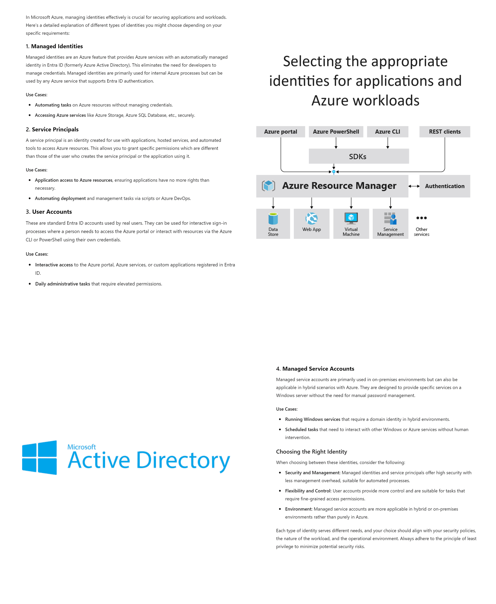

# Section 12: Plan and Implement identities for applications and Azure workloads

This section focuses on choosing and using the right identity type for applications, automation, Azure resources, and hybrid workloads. The main goal is to avoid using human accounts or stored secrets when a workload identity or managed identity is the better security design.

> [!NOTE]
> Section 12 is about workload identity choices. The exam usually cares less about the exact portal clicks and more about choosing the safest identity type for the scenario.

## 84. Select Appropriate Identities for Applications and Azure Workloads

### Core idea

Different application and workload scenarios need different identity types. The right choice depends on what is connecting, where it runs, whether it is human or non-human, and how much credential management you want to avoid.



### Identity decision table

| Identity type | Best fit | Common examples | Main benefit | Main limitation |
|---|---|---|---|---|
| Managed identity | Azure resource authenticating to another Azure-supported service. | VM to Key Vault, Function App to Storage, App Service to Azure SQL. | Azure manages the credential lifecycle. | Mostly for Azure-hosted resources and supported services. |
| Service principal | Application, script, automation, or CI/CD pipeline needing its own identity. | App registration, automation script, Azure DevOps workload, custom app. | Precise app permissions and tenant-level control. | Secrets/certificates or federation must be managed unless avoided through workload identity federation. |
| Standard user account | A real person performing interactive work. | Administrator, developer, operator, analyst. | Human accountability and interactive sign-in. | Not appropriate for app-to-app or service-to-service authentication. |
| Managed service account | On-premises or hybrid Windows service identity. | Windows service, scheduled task, domain-based service. | AD-managed password behavior for Windows services. | Primarily on-premises or hybrid, not the normal choice for Azure-native workloads. |

### Simple decision guide

| Scenario | Choose |
|---|---|
| Azure service to Azure service | Managed identity |
| Application to Azure resource | Service principal or managed identity if the app runs on Azure and supports it |
| Human administrator or developer | Standard user account |
| On-premises Windows service or hybrid scheduled task | Managed service account |

### Managed identity

A [Managed Identity](../00-front-matter/glossary.md#managed-identity) is an Azure-managed identity in Microsoft Entra ID. It lets supported Azure resources authenticate without storing passwords, secrets, or certificates in code.

Good for:

- Azure automation without manual secrets.
- Azure services accessing storage accounts.
- Azure services accessing Key Vault.
- Azure services accessing Azure SQL.
- Reducing credential exposure.

### Service principal

A [Service Principal](../00-front-matter/glossary.md#service-principal) is the tenant-local identity for an application or service. It is useful when an application needs its own identity and permissions.

Good for:

- Web applications.
- Scripts.
- Automation.
- CI/CD pipelines.
- Azure DevOps-style deployment scenarios.
- Apps that need explicit permissions to Azure or Microsoft Graph.

> [!WARNING]
> A service principal is not a human user. Avoid giving it broad permissions just because it is used by automation.

### Standard user account

A standard user account is for a real person. It should be used when a human is interactively signing in and performing work.

Good for:

- Administration.
- Development.
- Manual operations.
- Interactive portal, PowerShell, or CLI tasks.

Not good for:

- Long-running services.
- App-to-app authentication.
- Scheduled automation.
- Storing credentials in scripts.

### Managed service account

A managed service account is mainly an on-premises Active Directory / Windows Server identity pattern.

Good for:

- Windows services.
- Scheduled tasks.
- Domain-joined servers.
- Hybrid environments where on-premises services need managed credentials.

> [!TIP]
> Memory hook: Managed identity is Azure-managed, service principal is app-managed, user account is human-managed, and managed service account is AD-managed.

## 85. Create Managed Identities

### Core idea

A user-assigned managed identity can be created as its own Azure resource. Because it is an Azure resource, it must be placed in a resource group and region.

### Where to create it

Portal path:

```text
portal.azure.com > All services > Managed identities > Create
```

### Setup process

1. Open **Managed identities**.
2. Select **Create**.
3. Choose or create a resource group.
4. Select a region.
5. Give the managed identity a name.
6. Review the remaining settings.
7. Select **Create**.

### Example from the course

| Setting | Example value |
|---|---|
| Resource group | managed identity demo RG |
| Region | East US |
| Identity name | vm db account |
| Intended purpose | Identity for a VM to interact with a SQL database |

### Why a resource group is required

A user-assigned managed identity is its own Azure resource. Azure needs to store and manage that resource somewhere, and that container is the resource group.

> [!WARNING]
> Creating a managed identity only creates the identity object. It does not grant access to storage, SQL, Key Vault, or any other resource yet.

> [!TIP]
> Memory hook: create identity first, assign it to a resource second, grant it permissions third.

## 86. Assign a Managed Identity to an Azure Resource

### Core idea

An Azure resource, such as a virtual machine, can use a managed identity to access other Azure services without storing usernames and passwords.

### System-assigned vs user-assigned managed identity

| Type | Lifecycle | Best fit |
|---|---|---|
| System-assigned managed identity | Created with one Azure resource and deleted when that resource is deleted. | One resource needs its own dedicated identity. |
| User-assigned managed identity | Created separately and can be attached to multiple resources. | Several resources need to share the same identity. |

### Example scenario

In the course example:

1. A virtual machine was created.
2. The VM's **Identity** blade was opened.
3. The existing user-assigned managed identity named `vm db account` was attached to the VM.

### Why use user-assigned?

User-assigned managed identities are helpful when multiple resources need the same access pattern.

Examples:

- Multiple VMs need the same database access.
- Multiple app services need the same Key Vault permissions.
- A workload needs an identity that survives resource replacement.

### Important access step

Attaching the identity to the VM does not automatically grant access to the target resource. You still need to assign the managed identity the correct role or permission on the resource it needs to access.

> [!WARNING]
> Managed identity attachment answers "who is the workload?" Role assignment answers "what can that workload access?"

> [!TIP]
> Memory hook: system-assigned equals one resource, one identity. User-assigned equals one identity, many resources.

## 87. Use a Managed Identity Assigned to an Azure Resource to Access Other Resources

### Core idea

After a managed identity is assigned to an Azure resource, it must receive permissions on the destination resource. This is usually done with Azure RBAC or a resource-specific access model.

### Course example: VM identity to Azure SQL

The course example demonstrates a VM using a user-assigned managed identity to access an Azure SQL-related resource.

What was created:

- A new Azure SQL Database.
- A new SQL Server.
- The same resource group used for the managed identity demo.

### Key configuration steps

1. Create the Azure SQL Database.
2. Create or select the SQL Server.
3. Use Microsoft Entra-only authentication where appropriate.
4. Select an admin account.
5. Choose sizing and compute options.
6. Configure networking, such as private endpoint connectivity, if required.
7. Open the SQL Server resource.
8. Go to **Access Control (IAM)**.
9. Add a role assignment.
10. Search for the required role, such as **SQL Server Contributor**.
11. Assign the role to the user-assigned managed identity.

### What the role assignment does

The role assignment grants the managed identity access to manage or interact with the SQL Server resource according to the selected role.

This demonstrates the full pattern:

```text
Azure resource has managed identity > target resource grants role > workload can access target resource without stored credentials
```

### Resource access vs data access

| Access type | Meaning | Example |
|---|---|---|
| Control plane access | Manage the Azure resource itself. | Assign SQL Server Contributor to manage SQL Server resource settings. |
| Data plane access | Access the data inside the service. | Query database data after database-level permissions are configured. |

> [!WARNING]
> Azure RBAC on the SQL Server resource is not always the same as permission to query database data. Control plane access and data plane access are separate concepts.

### Cleanup

After the lab, deleting the resource group removes the VM, managed identity, SQL resources, and related demo resources to avoid unnecessary Azure costs.

> [!TIP]
> Memory hook: managed identity removes stored credentials, but RBAC still decides what the identity can do.

## High-Yield Review

| Scenario | Identity to choose |
|---|---|
| Azure Function reads from Key Vault | Managed identity |
| VM needs access to Azure SQL resource | Managed identity plus role assignment |
| CI/CD pipeline deploys Azure resources | Service principal or workload identity federation |
| Admin signs into Azure portal | Standard user account |
| On-prem Windows service runs under domain identity | Managed service account |

> [!WARNING]
> The biggest Section 12 exam trap is thinking identity assignment equals permission. A workload identity proves who the app or resource is; role assignments and access policies decide what it can access.
