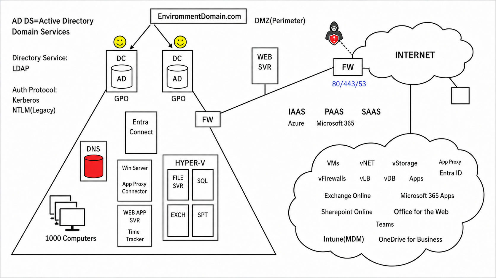

# Section 13: Plan, implement, and monitor the integration of enterprise applications

This section covers enterprise application integration in Microsoft Entra ID, including app-level and tenant-level settings, app administration roles, Application Proxy, SaaS app SSO and provisioning, user and group assignment, consent, and app collections.

> [!NOTE]
> Enterprise applications represent app instances in the tenant. App registrations define app identity configuration; enterprise applications are where access, assignment, SSO, provisioning, and app-specific controls are commonly managed.

## 88. Plan and Implement Settings for Enterprise Applications, App and Tenant Level

### Core idea

Modern enterprise applications are often web-based and cloud-hosted. Microsoft Entra ID provides central identity, authentication, and access management for company apps, Azure-hosted apps, and third-party SaaS apps.

### Microsoft Entra ID's role

Microsoft Entra ID helps answer:

- Who can access the app?
- How do users authenticate?
- Is single sign-on configured?
- Can users consent to app permissions?
- Should Conditional Access apply?
- Are users provisioned manually or automatically?

### Tenant-level vs application-level settings

| Level | What it controls | Examples |
|---|---|---|
| Tenant level | Broad behavior across the Microsoft Entra environment. | Company branding, user settings, authentication methods, security defaults, Conditional Access, consent settings. |
| Application level | Configuration for one specific enterprise application. | User/group assignment, SSO mode, provisioning, owners, app roles, app-specific Conditional Access targeting. |

> [!TIP]
> Memory hook: tenant level controls the building rules; app level controls the room access.

### Enterprise Applications blade

In **Enterprise Applications**, administrators can:

- Add new applications.
- Choose apps from the Microsoft Entra application gallery.
- Configure single sign-on.
- Assign users and groups.
- Configure provisioning.
- Manage owners.
- Review sign-in and audit activity.
- Configure app-specific settings.

Users can access assigned applications through:

- My Apps.
- Microsoft 365 app experiences.
- Direct application URLs, depending on configuration.

### Conditional Access note

Conditional Access can operate across both levels:

| Level | Example |
|---|---|
| Tenant-level mindset | Require MFA for risky sign-ins across many apps. |
| Application-level targeting | Require compliant device only for a sensitive SaaS application. |

> [!WARNING]
> Assigning a user to an enterprise application does not automatically decide the authentication protocol, provisioning behavior, or app permissions. Those settings must be configured separately.

## 89. Assign Appropriate Microsoft Entra Roles to Users to Manage Enterprise Apps

### Core idea

Application administration should follow least privilege. Users should not receive Global Administrator just because they need to manage enterprise applications.

### Key application admin roles

| Role | Scope | Best use case |
|---|---|---|
| Application Administrator | Broad app administration across the tenant. | Admin needs broad control over app registrations and enterprise applications. |
| Cloud Application Administrator | App administration with a narrower cloud-app focus. | Admin needs to manage cloud apps without full tenant administration. |
| Reports Reader | Read reporting data such as sign-ins and audit information. | User needs visibility into app usage or troubleshooting data. |
| Global Administrator | Full tenant control. | Emergency or broad tenant administration, not routine app management. |

### Application Administrator

Application Administrator is the more powerful application-focused role. It can manage many aspects of app registrations and enterprise applications across the organization.

Examples:

- Application registrations.
- Enterprise application settings.
- App permissions.
- Attributes.
- Single sign-on settings.

### Cloud Application Administrator

Cloud Application Administrator is more limited than Global Administrator and is better aligned to delegated app management.

Good for:

- Cloud app administrators.
- Teams that manage specific enterprise applications.
- Delegated app operations without broad tenant control.

### Where to assign roles

Portal path:

```text
Microsoft Entra ID > Roles and administrators > Select role > Assignments > Add assignment
```

> [!WARNING]
> Do not use Global Administrator as the default app-management role. For SC-300, the safer answer is usually a more specific role aligned to least privilege.

> [!TIP]
> Memory hook: app users use the app; app admins manage the app.

## 90. Design and Implement Integration for On-Premises Apps by Using Entra App Proxy

### Core idea

Microsoft Entra Application Proxy lets users securely access internal on-premises web applications through Microsoft Entra ID without exposing the internal app directly to the internet.



### Traditional approach

Historically, organizations often used:

- Internal web servers.
- External proxy servers.
- DMZ or perimeter network designs.
- VPN or reverse proxy access.

This approach works, but it can increase infrastructure, firewall exposure, and operational complexity.

### How Application Proxy works

| Component | Role |
|---|---|
| Internal web app | The on-premises app users need to reach. |
| Application Proxy connector | Windows Server component installed inside the corporate network. |
| Application Proxy service | Microsoft cloud service that brokers secure access. |
| Microsoft Entra ID | Authenticates users and applies identity-based controls. |

Flow:

1. External user accesses the published app URL.
2. User authenticates with Microsoft Entra ID.
3. Application Proxy service receives the request.
4. The internal connector communicates outbound to the service.
5. The connector retrieves app content from the internal web app.
6. Content is relayed back to the user.

### Why this improves security

- The internal web app is not directly exposed to the internet.
- The connector uses outbound connectivity rather than requiring inbound internet access to the app.
- Microsoft Entra authentication and Conditional Access can protect access.
- Users can get SSO-like access to internal apps.

### Where to set it up

Portal path:

```text
Microsoft Entra ID > Application Proxy > Download Connector Service
```

### Key prerequisites

| Requirement | Why it matters |
|---|---|
| Windows Server 2012 R2 or later | Required for the connector host. |
| Network, firewall, and DNS readiness | Connector must reach both the cloud service and internal app. |
| TLS/SSL support | Secure app publishing and user access. |
| Microsoft Entra Premium licensing | Required for Application Proxy. |
| Hybrid identity for some scenarios | Helps support internal identities and SSO patterns. |

### High availability

Install more than one connector for resiliency. If one connector fails, another connector can continue servicing published applications.

> [!WARNING]
> Application Proxy is mainly for web applications. It is not the same as publishing every internal protocol or replacing all private network access scenarios.

> [!TIP]
> Memory hook: external users talk to Entra; the connector talks outbound to the internal app.

## 91. Design and Implement Integration for SaaS Apps

### Core idea

SaaS app integration requires planning authentication, single sign-on, provisioning, and access assignment.

### Authentication requirements come first

Before integrating a SaaS app, decide:

- Will the app use SSO?
- Does the app support SAML?
- Does the app support OpenID Connect?
- Will users authenticate only with Microsoft Entra ID?
- Is another identity provider involved?
- Does the app need user provisioning?

### Single sign-on options

Inside:

```text
Enterprise Applications > Select app > Single sign-on
```

Common SSO options:

| SSO type | Best fit |
|---|---|
| SAML | Enterprise SaaS apps that support federation with Microsoft Entra ID. |
| OpenID Connect | Modern applications that support OIDC-based sign-in. |
| Password-based | Legacy apps that still require username/password sign-in. |
| Linked sign-on | App appears in My Apps or Microsoft 365, but authentication happens separately. |

> [!WARNING]
> Password-based SSO is not the same as federation. It is usually a compatibility option for apps that do not support modern SSO.

### Provisioning considerations

Provisioning controls how accounts are created, updated, and disabled in the target application.

Inside:

```text
Enterprise Applications > Select app > Provisioning
```

| Provisioning type | Meaning |
|---|---|
| Manual provisioning | Admins or app owners manage accounts and access manually. |
| Automatic provisioning | Microsoft Entra provisions users or groups to the target app through supported APIs, often SCIM. |

### Useful provisioning features

When automatic provisioning is supported, useful features can include:

- Email notifications on failure.
- Prevent accidental deletion thresholds.
- Attribute mappings.
- Scope filters.
- Provisioning logs.

> [!TIP]
> Memory hook: authentication signs users in; provisioning makes sure the app account exists.

## 92. Assign, Classify, and Manage Users, Groups, and App Roles for Enterprise Apps

### Core idea

Enterprise app access can be assigned directly to users or more efficiently through groups. Groups are usually better for scale, consistency, and review.

### Why use groups

Instead of assigning users one by one, create a security group and assign the group to the application.

Example:

```text
Box App Users
```

More specific examples:

- Box App Sales Users.
- Box App HR Users.
- Box App Finance Users.

### Group configuration concepts

| Setting | Purpose |
|---|---|
| Group type | Security group is commonly used for app access. |
| Description | Explains the access purpose. |
| Owner | Person responsible for managing membership. |
| Members | Users who receive access through the group. |

### Assigning the group to the app

Process:

1. Open **Enterprise Applications**.
2. Select the application.
3. Open **Users and groups**.
4. Select **Add user/group**.
5. Select the security group.
6. Assign the group to the application.

> [!WARNING]
> Nested group membership does not cascade for enterprise app assignment. Users must be direct members of the assigned group to receive access.

### Application owners

Application owners can manage aspects of the enterprise application and can add or remove other owners.

### App users vs app administrators

| Assignment type | Controls |
|---|---|
| User/group app assignment | Who can use the application. |
| Application owner | Who can manage that specific application. |
| Application Administrator or Cloud Application Administrator | Who can manage application configuration at a broader administrative level. |
| Reports Reader | Who can view sign-in and audit reports. |

### Access Reviews

Access Reviews help periodically verify whether users should keep access to an application.

Useful for:

- Sensitive apps.
- External access.
- High-privilege apps.
- Department-specific applications.
- Recurring access validation.

Review cadence examples:

- Monthly.
- Quarterly.
- Weekly for sensitive access.

> [!TIP]
> Memory hook: groups grant access at scale; access reviews clean up access over time.

## 93. Configure and Manage User and Admin Consent

### Core idea

Consent controls whether users or administrators can allow an application to access user, group, tenant, or Microsoft cloud data.

### What consent means

Consent means a user or admin grants an application permission to access data or perform actions through APIs.

Examples:

- Read a user's basic profile.
- Read mailbox data.
- Access files.
- Read directory information.
- Send mail as a user.

### Where to manage consent

Portal path:

```text
Microsoft Entra ID > Enterprise Applications > Security > Consent and permissions
```

### User consent settings

| User consent option | Security posture |
|---|---|
| Do not allow user consent | Most restrictive; admins approve app access. |
| Allow user consent for verified publishers and selected permissions | Balanced option for lower-risk apps and permissions. |
| Allow user consent for apps | Least restrictive; users can approve app access more freely. |

### Admin consent settings

Admin consent workflow controls what happens when users need approval for an app they cannot approve themselves.

Configuration can include:

- Allow users to request admin consent.
- Select reviewers by admin role, group, or user.
- Enable email notifications.
- Enable reminders.
- Configure request expiration.

> [!WARNING]
> Consent is not just "letting an app appear in My Apps." Consent can grant API access to organizational data, so broad user consent can become a security risk.

> [!TIP]
> Memory hook: user consent answers "can the user approve this app?" Admin consent answers "who reviews it when they cannot?"

## 94. Create and Manage Application Collections

### Core idea

App collections group related enterprise applications together so users can find them more easily in My Apps.

### Where to create collections

Portal path:

```text
Microsoft Entra ID > Enterprise Applications > App launchers > Collections > Create new collection
```

### Example

Collection:

```text
File Sharing App Collection
```

Apps:

- OneDrive.
- Box.

### Owners vs users and groups

| Assignment | Meaning |
|---|---|
| Owners | Can manage and edit the collection. |
| Users and groups | Can see the collection in the app launcher experience. |

### Result

After the collection is created, assigned users can see the grouped applications in:

```text
myapps.microsoft.com
```

> [!TIP]
> Memory hook: app assignment gives access; app collections organize the user experience.

## High-Yield Review

| Topic | What to remember |
|---|---|
| Tenant-level settings | Affect broad identity and security behavior. |
| App-level settings | Affect a specific enterprise application. |
| Application Administrator | Broad application administration role. |
| Cloud Application Administrator | Delegated app management without Global Administrator. |
| Application Proxy | Publishes internal web apps through Microsoft Entra. |
| SSO | Controls how users sign in to an app. |
| Provisioning | Controls how users and groups are created and maintained in the app. |
| User/group assignment | Controls who can use the app. |
| Consent | Controls whether an app can access data through permissions. |
| App collections | Organize apps for users in My Apps. |

> [!WARNING]
> The biggest Section 13 exam trap is mixing up app assignment, app ownership, admin roles, consent, and provisioning. They are related, but each solves a different problem.
