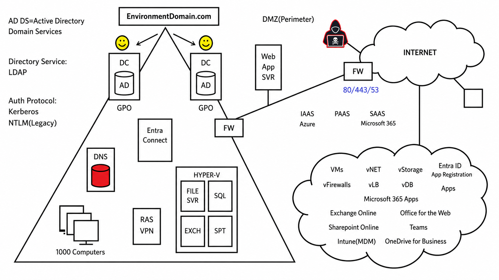

# Section 14: Plan and Implement App Registrations

This section focuses on app registrations in Microsoft Entra ID. App registrations define an application's identity configuration so Microsoft Entra can authenticate users, issue tokens, expose app roles, and authorize API access.

> [!NOTE]
> Enterprise applications manage the tenant-local app instance. App registrations define the application's identity and protocol configuration.

## 95. Plan for App Registrations

### Core idea

[App Registration](../00-front-matter/glossary.md#app-registration) is how an application is represented inside Microsoft Entra ID so Entra can handle authentication and authorization for that app.



### Why app registrations matter

In older application designs, organizations often had to build and operate:

- The web application.
- The user database.
- The authentication system.
- Authorization logic.
- Password handling and recovery.

In modern Microsoft cloud identity designs, the application can rely on Microsoft Entra ID for identity services instead of building all identity handling from scratch.

### What an app registration solves

An application needs an identity in Microsoft Entra so Entra can recognize it.

Once registered, the app can:

- Sign users in.
- Receive tokens.
- Request API permissions.
- Define redirect URIs.
- Define app roles.
- Integrate with Microsoft Entra accounts.

### Hosting does not matter as much

The app can be hosted:

- Internally.
- In Azure.
- In another cloud provider.
- With a third-party hosting provider.

The key point is that Microsoft Entra can still be the identity provider for the application.

### Mental model

| Piece | Meaning |
|---|---|
| Web app | The application users want to access. |
| User account | The identity stored in Microsoft Entra ID. |
| App registration | The identity configuration that links the app to Microsoft Entra. |
| Token | The signed result Entra issues after authentication. |

> [!TIP]
> Memory hook: app registration is the app's passport in Microsoft Entra.

> [!WARNING]
> App registration does not automatically give every user access to the app. Authentication configuration, app assignment, permissions, and app logic still matter.

## 96. Create App Registrations

### Core idea

Creating an app registration creates an application identity in Microsoft Entra ID. This tells Entra what the app is, who can sign in, and where authentication responses should be sent.

### Where to create it

Portal path:

```text
Microsoft Entra ID > App registrations > New registration
```

### Main fields

| Field | Purpose | Example |
|---|---|---|
| Display name | User-facing and admin-facing app name. | Company Web App |
| Supported account types | Defines who can sign in. | Single-tenant or multi-tenant |
| Redirect URI | Where Entra sends the authentication response. | `https://example.com/webapp` |

### Supported account types

| Option | Meaning | Best fit |
|---|---|---|
| Accounts in this organizational directory only | Single-tenant app. Only users in your tenant can sign in. | Internal business app. |
| Accounts in any organizational directory | Multi-tenant app. Users from other Entra tenants can sign in. | SaaS app for business customers. |
| Accounts in any organizational directory and personal Microsoft accounts | Work/school accounts plus personal Microsoft accounts. | App serving both business and consumer users. |
| Personal Microsoft accounts only | Consumer Microsoft accounts only. | Consumer-only app scenario. |

### Redirect URI

The redirect URI is where Microsoft Entra sends the authentication response after sign-in.

In real projects, developers usually provide this value because it must match the application's authentication flow.

Example:

```text
https://example.com/webapp
```

> [!WARNING]
> Redirect URIs must match exactly. A wrong scheme, path, port, or trailing slash can break sign-in flows.

### Registration result

After selecting the name, supported account type, and optional redirect URI, selecting **Register** creates the app registration.

The app registration then has identifiers such as:

- Application (client) ID.
- Directory (tenant) ID.
- Object ID.

> [!TIP]
> Memory hook: display name is what humans see, supported account type is who can sign in, and redirect URI is where the sign-in response returns.

## 97. Configure App Authentication

### Core idea

Authentication settings define how Microsoft Entra will sign users in to the application and which redirect or platform configuration the app uses.

### Common authentication settings

| Setting | Why it matters |
|---|---|
| Platform type | Defines whether the app is web, single-page app, mobile/desktop, or another platform. |
| Redirect URI | Where authentication responses are sent. |
| Front-channel logout URL | Where Entra can send logout messages for supported scenarios. |
| Implicit grant settings | Legacy flow settings for tokens returned directly to the browser. |
| Supported account types | Controls who can authenticate. |

### Authentication design questions

Before configuring authentication, answer:

- Is this a web app, SPA, mobile app, desktop app, or daemon/service?
- Who should sign in?
- Does the app need users from only this tenant or multiple tenants?
- What redirect URI does the developer require?
- Does the app use OpenID Connect or OAuth 2.0?
- Does the app need delegated or application permissions?

### Single-tenant vs multi-tenant

| Design | Meaning | Risk consideration |
|---|---|---|
| Single-tenant | Only users from your organization can sign in. | Simpler trust boundary. |
| Multi-tenant | Users from other organizations can sign in. | Requires more careful consent, publisher, and tenant trust planning. |

> [!WARNING]
> Do not choose multi-tenant just because it sounds more flexible. It expands who can authenticate and requires stronger planning around consent, app ownership, and customer tenant access.

> [!TIP]
> Memory hook: app authentication answers "who can sign in and where does Entra send them back?"

## 98. Configure API Permissions

### Core idea

API permissions define what APIs or resources the application can access after authentication. This is where an app is granted permission to call Microsoft Graph, Azure APIs, or other protected APIs.

### Where to configure it

Portal path:

```text
Microsoft Entra ID > App registrations > All applications > Select app > API permissions
```

### Default permission

Many new app registrations include a default Microsoft Graph delegated permission:

```text
User.Read
```

This allows the app to read the signed-in user's basic profile when consent is granted.

### Delegated vs application permissions

| Permission type | Meaning | Example |
|---|---|---|
| Delegated permission | App acts on behalf of a signed-in user. | Read user profile as the signed-in user. |
| Application permission | App acts as itself without a signed-in user. | Background service reads directory data. |

### Example: Azure Storage permission

The course example adds an Azure Storage permission so a web app could access storage resources such as:

- Images.
- Text.
- Files.
- Other stored content.

The selected permission was user impersonation, meaning the app can act on behalf of the signed-in user for that resource.

### Admin consent

Adding a permission is not always enough. Some permissions require admin approval.

| Step | Meaning |
|---|---|
| Add permission | Adds the requested permission to the app registration. |
| Grant admin consent | Approves that permission for the tenant where admin approval is required. |

> [!WARNING]
> Adding API permissions and granting admin consent are separate actions. If admin consent is required and not granted, the app may still fail even though the permission appears in the list.

> [!TIP]
> Memory hook: API permissions say what the app wants; consent says who approved it.

## 99. Create App Roles

### Core idea

[App Roles](../00-front-matter/glossary.md#app-role) are custom roles defined inside an app registration. They let the app receive role claims in tokens and make authorization decisions inside the application.

### Important concept

The application developer defines the permission model. Microsoft Entra stores and issues the roles, but the application code must understand what the role values mean.

### App roles and claims

A claim is information sent in a token. When a user or app is assigned an app role, Microsoft Entra can include that role value in the token.

Example:

```text
task.write
```

The application reads that claim and decides whether the user can create or write tasks.

### Example app role

| Field | Example |
|---|---|
| Display name | Task Writers |
| Allowed member types | Users |
| Value | `task.write` |
| Description | Writers can create and write tasks |
| Enabled | Yes |

### App role workflow

1. Developer defines the app permission model.
2. Admin or developer creates app roles in the app registration.
3. Users, groups, or applications are assigned to the role.
4. User or app authenticates.
5. Microsoft Entra issues a token with role claims.
6. Application reads the claims and enforces authorization.

### Allowed member types

| Member type | Meaning |
|---|---|
| Users/Groups | Human users or groups can be assigned the app role. |
| Applications | Service principals or apps can be assigned the app role. |

> [!WARNING]
> The app role value must match what the application code expects. Entra can issue the claim, but the app must enforce it.

> [!TIP]
> Memory hook: app roles are the app's vocabulary for permissions; claims are how Entra speaks that vocabulary to the app.

## High-Yield Review

| Topic | What to remember |
|---|---|
| App registration | Defines the app identity and protocol configuration in Microsoft Entra. |
| Supported account types | Determines who can sign in. |
| Redirect URI | Where Entra sends the authentication response. |
| API permissions | What APIs the app can request access to. |
| Admin consent | Tenant-level approval for permissions requiring admin approval. |
| Delegated permissions | App acts on behalf of a signed-in user. |
| Application permissions | App acts as itself without a user. |
| App roles | App-defined authorization values sent as claims. |

> [!WARNING]
> The biggest Section 14 exam trap is mixing up app registration, enterprise application, API permissions, consent, and app roles. App registration defines the app; enterprise application manages the tenant instance; API permissions request access; consent approves access; app roles describe app-specific authorization.
