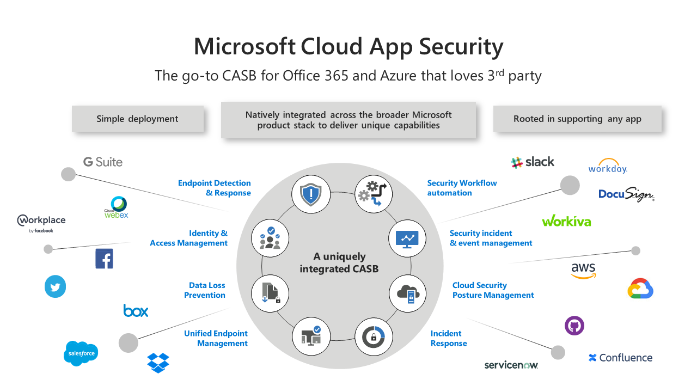
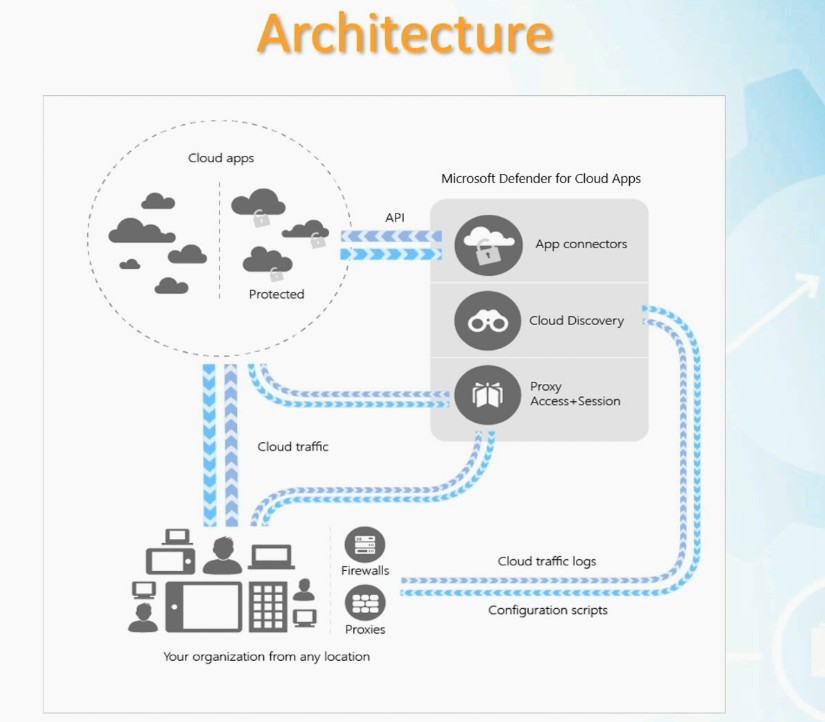
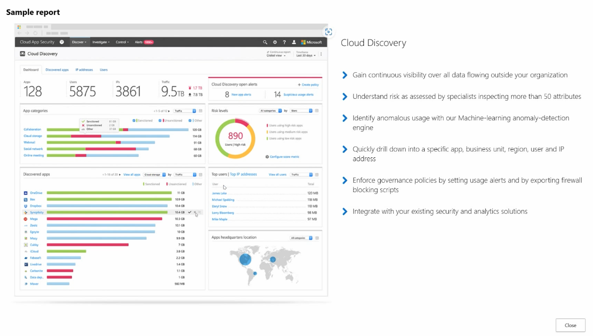

# Section 15: Manage and monitor app access by using Microsoft Defender for Cloud Apps

This section introduces [Microsoft Defender for Cloud Apps](../00-front-matter/glossary.md#microsoft-defender-for-cloud-apps) as the Microsoft cloud app security layer for discovering cloud usage, monitoring SaaS activity, controlling sessions, and governing risky app behavior.

> [!NOTE]
> The older product name was Microsoft Cloud App Security. Current SC-300 materials and Microsoft documentation use Microsoft Defender for Cloud Apps.

## 100. Understanding Microsoft Defender for Cloud Apps

### Core idea

Microsoft Defender for Cloud Apps is Microsoft’s [Cloud Access Security Broker](../00-front-matter/glossary.md#cloud-access-security-broker) capability. It helps organizations see which cloud apps are being used, evaluate the risk of those apps, monitor cloud activity, and enforce policies around files, sessions, OAuth apps, and user behavior.

*Image source: [Dev4Side](https://www.dev4side.com/en/blog/microsoft-defender-for-cloud-apps).*

### What to know

- It helps detect and reduce [Shadow IT](../00-front-matter/glossary.md#shadow-it), such as users uploading business data to unapproved personal cloud services.
- It can discover cloud apps, assess risk, connect to supported SaaS apps, monitor activity, and trigger alerts or governance actions.
- It supports data protection scenarios by helping identify sensitive content, risky sharing, and suspicious file activity.
- It integrates with Microsoft security controls such as Conditional Access, Microsoft Entra ID, Microsoft Purview sensitivity concepts, and Defender signals.
- It can control user sessions through [Conditional Access App Control](../00-front-matter/glossary.md#conditional-access-app-control) when supported apps and policies are configured correctly.

### Problems it helps solve

| Problem | What Defender for Cloud Apps helps with |
|---|---|
| Shadow IT | Discovers unsanctioned cloud apps and helps admins evaluate whether they should be allowed or blocked. |
| Sensitive data exposure | Detects risky sharing, sensitive file activity, and policy violations in supported cloud apps. |
| Threat behavior | Identifies anomalous activity such as mass downloads, impossible travel patterns, suspicious app usage, or compromised accounts. |
| Compliance pressure | Helps assess cloud apps against security, compliance, and legal factors before approving them for business use. |

### Main capabilities

| Capability | Purpose |
|---|---|
| [Cloud Discovery](../00-front-matter/glossary.md#cloud-discovery) | Identifies cloud apps, users, IP addresses, traffic volume, and risk from logs or integrations. |
| Sanctioned and unsanctioned apps | Marks apps as approved or disallowed for governance and enforcement workflows. |
| [App connectors](../00-front-matter/glossary.md#app-connector) | Connect supported cloud apps through APIs for deeper activity visibility and governance. |
| Conditional Access App Control | Applies real-time access and session controls to supported apps. |
| Policy management | Creates alerting, governance, file, activity, OAuth, and session policies. |
| Cloud App Catalog | Evaluates cloud apps by risk, compliance, legal, and security characteristics. |

### Architecture idea

Defender for Cloud Apps can receive information from several places: app connectors, firewalls, proxies, cloud traffic logs, user devices, and session control paths. This lets it support both visibility and enforcement instead of acting as only a dashboard.

### Policy control

Policies define what cloud behavior is expected and what should happen when activity becomes risky. They can detect violations, generate alerts, apply governance actions, and help reduce exposure from unsanctioned apps, inappropriate sharing, or suspicious app behavior.

> [!WARNING]
> Defender for Cloud Apps is not the same product as Microsoft Defender for Cloud. Defender for Cloud Apps focuses on SaaS/cloud app visibility, governance, app activity, and session control.

> [!TIP]
> Memory hook: Cloud Discovery sees what users use, app connectors see what connected apps do, and Conditional Access App Control controls what happens during supported sessions.

## 101. Configure and analyze cloud discovery results by using Defender for Cloud Apps

### Core idea

[Cloud Discovery](../00-front-matter/glossary.md#cloud-discovery) is the visibility engine for Defender for Cloud Apps. It helps identify which cloud apps, websites, users, devices, IP addresses, and traffic patterns exist in the environment.

### Where to go

In the Microsoft Defender portal, open **Cloud Apps** and use **Cloud Discovery** to review discovered apps, upload logs, configure ongoing log collection, and analyze reports.

### What to know

- Cloud Discovery can analyze traffic data from firewalls, proxies, routers, secure web gateways, and other network sources.
- It helps identify apps that users are actually accessing, even when those apps were never formally approved.
- Discovered apps can be reviewed by risk score, category, users, IP addresses, and traffic volume.
- Discovery output supports later decisions such as sanctioning, unsanctioning, alerting, blocking, or creating policies.

### Sample report

The sample report shows how Cloud Discovery can summarize discovered apps, users, IP addresses, traffic volume, risk levels, top users, and app categories.

### Discovery ingestion options

| Option | Best use | What it means |
|---|---|---|
| Manual report upload | One-time investigation or lab practice | Upload a supported firewall, proxy, or appliance log file and generate a snapshot report. |
| Automatic upload | Production visibility | Continuously collect logs from supported sources so discovery stays current. |
| Log collector | Centralized log collection | Uses a collector to receive logs from configured data sources and forward them to Defender for Cloud Apps. |

### Data sources and log collectors

| Term | Meaning |
|---|---|
| Data source | The network device, appliance, or log source that provides activity data. |
| [Log collector](../00-front-matter/glossary.md#log-collector) | A collection component that receives logs from supported sources and forwards them for Cloud Discovery analysis. |
| [Snapshot report](../00-front-matter/glossary.md#snapshot-report) | A saved discovery report generated from uploaded or collected log data. |

### What to watch

- Use automatic upload for ongoing visibility in real environments.
- Use manual reports when testing, learning, or analyzing a limited log sample.
- Be careful with the delete data option because removed discovery data cannot be recovered from Defender for Cloud Apps.

> [!WARNING]
> Cloud Discovery gives visibility first. Blocking or controlling app use requires a matching enforcement path, such as policy actions, network controls, Conditional Access App Control, or integrations.

> [!TIP]
> Memory hook: manual upload is a one-time snapshot; automatic upload is ongoing visibility.

## 102. Configure connected apps

### Core idea

[App connectors](../00-front-matter/glossary.md#app-connector) connect Defender for Cloud Apps directly to supported cloud services. Instead of only analyzing network logs, Defender can receive deeper activity and governance data from the application itself.

### What to know

- Connected apps provide richer visibility than traffic logs alone.
- App connectors commonly use provider APIs to collect supported activity and configuration data.
- Connector health matters because a disconnected or unhealthy app connector can reduce monitoring coverage.
- Supported apps can include Microsoft 365 and other SaaS platforms such as Google Workspace or Salesforce, depending on configuration and licensing.

### Microsoft 365 connector examples

| Data area | Why it matters |
|---|---|
| Management events | Shows administrative and service activity. |
| Sign-in events | Helps correlate identity activity with app usage. |
| Microsoft Entra apps | Improves visibility into cloud app relationships. |
| Microsoft 365 files | Supports file policy, sharing, and sensitive data scenarios. |
| Microsoft 365 activities | Helps detect user behavior and governance events. |

### Operational checks

- Confirm the connector is enabled.
- Review connection health and last successful check.
- Validate that the expected workloads are included.
- Re-check connectors after major permission, licensing, or service changes.

> [!WARNING]
> App connectors improve app-level visibility, but they do not replace Conditional Access policies, session controls, or governance policies. They are an integration source, not the whole enforcement model.

> [!TIP]
> Memory hook: Cloud Discovery tells you what apps are being used; app connectors tell you what is happening inside connected apps.

## 103. Implement application-enforced restrictions

### Core idea

Application-enforced restrictions limit what users can do inside cloud apps, not just whether they can sign in. In Defender for Cloud Apps, this is commonly handled through Conditional Access App Control, access policies, and [session policies](../00-front-matter/glossary.md#session-policy).

### Access policy vs session policy

| Policy type | Question it answers | Example |
|---|---|---|
| Access policy | Can the user enter the app? | Block access to Salesforce from unmanaged devices. |
| Session policy | What can the user do after entering? | Block downloading sensitive OneDrive files to unmanaged devices. |

### What to know

- Access policies focus on entry conditions.
- Session policies focus on user actions after access is granted.
- Session restrictions are useful for unmanaged devices, sensitive files, suspicious activity, or high-risk usage.
- Controls can monitor, block, protect, or require additional verification depending on the policy design.

### Common restrictions

| Restriction | Practical purpose |
|---|---|
| Block downloads, copy, cut, print, or save actions | Reduce [data exfiltration](../00-front-matter/glossary.md#data-exfiltration) risk. |
| Require reauthentication or MFA | Re-check identity before sensitive actions. |
| Protect files on download | Apply labeling, encryption, or protection instead of simply blocking. |
| Block unlabeled file uploads | Prevent sensitive data from entering cloud apps without required classification. |
| Block malware uploads | Stop suspicious or malicious files from being uploaded to supported apps. |
| Monitor abnormal behavior | Detect risky activity during the session. |

### Design mindset

Use access policies for the gate and session policies for the behavior inside the gate. A user can be allowed into an app while still being prevented from downloading sensitive files or performing risky actions.

> [!WARNING]
> A sign-in success does not mean every action should be allowed. Defender for Cloud Apps can enforce controls after authentication when session control is configured.

> [!TIP]
> Memory hook: access policy is the door; session policy is the rulebook once inside.

## 104. Conditional Access App Control along with access and session policies

### Core idea

Conditional Access App Control lets Defender for Cloud Apps apply real-time controls to supported cloud app sessions. This is useful when organizations need different controls for managed devices, unmanaged devices, risky users, or sensitive actions.

### Setup concept

Many third-party app scenarios require a proper SSO or federation configuration, often using SAML. For apps such as Salesforce or Dropbox, administrators may need metadata, certificates, URLs, or other trust details from the app provider before the session can be controlled correctly.

### Workflow

| Step | Action |
|---:|---|
| 1 | Select the cloud app that needs access or session control. |
| 2 | Configure the required SSO, SAML, or federation details when needed. |
| 3 | Connect or onboard the app into Defender for Cloud Apps. |
| 4 | Create an access policy if the goal is to control entry. |
| 5 | Create a session policy if the goal is to control activity after entry. |

### Access and session policy examples

| Scenario | Policy direction |
|---|---|
| Block Salesforce from unmanaged devices | Access policy |
| Block Dropbox native clients | Access policy |
| Block sensitive file downloads from OneDrive | Session policy |
| Block malware upload to SharePoint Online | Session policy |
| Monitor user activity in a sensitive app | Session policy |

### What to know

- Conditional Access App Control sits between identity-based access decisions and in-app activity control.
- It is strongest when paired with Conditional Access policies and supported cloud app integrations.
- It is especially useful when the organization wants limited access instead of fully blocking the user.

> [!WARNING]
> Not every app or session supports every control. App support, SSO configuration, browser/client behavior, and policy design all affect what can be enforced.

> [!TIP]
> Memory hook: Conditional Access decides whether access should be allowed; Conditional Access App Control can shape what the session is allowed to do.

## 105. Implement and manage policies including OAuth apps

### Core idea

Defender for Cloud Apps policies monitor, alert on, and govern risky cloud behavior across users, files, apps, sessions, and OAuth-connected applications.

### Policy templates

Policy templates give administrators a starting point for common detections and governance scenarios. Templates can help with situations such as mass downloads, risky app usage, file sharing to unauthorized domains, multiple failed logons, or new risky apps appearing in the environment.

### Policy categories

| Category | Purpose |
|---|---|
| Threat detection | Detect suspicious sign-ins, abnormal activity, impossible travel, or risky behavior. |
| Information protection | Monitor and protect sensitive files, labels, and sharing behavior. |
| Conditional Access App Control | Apply access and session restrictions to supported apps. |
| Shadow IT | Identify and govern unsanctioned or risky cloud app usage. |

### File policies

[File policies](../00-front-matter/glossary.md#file-policy) monitor file activity and can detect when files are shared in risky ways, such as with personal email addresses or unauthorized domains. They can also use classification, sensitivity, inspection methods, alerts, and governance actions.

| File policy setting | Why it matters |
|---|---|
| Policy name and severity | Makes alert triage easier. |
| Category | Groups the policy by security goal. |
| Collaborator or domain conditions | Detects risky external sharing. |
| File owner or user scope | Limits the policy to the right users or groups. |
| Inspection method | Determines how file content or metadata is evaluated. |
| Alerts and limits | Controls notification volume. |
| Governance actions | Defines remediation such as removing sharing or applying controls. |

### OAuth app policies

[OAuth app policies](../00-front-matter/glossary.md#oauth-app-policy) monitor cloud applications that have been granted OAuth-based access. They help detect risky connected apps, suspicious publishers, unusual permissions, or unwanted app behavior.

| OAuth policy element | Example |
|---|---|
| Policy name | Risky OAuth app review |
| Category or threat type | App permissions or suspicious app behavior |
| Filter | Publisher, app, permission, user count, or other supported criteria |
| Alert behavior | Generate alerts when matching apps are detected |

> [!WARNING]
> OAuth app policy is not the same thing as creating API permissions in an app registration. In Defender for Cloud Apps, the focus is monitoring and governing OAuth-connected apps already interacting with the environment.

> [!TIP]
> Memory hook: file policy watches what users do with files; OAuth app policy watches what connected apps do with authorized access.

## 106. Manage the Cloud App Catalog

### Core idea

The [Cloud App Catalog](../00-front-matter/glossary.md#cloud-app-catalog) is Defender for Cloud Apps’ reference database for evaluating cloud applications. It helps administrators understand what apps exist, how risky they are, and what security, compliance, and legal controls they support.

### What to know

- The catalog contains thousands of cloud apps that Defender for Cloud Apps can detect and evaluate.
- Apps are scored based on risk factors such as security, compliance, legal posture, and supported controls.
- Admins can search and filter by app name, category, score, and other characteristics.
- The catalog supports governance decisions such as approving an app, rejecting an app, connecting an app, or creating policies around app risk.

### Cloud Discovery vs Cloud App Catalog

| Concept | What it answers |
|---|---|
| Cloud Discovery | What apps are users actually using? |
| Cloud App Catalog | How risky or trustworthy are those apps? |

### Practical use cases

| Use case | Example |
|---|---|
| App evaluation | Compare project management apps before approving one for business use. |
| Risk filtering | Show only apps with high security and compliance scores. |
| Governance planning | Decide whether an app should be sanctioned, unsanctioned, monitored, or blocked. |
| Policy creation | Build a policy around newly detected risky apps or app categories. |

### Comprehension checkpoints

| Question | Answer |
|---|---|
| What is the Cloud App Catalog used for? | Researching and evaluating cloud apps based on risk, security, compliance, and legal characteristics. |
| What does the risk score help an admin understand? | Whether an app appears secure and trustworthy enough for business use. |
| How is the catalog different from Cloud Discovery? | Discovery shows actual usage; the catalog evaluates the apps themselves. |
| Why filter by risk score? | To focus on apps that meet the organization’s minimum security or compliance expectations. |

> [!WARNING]
> A Cloud App Catalog score helps with evaluation, but it does not automatically approve, block, or enforce app usage by itself.

> [!TIP]
> Memory hook: Cloud Discovery finds usage; Cloud App Catalog rates the apps.

## Assignment 10: Use Defender for Cloud Apps and Create a File Policy for Detection

### Core idea

This assignment should document a Defender for Cloud Apps file policy that detects risky sharing or sensitive data exposure.

### Evidence to document

- Policy name, category, and severity.
- File, sharing, collaborator, or domain conditions.
- Sensitive information, inspection, or classification settings used.
- Alert settings and recipient behavior.
- Governance actions selected.
- Sanitized screenshots showing the saved policy and relevant results.

### Repository note

Document the assignment in [section-15-assignment-10-defender-cloud-apps-file-policy.md](../assignments/section-15-assignment-10-defender-cloud-apps-file-policy.md).
