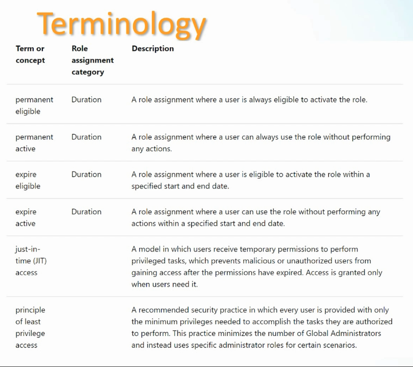

# Section 18: Plan and Implement Privileged access (PIM)

This section covers [Privileged Identity Management](../00-front-matter/glossary.md#privileged-identity-management) in Microsoft Entra: how PIM reduces standing administrative access, how eligible and active assignments work, how users activate roles, and why emergency access accounts are handled differently from normal privileged access.

> [!NOTE]
> PIM supports the same big security direction used throughout SC-300: [least privilege](../00-front-matter/glossary.md#least-privilege), [Zero Trust](../00-front-matter/glossary.md#zero-trust), just-in-time elevation, time-bound access, auditability, and access review.

## 114. Understand Privileged Identity Management

### Core idea

Privileged Identity Management is used to control, monitor, and manage privileged access to Microsoft Entra ID, Azure resources, Microsoft 365, Intune, and related Microsoft services. Its purpose is to reduce permanent administrative access and replace it with controlled, temporary, auditable elevation.

### Why it matters

Admin rights are powerful. If privileged roles are permanently active, an attacker who compromises that account immediately inherits high-impact permissions. PIM reduces that risk by making privileged access eligible, time-bound, approved, justified, and monitored.

### Security concepts

| Concept | Meaning | How PIM supports it |
|---|---|---|
| Least privilege | Give only the permissions needed to do the job. | Users activate only the role needed for a specific task. |
| Zero Trust | Verify explicitly and do not assume permanent trust. | Activation can require MFA, approval, justification, and time limits. |
| [Just-in-time access](../00-front-matter/glossary.md#just-in-time-access) | Give privileged access only when needed. | Eligible users activate roles temporarily. |
| [Privilege bracketing](../00-front-matter/glossary.md#privilege-bracketing) | Elevate access for a task, then remove it. | Role activation expires after the configured duration. |

### Main PIM capabilities

| Capability | What it does |
|---|---|
| Eligible assignments | Let users activate a role when needed without holding it all the time. |
| Time-bound activation | Limits how long the role remains active. |
| Approval | Requires another person to approve activation before access is granted. |
| Multifactor authentication | Requires stronger verification before activation. |
| Justification | Requires the user to explain why the role is needed. |
| Notifications | Alerts administrators or stakeholders when roles are assigned or activated. |
| Access reviews | Periodically confirms whether users still need privileged eligibility or access. |
| Audit history | Records who activated what, when, and why. |

### Licensing

PIM requires Microsoft Entra ID P2 or Microsoft Entra ID Governance. Some higher Microsoft 365 bundles may include the required licensing, but the exam point is that PIM is a premium governance capability, not a basic tenant feature.

### Roles related to PIM management

| Role | Relevance |
|---|---|
| Global Administrator | Can manage broad tenant configuration and privileged assignments. |
| Privileged Role Administrator | Can manage role assignments in PIM without granting full Global Administrator power. |
| Security Administrator | Can view and manage many security-related areas, depending on task and scope. |
| Global Reader / Security Reader | Useful for read-only visibility and review scenarios. |

### Important PIM terminology

| Term | Category | Meaning |
|---|---|---|
| Eligible | Assignment state | The user can activate the role, but the role is not currently active. |
| Active | Assignment state | The user currently has the role and can use its permissions. |
| Activated | Activation result | An eligible user completed the required steps and made the role active. |
| Permanently eligible | Duration | The user is always eligible to activate the role, but it is not always active. |
| Permanently active | Duration | The user always has the role active. This is the riskiest standing-access model. |
| Expire eligible | Duration | The user is eligible to activate the role only between a defined start and end time. |
| Expire active | Duration | The user has active role access only until a defined expiration time. |
| Just-in-time access | Access model | The user receives privileged access only when needed and only for a limited time. |
| Principle of least privilege | Security principle | Users receive the minimum privileges needed to perform authorized tasks. |

### Main design idea

PIM replaces permanent admin access with temporary, controlled, approved, and auditable admin access.

> [!WARNING]
> Permanently active privileged roles are the least restrictive and highest-risk model. They may be necessary for specific emergency scenarios, but they should not be the default for normal administrators.

> [!TIP]
> Memory hook: eligible means can activate; active means currently has it; activated means the user turned eligible access into temporary usable access.

## 115. Implement and configure Privileged Identity Management

### Core idea

Implementing PIM usually means assigning a role as eligible so the user can activate it only when needed. The admin prepares the privileged path, and the user activates it later for a specific task.

### Example scenario

An administrator will be unavailable, and another user needs temporary ability to create user accounts. Instead of assigning permanent administrative access, the user is made eligible for the User Administrator role and activates it only when needed.

### Admin setup flow

| Step | Admin action |
|---:|---|
| 1 | Open Microsoft Entra Privileged Identity Management. |
| 2 | Go to Microsoft Entra roles. |
| 3 | Select the needed role, such as User Administrator. |
| 4 | Choose Add assignment. |
| 5 | Select the scope, such as directory or administrative unit. |
| 6 | Select the member. |
| 7 | Set the assignment type, preferably eligible for just-in-time activation. |

### Scope options

| Scope | Meaning |
|---|---|
| Directory | The role applies across the tenant according to that role’s normal permissions. |
| Administrative unit | The role is scoped to a subset of users, groups, or devices when supported. |

### User activation flow

| Step | User action |
|---:|---|
| 1 | Sign in to the portal. |
| 2 | Open Microsoft Entra Privileged Identity Management. |
| 3 | Open My roles. |
| 4 | Find the role listed as eligible. |
| 5 | Select Activate. |
| 6 | Complete required MFA if prompted. |
| 7 | Choose an activation duration. |
| 8 | Enter a business justification. |
| 9 | Use the role temporarily after activation succeeds. |

### Activation controls

| Control | Why it matters |
|---|---|
| MFA | Confirms the user is really present before elevation. |
| Duration | Limits privileged access to the smallest practical window. |
| Justification | Creates an audit reason for the activation. |
| Approval | Adds human review before elevation is granted. |
| Notification | Makes privileged activation visible to security or admin teams. |

### Activation duration

The default activation window might be longer than the task requires. If the task only needs a short period, the user should choose a shorter duration. For example, creating a few user accounts may only require two hours instead of a full workday.

### Proof of activation

Before activation, the user does not have the role’s privileged capability. After activation, the privileged action becomes available. In the walkthrough, the visible proof was that the user could access the **New user** action after activating User Administrator.

### Implementation pattern

| Phase | Responsibility |
|---|---|
| Admin setup | Assign eligible role, scope, and activation requirements. |
| User activation | Activate role, complete MFA, set duration, provide justification, perform task. |
| Audit and review | Review activation history, assignments, and whether the user still needs eligibility. |

> [!WARNING]
> Assigning a role as active gives the user permissions immediately. Assigning a role as eligible requires activation first, which is the safer PIM pattern for most privileged work.

> [!TIP]
> Memory hook: admin grants eligibility; user activates privilege; PIM records the trail.

## 116. Break-glass accounts

### Core idea

A break-glass account, also called an [emergency access account](../00-front-matter/glossary.md#emergency-access-account), is a highly protected account used only when normal administrative sign-in fails.

### Why it exists

The purpose is to prevent tenant lockout during emergencies. Examples include a failed identity provider, unavailable MFA service, network outage, unavailable top administrator, or a Conditional Access mistake that blocks normal admin access.

### What to know

- It is usually a normal cloud user account assigned permanent Global Administrator rights.
- It should not be a daily-use admin account.
- It should not depend on the same fragile authentication path that could fail during an outage.
- It should be monitored closely and used only for emergency recovery.
- Credentials should be stored securely but remain retrievable by trusted personnel during a real emergency.

### Design guidance

| Design point | Recommended approach |
|---|---|
| Identity | Use a dedicated emergency account, not a personal admin identity. |
| Role | Usually permanent Global Administrator, because it must work during emergencies. |
| PIM relationship | Do not rely on PIM activation for the emergency account itself. |
| Authentication | Avoid the same single point of failure as normal admin sign-in. |
| Password | Use a long, random, strongly protected password if password-based. |
| Storage | Store credentials in a secure, controlled, documented emergency process. |
| Monitoring | Alert on sign-in or usage because any use should be rare and investigated. |

### PIM vs break-glass

| Concept | Normal PIM admin access | Break-glass account |
|---|---|---|
| Purpose | Routine privileged work with controlled elevation. | Emergency tenant recovery. |
| Access model | Eligible or time-bound active. | Usually permanently active. |
| Authentication path | Can require MFA, approval, justification. | Must avoid being blocked by the same outage or policy failure. |
| Usage frequency | Used when privileged tasks are needed. | Rare, only during emergencies or tests. |
| Monitoring | Audited and reviewed. | Heavily monitored and investigated if used. |

> [!WARNING]
> Do not make the emergency access account dependent on PIM activation. If PIM, MFA, Conditional Access, or federation is part of the outage, the account may not help you recover.

> [!TIP]
> Memory hook: PIM is for normal controlled elevation; break-glass is for emergency recovery when the normal path is broken.

## Assignment 12: Make a User Eligible for User Administrator Using PIM

### Core idea

This assignment should document making a test user eligible for the User Administrator role, signing in as that user, activating the role, and verifying the temporary privileged capability.

### Evidence to document

- Role selected: User Administrator.
- Assignment type: eligible.
- Scope selected, such as directory or administrative unit.
- Activation requirements, such as MFA, duration, and justification.
- Screenshot or note showing the role listed under My roles.
- Screenshot or note showing activation succeeded.
- Verification that the user can perform the intended privileged task.
- Cleanup or deactivation notes after the task is complete.

### Repository note

Document the assignment in [section-18-assignment-12-pim-user-administrator-eligibility.md](../assignments/section-18-assignment-12-pim-user-administrator-eligibility.md).
