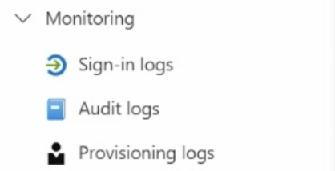
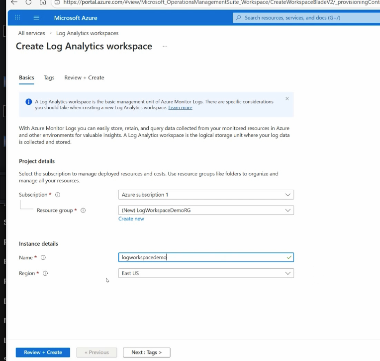
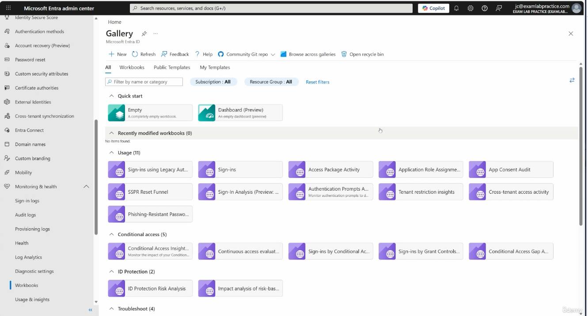
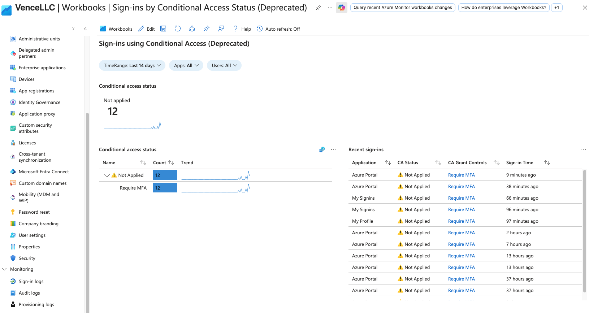
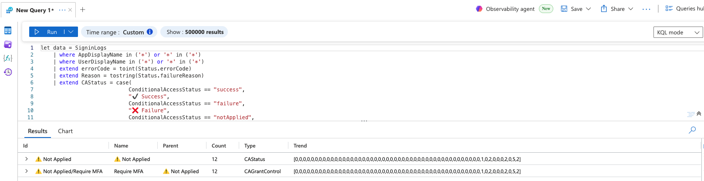

# Section 19: Monitor identity activity by using logs, workbooks, and reports

This section covers the monitoring side of Microsoft Entra: sign-in logs, audit logs, provisioning logs, diagnostic settings, Log Analytics, Kusto Query Language, workbooks, reports, and Identity Secure Score.

> [!NOTE]
> Monitoring is where identity administration becomes measurable. Logs show what happened, diagnostic settings route the data, KQL queries investigate it, and workbooks turn it into reusable dashboards.

## 117. Review and analyze sign-in, audit, and provisioning logs in the Entra admin center

### Core idea

Microsoft Entra provides core monitoring tools under **Monitoring and health**. The three high-yield log types are sign-in logs, audit logs, and provisioning logs.



### Where to find them

You can review these logs in the Microsoft Entra admin center or the Azure portal. Both routes expose the same core identity logging information.

### Log types

| Log type | What it tracks | Memory hook |
|---|---|---|
| [Sign-in logs](../00-front-matter/glossary.md#sign-in-logs) | Authentication activity, app access, Conditional Access results, client details, device details, and success or failure. | Who logged in |
| [Audit logs](../00-front-matter/glossary.md#audit-logs) | Directory and administrative changes, including who changed what and whether it succeeded. | Who changed what |
| [Provisioning logs](../00-front-matter/glossary.md#provisioning-logs) | Automated identity creation, update, deletion, and synchronization between systems. | What synced where |

### Sign-in logs

Sign-in logs show authentication activity in the tenant. They help answer who signed in, when, from where, using what application, using what device, and whether Conditional Access applied.

| Sign-in type | Meaning | Example |
|---|---|---|
| Interactive user sign-in | A person actively signs in. | User signs in to Teams, Outlook, Azure portal, or Microsoft 365. |
| Non-interactive user sign-in | Authentication happens in the background. | App refreshes a token or checks mail without prompting the user. |
| Service principal sign-in | An application or automation authenticates. | Script, integration, or workload uses an app identity. |
| Managed identity sign-in | An Azure resource authenticates with a managed identity. | Azure VM or function accesses another Azure service without stored credentials. |

### Audit logs

Audit logs track directory and administrative changes. If sign-in logs are a security camera for authentication, audit logs are the change record for the tenant.

| Audit log question | Example |
|---|---|
| Who made the change? | Which admin or service principal performed the action. |
| What changed? | User, group, app, role, policy, or setting. |
| When did it happen? | Timestamp of the activity. |
| Did it succeed? | Success, failure, or other result state. |

### Provisioning logs

Provisioning logs track automated identity synchronization and provisioning activity between Microsoft Entra and connected systems. They are useful when a user, group, or assignment should appear in another system but does not.

| Scenario | Why provisioning logs help |
|---|---|
| User missing in a SaaS app | Shows whether provisioning ran and whether it failed. |
| HR-driven identity update did not sync | Shows whether the update was attempted. |
| Account was removed unexpectedly | Shows whether deprovisioning logic triggered. |
| Attribute mapping issue | Helps identify source and target attribute behavior. |

### Filtering and export

The logs can be filtered by date, user, application, IP address, result, service, category, activity, or other relevant fields. Logs can also be exported or routed through diagnostic settings for longer retention and deeper analysis.

> [!WARNING]
> Do not confuse audit logs with sign-in logs. Sign-in logs tell you about authentication; audit logs tell you about configuration and directory changes.

> [!TIP]
> Memory hook: sign-in equals authentication, audit equals changes, provisioning equals synchronization.

## 118. Configure diagnostic settings with Log Analytics, storage accounts, and Event Hubs

### Core idea

[Diagnostic settings](../00-front-matter/glossary.md#diagnostic-settings) route Microsoft Entra logs to external destinations for retention, analysis, alerting, or integration. Diagnostic settings do not analyze logs by themselves; they move selected log categories to the destination you choose.

### Where to configure it

Go to **Microsoft Entra ID -> Monitoring and health -> Diagnostic settings**. The destination resource must already exist before it can be selected.

### Main destinations

| Destination | Best for | Exam memory |
|---|---|---|
| [Log Analytics workspace](../00-front-matter/glossary.md#log-analytics-workspace) | Querying, alerting, investigation, visualization, and KQL analysis. | Investigate |
| Storage account | Long-term retention, audit archive, and compliance storage. | Retain |
| Event Hubs | Streaming logs to SIEM platforms or external monitoring pipelines. | Stream |
| Partner solution | Integrated third-party monitoring destinations. | Integrate |

### High-yield log categories

| Category | What it captures |
|---|---|
| AuditLogs | Directory and administrative changes. |
| SignInLogs | User and workload sign-in activity. |
| MicrosoftGraphActivityLogs | Microsoft Graph API activity in the tenant. |
| ProvisioningLogs | Automated provisioning and synchronization events when enabled. |

### Transcript workflow



| Step | Action |
|---:|---|
| 1 | Create a Log Analytics workspace. |
| 2 | Return to Microsoft Entra diagnostic settings. |
| 3 | Select **Add diagnostic setting**. |
| 4 | Choose the log categories to send. |
| 5 | Select **Send to Log Analytics workspace**. |
| 6 | Save the setting. |
| 7 | Wait for ingestion. |
| 8 | Open the workspace and query the generated tables. |

### Operational notes

- You can create multiple diagnostic settings for different destinations.
- Log ingestion is not always immediate.
- Cost can increase depending on log volume, destination, and retention.
- Log Analytics is usually the most useful destination for investigations.
- Storage is better for archive retention than interactive investigation.
- Event Hubs is best when another platform needs the logs in near real time.

> [!WARNING]
> Diagnostic settings are about log routing, not log analysis. Log Analytics, Sentinel, workbooks, or a SIEM analyze the data after routing.

> [!TIP]
> Memory hook: diagnostic settings move the logs; Log Analytics investigates them; Storage retains them; Event Hubs streams them.

## 119. What is Kusto Query Language?

### Core idea

[Kusto Query Language](../00-front-matter/glossary.md#kusto-query-language) is Microsoft’s query language for searching, filtering, summarizing, and analyzing log and security data.

### Why it matters

Microsoft Entra, Azure Monitor, Microsoft Sentinel, Defender, Purview, and Microsoft 365 services can generate large amounts of telemetry. KQL helps administrators and analysts isolate meaningful events, investigate incidents, and summarize patterns over time.

### Where KQL is used

| Area | Typical use |
|---|---|
| Microsoft Defender XDR | Threat hunting, incident investigation, and suspicious activity analysis. |
| Microsoft Sentinel | SIEM queries, analytics rules, hunting, workbooks, and investigations. |
| Microsoft Purview | Audit and data activity investigation. |
| Azure Monitor / Log Analytics | Querying operational and identity logs. |
| Microsoft Entra monitoring | Querying sign-in, audit, and diagnostic data routed to a workspace. |

### Basic KQL flow

| Step | KQL element | Meaning |
|---:|---|---|
| 1 | Table name | Start with the dataset, such as `SigninLogs` or `SecurityEvent`. |
| 2 | Pipe `|` | Send the current results into the next operation. |
| 3 | `where` | Filter rows. |
| 4 | `project` | Select or shape columns. |
| 5 | `summarize` | Aggregate results. |
| 6 | `bin()` | Group time values into intervals. |

### Example logic

```kusto
DeviceLogonEvents
| where AccountName == "jdoe"
| where LogonType == "RemoteInteractive"
| summarize RemoteLogons = count() by bin(Timestamp, 1h)
```

This query starts with device logon events, filters to one account, filters to remote interactive logons, counts the events, and groups the result into one-hour time buckets.

> [!TIP]
> Memory hook: table -> pipe -> where -> project -> summarize.

## 120. Accessing Microsoft’s demo environment for learning KQL

### Core idea

The lecture recommends practicing KQL in Microsoft’s Log Analytics demo environment before experimenting in production. A demo environment gives you real sample data without risking real tenant logs.

### Practice workflow

| Step | Action |
|---:|---|
| 1 | Open the Microsoft Log Analytics demo environment. |
| 2 | Use a reference sheet for common operators and sample queries. |
| 3 | Draft a query manually or with AI assistance. |
| 4 | Paste the query into the demo environment. |
| 5 | Run, troubleshoot, and refine the query. |

### Operators to recognize

| Operator or function | Purpose |
|---|---|
| `search` | Searches across columns. |
| `where` | Filters rows. |
| `summarize` | Aggregates data. |
| `project` | Selects columns. |
| `extend` | Adds calculated columns. |
| `ago()` | Creates relative time filters. |
| `datetime()` | Creates fixed date-time values. |
| `union` | Combines rows from multiple queries or tables. |
| `join` | Combines related rows based on a matching key. |

### AI workflow note

AI can help draft queries, but you still need to understand the table, fields, filters, and expected result. Treat AI output as a starting point to test and refine.

> [!WARNING]
> Never paste sensitive tenant data, real user details, customer names, or private logs into an AI prompt.

> [!TIP]
> Memory hook: demo environment equals practice; reference sheet equals syntax help; AI equals draft assistant.

## 121. Basic KQL syntax

### Core idea

KQL becomes easier when you start with simple filters and build one pipe at a time.

### Basic examples

```kusto
SecurityEvent
```

Search all columns for a value:

```kusto
SecurityEvent
| search "10"
```

Filter to successful Windows logon events:

```kusto
SecurityEvent
| where EventID == 4624
```

Filter by account type:

```kusto
SecurityEvent
| where AccountType == "Machine"
```

Filter by computer:

```kusto
SecurityEvent
| where Computer == "DC01"
```

Filter by process:

```kusto
SecurityEvent
| where Process == "powershell.exe"
```

Combine conditions:

```kusto
SecurityEvent
| where (EventID == 4624 or EventID == 4625) and Computer == "RETAILVM01"
```

> [!NOTE]
> Event ID `4624` represents a successful Windows logon event. Event ID `4625` represents a failed logon event.

## 122. KQL filtering with time ranges

### Core idea

Time filtering and summarization help turn raw logs into useful counts, trends, and investigation windows.

### Count matching events

```kusto
SecurityEvent
| where EventID == 4624
| summarize TotalLogonEvents = count()
```

### Show top event sources

```kusto
SecurityEvent
| summarize EventCount = count() by EventSourceName
| top 5 by EventCount
```

### Filter by relative time

```kusto
SecurityEvent
| where TimeGenerated >= ago(9000h)
```

### Filter by fixed date range

```kusto
SecurityEvent
| where TimeGenerated between (datetime(2021-01-01) .. datetime(2029-01-01))
```

### Count distinct accounts by computer

```kusto
SecurityEvent
| summarize UniqueAccounts = dcount(Account) by Computer
```

### Add a calculated column

```kusto
SecurityEvent
| extend LogType = "Security"
| take 10
```

### Count unique users

```kusto
SecurityEvent
| summarize UniqueUsers = dcount(Account)
```

> [!TIP]
> Memory hook: `where` narrows rows, `summarize` counts or groups rows, and `ago()` builds relative time windows.

## 123. Display columns, amounts, and characters with KQL

### Core idea

`project`, `extend`, `order by`, and string filters help control what you see and how readable the output becomes.

### Calculate event age

```kusto
SecurityEvent
| extend EventAge = now() - TimeGenerated
```

### Display one column

```kusto
SecurityEvent
| project TimeGenerated
```

### Show earliest successful logons

```kusto
SecurityEvent
| where EventID == 4624
| order by TimeGenerated asc
| take 10
```

### Create an event hour column

```kusto
SecurityEvent
| project TimeGenerated, Computer, Account, EventID
| extend EventHour = format_datetime(TimeGenerated, "HH")
```

### Filter IP address prefix

```kusto
SecurityEvent
| where IpAddress startswith "10.1"
| project IpAddress
```

### Search command-line activity

```kusto
SecurityEvent
| where CommandLine contains "powershell"
```

> [!WARNING]
> KQL is case-sensitive in some contexts and field names must match the table schema. If a query fails, first check table name, column name, operator, and quotation marks.

## 124. Use variables and combine output data with KQL

### Core idea

`let`, `union`, and `join` help build reusable query logic and combine related results.

### Use `let` to assign a query variable

```kusto
let LogonEvents = SecurityEvent
| where EventID == 4624;
LogonEvents
| summarize LogonCount = count() by Account
```

### Combine two result sets with `union`

```kusto
SecurityEvent
| where EventID == 4688
| project Computer, EventID, TimeGenerated, Account
| union (
    SecurityEvent
    | where EventID == 4624
    | project Computer, EventID, TimeGenerated, Account
)
```

### Join process creation and logon events by computer

```kusto
SecurityEvent
| where EventID == 4688
| project Computer, ProcessTime = TimeGenerated, ProcessAccount = Account, Process
| join kind=inner (
    SecurityEvent
    | where EventID == 4624
    | project Computer, LogonTime = TimeGenerated, LogonAccount = Account
) on Computer
```

### When to use each

| Operator | Best use |
|---|---|
| `let` | Store a reusable query or value. |
| `union` | Stack similar results from multiple queries or tables. |
| `join` | Combine related data based on a matching column. |

## 125. Monitor Microsoft Entra ID by using KQL queries in Log Analytics

### Core idea

After Microsoft Entra logs are routed to a Log Analytics workspace, you can query tables such as `SigninLogs` to investigate identity activity.

### Where you can run queries

- Directly inside the Log Analytics workspace.
- From Microsoft Entra ID monitoring experiences.
- From the Entra admin center under Monitoring and health.

### Example Entra sign-in queries

Filter by user principal name:

```kusto
SigninLogs
| where UserPrincipalName == "user@example.com"
```

Filter by application:

```kusto
SigninLogs
| where AppDisplayName == "Azure Portal"
```

Show interactive browser sign-ins:

```kusto
SigninLogs
| where ClientAppUsed == "Browser"
| where IsInteractive == true
```

Show top applications by sign-in count:

```kusto
SigninLogs
| summarize SignInCount = count() by AppDisplayName
| top 5 by SignInCount
```

Parse device details:

```kusto
SigninLogs
| extend Device = todynamic(DeviceDetail)
| project TimeGenerated,
          UserPrincipalName,
          AppDisplayName,
          OS = tostring(Device.operatingSystem),
          Browser = tostring(Device.browser),
          DeviceId = tostring(Device.deviceId),
          TrustType = tostring(Device.trustType)
```

> [!WARNING]
> Do not commit real user principal names, tenant domains, device IDs, object IDs, or raw log exports. Use sanitized examples in the study guide.

## 126. Analyze Microsoft Entra ID by using workbooks and reporting

### Core idea

[Workbooks](../00-front-matter/glossary.md#workbook) are interactive dashboards used to visualize and analyze identity data. They can combine KQL queries, charts, filters, text, and saved layouts.

### Where to find them



Use **Microsoft Entra ID -> Monitoring and health -> Workbooks** to browse built-in workbooks or create custom ones.

### Why workbooks matter

Logs give raw records. Workbooks turn those records into reusable visual analysis.



### Workbook categories

| Category | Example use |
|---|---|
| Usage | Sign-ins, access package activity, app consent audit. |
| Conditional Access | See how Conditional Access policies affect users. |
| ID Protection | Analyze risky sign-ins and suspicious behavior. |
| Troubleshooting | Investigate sign-in failures and provisioning issues. |
| Health | Review reliability and app sign-in health. |
| Hybrid auth | Review hybrid identity, sync, and federation scenarios. |

### Custom workbook idea



A custom workbook can include text, query components, parameters, charts, and tables. The transcript example used a KQL query to display Azure Portal sign-in logs.

### Logs vs workbooks

| Tool | Best for |
|---|---|
| Logs | Raw event investigation and precise KQL queries. |
| Workbooks | Reusable dashboards, charts, trends, and visual reporting. |
| Reports | Higher-level summaries for operational review. |

> [!TIP]
> Memory hook: logs are the raw data; workbooks are reusable dashboards built on that data.

## 127. Monitor and improve security posture by using Identity Secure Score

### Core idea

[Identity Secure Score](../00-front-matter/glossary.md#identity-secure-score) measures the identity security posture of a Microsoft Entra environment. It shows how closely the tenant aligns with Microsoft’s identity security recommendations.

### What it shows

| Area | Meaning |
|---|---|
| Current score | Percentage-based identity security posture score. |
| Score history | Trend over time, showing whether posture improves or declines. |
| Recommendations | Specific improvements Microsoft recommends. |
| Status handling | Recommendations can be reviewed, planned, accepted as risk, resolved another way, or tracked depending on the item. |

### Example recommendations

- Review privileged accounts and risky built-in groups.
- Enable or improve self-service password reset.
- Protect risky access with Conditional Access.
- Review on-premises accounts and hybrid identity hygiene.
- Address password and account configuration issues.

### Identity Secure Score vs Microsoft Secure Score

| Score | Scope |
|---|---|
| Identity Secure Score | Identity-focused Microsoft Entra security posture. |
| Microsoft Secure Score | Broader Microsoft security posture across multiple services. |

### Operational notes

- Some recommendations are tracked automatically.
- Some hybrid or on-premises recommendations may need manual tracking.
- Score updates are not always immediate.
- Identity Secure Score requires Microsoft Entra ID Premium licensing.

> [!WARNING]
> The score is a guide, not a substitute for risk assessment. A high score does not mean the tenant is fully secure, and a low score should be prioritized by business risk.

> [!TIP]
> Memory hook: score shows where you stand; recommendations show what to fix next.

## Assignment 13: Create a Log Analytics Workspace and Connect Entra ID Logs

### Core idea

This assignment should document creating a Log Analytics workspace and routing Microsoft Entra diagnostic logs into it.

### Evidence to document

- Workspace name, region, and resource group using sanitized values.
- Diagnostic setting name.
- Log categories selected.
- Destination selected, such as Log Analytics.
- Confirmation that logs are being routed.
- Example sanitized KQL query against an Entra log table.
- Cleanup notes if the workspace was created only for lab practice.

### Repository note

Document the assignment in [section-19-assignment-13-log-analytics-entra-diagnostic-settings.md](../assignments/section-19-assignment-13-log-analytics-entra-diagnostic-settings.md).
